# <a name="quickstart-create-a-stream-analytics-job-by-using-the-azure-portal"></a>Szybki start: tworzenie zadania usługi Stream Analytics przy użyciu witryny Azure Portal

W tym przewodniku Szybki start pokazano, jak rozpocząć tworzenie zadania usługi Stream Analytics. W tym przewodniku Szybki start zdefiniujesz zadanie usługi Stream Analytics, które odczytuje dane przesyłane strumieniowo w czasie rzeczywistym i filtruje komunikaty z temperaturą większą niż 27. Zadanie usługi Stream Analytics odczytuje dane z usługi IoT Hub, przekształca dane i zapisuje dane z powrotem do kontenera w magazynie obiektów blob. Dane wejściowe używane w tym przewodniku Szybki start są generowany przez symulator online Raspberry Pi. 

## <a name="before-you-begin"></a>Przed rozpoczęciem

* Jeśli nie masz subskrypcji platformy Azure, utwórz [bezpłatne konto](https://azure.microsoft.com/free/).

* Zaloguj się do [Portalu Azure](https://portal.azure.com/).

## <a name="prepare-the-input-data"></a>Przygotowywanie danych wejściowych

Przed zdefiniowaniem zadania usługi Stream Analytics należy przygotować dane wejściowe. Dane czujnika w czasie rzeczywistym są pochłonięta przez centrum IoT Hub, które później skonfigurowano jako dane wejściowe zadania. Aby przygotować dane wejściowe wymagane przez zadanie, wykonaj następujące czynności:

1. Zaloguj się do [Portalu Azure](https://portal.azure.com/).

2. Wybierz **pozycję Utwórz zasób** > Centrum**IoT Hub**internetu**rzeczy** > .

3. W okienku **IoT Hub** wprowadź następujące informacje:
   
   |**Ustawienie**  |**Sugerowana wartość**  |**Opis**  |
   |---------|---------|---------|
   |Subskrypcja  | \<Twoja subskrypcja\> |  Wybierz subskrypcję platformy Azure, której chcesz użyć. |
   |Grupa zasobów   |   asaquickstart-resourcegroup  |   Wybierz pozycję **Utwórz nową** i wprowadź nazwę nowej grupy zasobów dla swojego konta. |
   |Region  |  \<Wybierz region, który jest najbliżej Twoich użytkowników\> | Wybierz lokalizację geograficzną, w której możesz hostować swoje centrum IoT Hub. Użyj lokalizacji znajdującej się najbliżej użytkowników. |
   |Nazwa centrum IoT Hub  | MyASAIoTHub  |   Wybierz nazwę swojego centrum IoT Hub.   |

   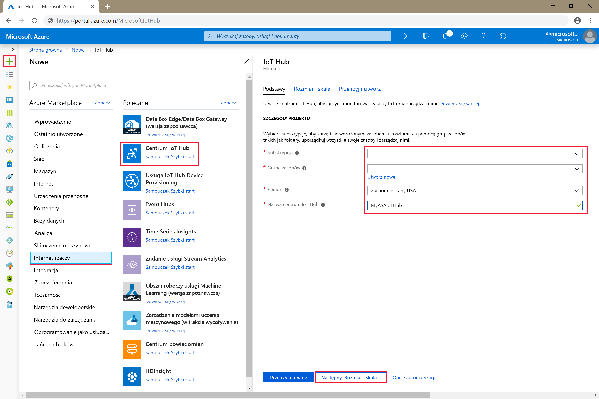

4. Wybierz pozycję **Dalej: Ustaw rozmiar i skalę**.

5. Wybierz wartość pozycji **Warstwa cenowa i warstwa skali**. Na potrzeby tego przewodnika Szybki start wybierz warstwę **F1 — Bezpłatna**, jeśli jest ona nadal dostępna w ramach subskrypcji. Aby uzyskać więcej informacji, zobacz [cennik usługi IoT Hub](https://azure.microsoft.com/pricing/details/iot-hub/).

   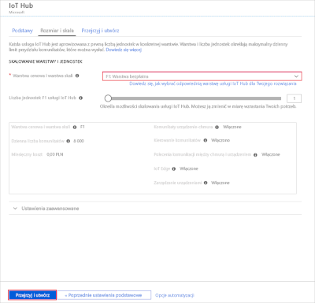

6. Wybierz pozycję **Przegląd + utwórz**. Przejrzyj informacje o centrum IoT Hub, a następnie kliknij pozycję **Utwórz**. Proces tworzenia centrum IoT Hub może potrwać kilka minut. Postępy możesz monitorować w okienku **Powiadomienia**.

7. W menu nawigacji centrum IoT Hub kliknij pozycję **Dodaj** w obszarze **Urządzenia IoT**. Dodaj **identyfikator urządzenia** i kliknij przycisk **Zapisz**.

   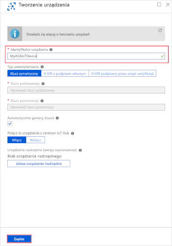

8. Po utworzeniu urządzenia otwórz je z poziomu listy **Urządzenia IoT**. Skopiuj wartość pola **Parametry połączenia — klucz podstawowy** i zapisz ją w notatniku do późniejszego użycia.

   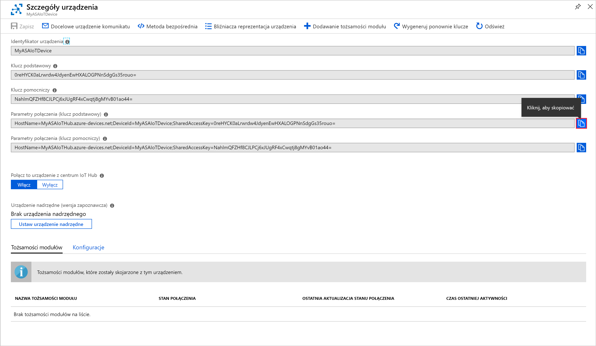

## <a name="create-blob-storage"></a>Tworzenie magazynu obiektów blob

1. W lewym górnym rogu witryny Azure portal wybierz pozycję **Utwórz** > **konto magazynu****magazynu** > zasobów .

2. W okienku **Utwórz konto magazynu** wprowadź nazwę konta magazynu, lokalizację i grupę zasobów. Wybierz tę samą lokalizację i grupę zasobów, co w przypadku utworzonego centrum IoT Hub. Następnie kliknij pozycję **Przeglądanie + tworzenie**, aby utworzyć konto.

   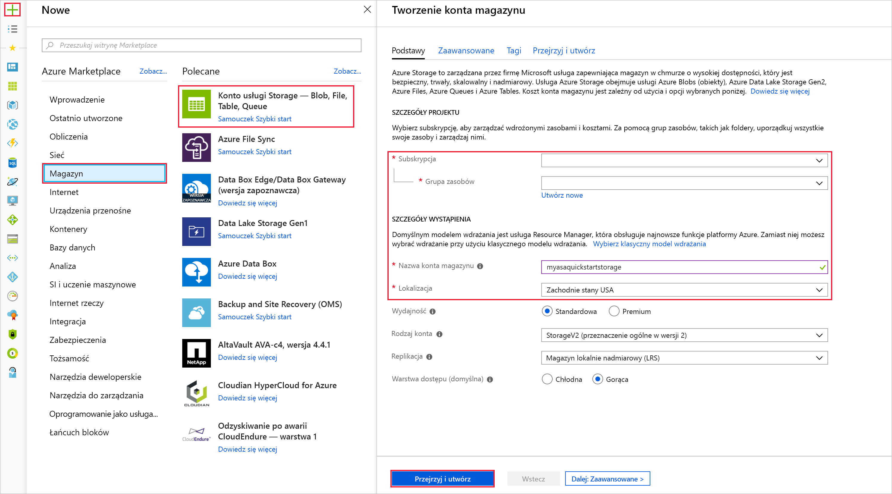

3. Po utworzeniu konta magazynu wybierz kafalek **Obiekty blob** w okienku **Przegląd**.

   

4. Na stronie **Blob Service** wybierz pozycję **Kontener** i podaj nazwę swojego kontenera, na przykład *container1*. W polu **Poziom dostępu publicznego** pozostaw wartość **Prywatny (bez dostępu anonimowego)** i wybierz przycisk **OK**.

   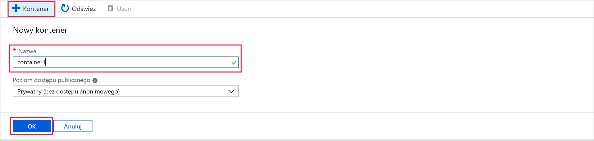

## <a name="create-a-stream-analytics-job"></a>Tworzenie zadania usługi Stream Analytics

1. Zaloguj się do Portalu Azure.

2. W lewym górnym rogu witryny Azure Portal wybierz pozycję **Utwórz zasób**.  

3. Wybierz **Analytics** > **zadanie Analytics Stream Analytics** z listy wyników.  

4. Wypełnij stronę zadania usługi Stream Analytics następującymi informacjami:

   |**Ustawienie**  |**Sugerowana wartość**  |**Opis**  |
   |---------|---------|---------|
   |Nazwa zadania   |  MyASAJob   |   Wprowadź nazwę identyfikującą zadanie usługi Stream Analytics. Nazwa zadania usługi Stream Analytics może zawierać wyłącznie znaki alfanumeryczne, łączniki i podkreślenia oraz musi składać się z od 3 do 63 znaków. |
   |Subskrypcja  | \<Twoja subskrypcja\> |  Wybierz subskrypcję platformy Azure, której chcesz użyć dla tego zadania. |
   |Grupa zasobów   |   asaquickstart-resourcegroup  |   Wybierz tę samą grupę zasobów, w której znajduje się centrum IoT Hub. |
   |Lokalizacja  |  \<Wybierz region, który jest najbliżej Twoich użytkowników\> | Wybierz lokalizację geograficzną, w której możesz hostować swoje zadania usługi Stream Analytics. Użyj lokalizacji, która jest najbliżej Twoich użytkowników, aby zapewnić lepszą wydajność i zmniejszyć koszty transferu danych. |
   |Jednostki przesyłania strumieniowego  | 1  |   Jednostki przesyłania strumieniowego reprezentują zasoby obliczeniowe, które są wymagane do wykonania zadania. Domyślnie to ustawienie ma wartość 1. Aby dowiedzieć się więcej na temat skalowania jednostek przesyłania strumieniowego, zobacz artykuł [Understanding and adjusting streaming units (Opis i dostosowywanie jednostek przesyłania strumieniowego)](stream-analytics-streaming-unit-consumption.md).   |
   |Środowisko hostingu  |  Chmura  |   Zadania usługi Stream Analytics można wdrożyć w chmurze lub na urządzeniu brzegowym. Chmura umożliwia wdrożenie w usłudze Azure Cloud, a usługa Edge umożliwia wdrożenie na urządzeniu usługi IoT Edge. |

   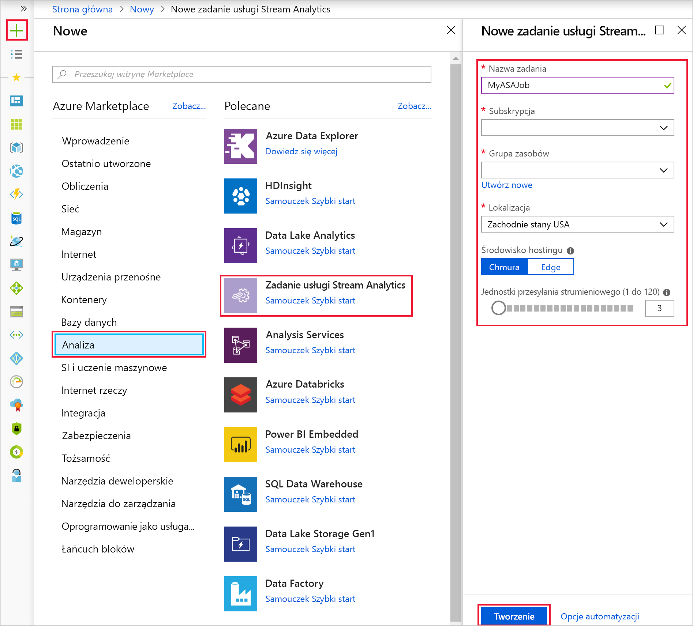

5. Zaznacz pole wyboru **Przypnij do pulpitu nawigacyjnego**, aby umieścić zadanie na pulpicie nawigacyjnym, a następnie kliknij pozycję **Utwórz**.  

6. W prawym górnym rogu okna przeglądarki powinno być widoczne powiadomienie *Wdrażanie jest w toku...*. 

## <a name="configure-job-input"></a>Konfigurowanie danych wejściowych zadania

W tej sekcji skonfigurujesz dane wejściowe urządzenia usługi IoT Hub do zadania usługi Stream Analytics. Użyj centrum IoT Hub utworzonego w poprzedniej sekcji tego przewodnika Szybki start.

1. Przejdź do zadania usługi Stream Analytics.  

2. Wybierz **pozycję Wejścia** > **Dodaj wejście strumienia** > **IoT Hub**.  

3. Wypełnij stronę **usługi IoT Hub** następującymi wartościami:

   |**Ustawienie**  |**Sugerowana wartość**  |**Opis**  |
   |---------|---------|---------|
   |Alias danych wejściowych  |  IoTHubInput   |  Wprowadź nazwę identyfikującą dane wejściowe zadania.   |
   |Subskrypcja   |  \<Twoja subskrypcja\> |  Wybierz subskrypcję platformy Azure, która ma utworzone konto magazynu. Konto magazynu może być w tej samej lub innej subskrypcji. W tym przykładzie przyjęto założenie, że konto magazynu zostało utworzone w tej samej subskrypcji. |
   |Usługa IoT Hub  |  MyASAIoTHub |  Wprowadź nazwę centrum IoT Hub utworzonego w poprzedniej sekcji. |

4. Dla pozostałych opcji pozostaw ich wartości domyślne i wybierz polecenie **Zapisz**, aby zapisać ustawienia.  

   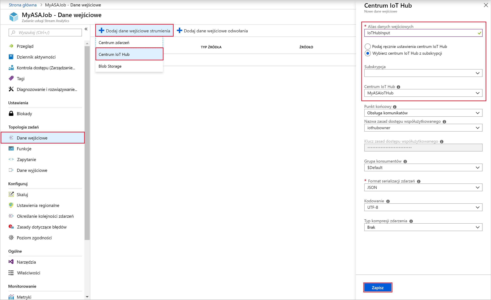
 
## <a name="configure-job-output"></a>Konfigurowanie danych wyjściowych zadania

1. Przejdź do utworzonego wcześniej zadania usługi Stream Analytics.  

2. Wybierz **pozycję Wyjścia** > **Dodaj** > **magazyn obiektów Blob**.  

3. Wypełnij stronę **Blob Storage** następującymi wartościami:

   |**Ustawienie**  |**Sugerowana wartość**  |**Opis**  |
   |---------|---------|---------|
   |Alias danych wyjściowych |   BlobOutput   |   Wprowadź nazwę identyfikującą dane wyjściowe zadania. |
   |Subskrypcja  |  \<Twoja subskrypcja\>  |  Wybierz subskrypcję platformy Azure, która ma utworzone konto magazynu. Konto magazynu może być w tej samej lub innej subskrypcji. W tym przykładzie przyjęto założenie, że konto magazynu zostało utworzone w tej samej subskrypcji. |
   |Konto magazynu |  asaquickstartstorage |   Wybierz lub wprowadź nazwę konta magazynu. Nazwy kont magazynu są wykrywane automatycznie, jeśli są one tworzone w tej samej subskrypcji.       |
   |Kontener |   container1  |  Wybierz istniejący kontener utworzony na koncie magazynu.   |

4. Dla pozostałych opcji pozostaw ich wartości domyślne i wybierz polecenie **Zapisz**, aby zapisać ustawienia.  

   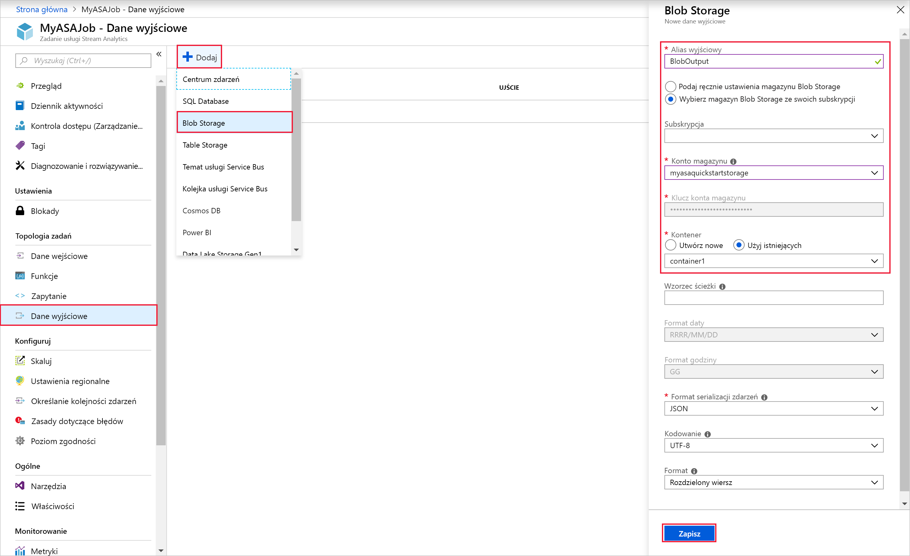
 
## <a name="define-the-transformation-query"></a>Definiowanie zapytania przekształcenia

1. Przejdź do utworzonego wcześniej zadania usługi Stream Analytics.  

2. Wybierz pozycję **Zapytanie** i zaktualizuj zapytanie w następujący sposób:  

   ```sql
   SELECT *
   INTO BlobOutput
   FROM IoTHubInput
   HAVING Temperature > 27
   ```

3. W tym przykładzie zapytanie odczytuje dane z centrum IoT Hub i kopiuje je do nowego pliku w obiekcie blob. Wybierz **pozycję Zapisz**.  

   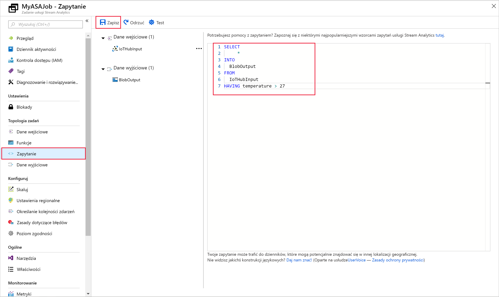

## <a name="run-the-iot-simulator"></a>Uruchamianie symulatora IoT

1. Otwórz symulator [Raspberry Pi Azure IoT Online Simulator](https://azure-samples.github.io/raspberry-pi-web-simulator/).

2. Zamień symbol zastępczy w wierszu 15 na parametry połączenia urządzenia usługi Azure IoT Hub, które zostały zapisane w poprzedniej sekcji.

3. Kliknij **przycisk Uruchom**. Dane wyjściowe powinny pokazywać dane z czujników i komunikaty, które są wysyłane do usługi IoT Hub.

   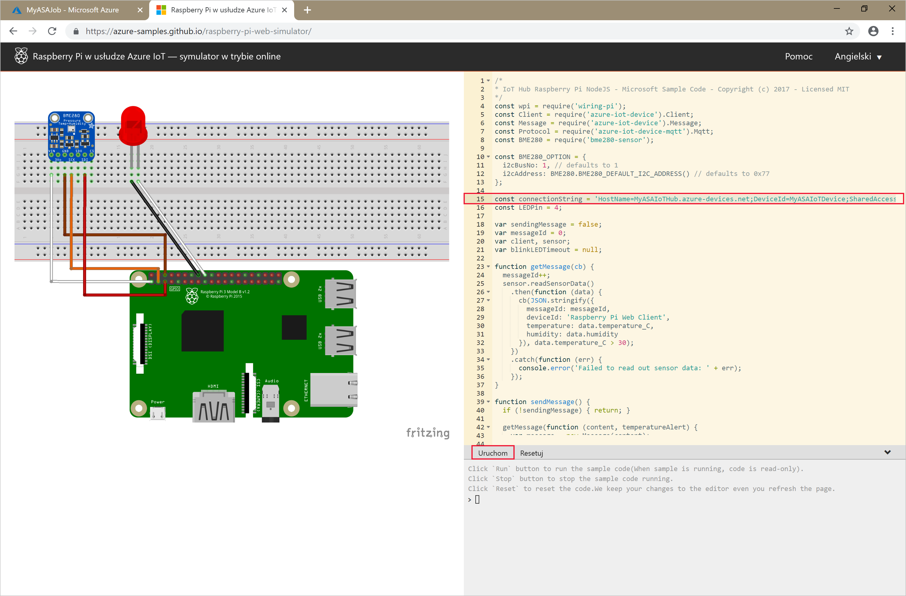

## <a name="start-the-stream-analytics-job-and-check-the-output"></a>Uruchamianie zadania usługi Stream Analytics i sprawdzanie danych wyjściowych

1. Wróć na stronę przeglądu zadania i wybierz pozycję **Uruchom**.

2. W obszarze **Uruchamianie zadania** wybierz opcję **Teraz** dla pola **Godzina rozpoczęcia generowania danych wyjściowych zadania**. Następnie wybierz pozycję **Uruchom**, aby uruchomić zadanie.

3. Po kilku minutach znajdź w portalu konto magazynu i kontener, który został skonfigurowany jako dane wyjściowe zadania. Plik wyjściowy jest teraz widoczny w kontenerze. Pierwsze uruchomienie zadania trwa kilka minut, natomiast po uruchomieniu będzie ono działać stale, w miarę nadchodzenia danych.  

   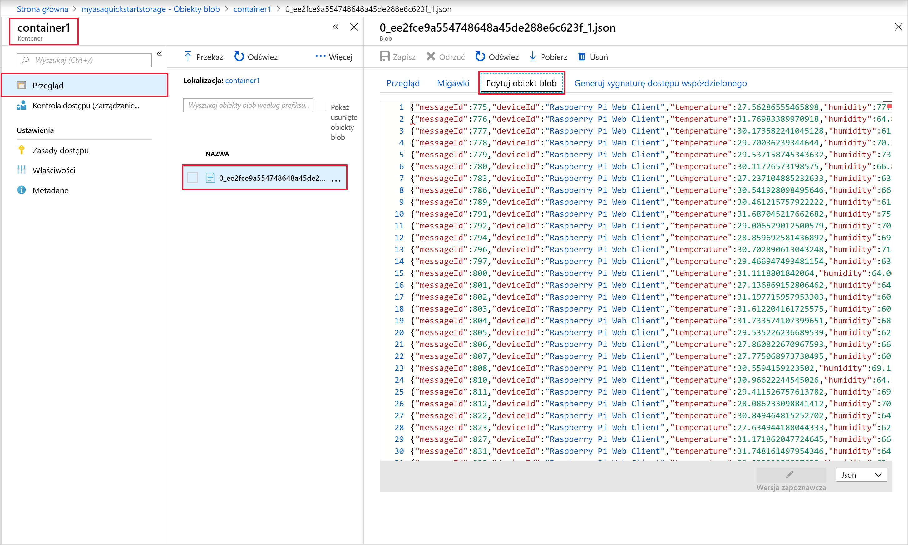

## <a name="clean-up-resources"></a>Oczyszczanie zasobów

Gdy nie jest już potrzebna, usuń grupę zasobów, zadanie usługi Stream Analytics i wszystkie powiązane zasoby. Usunięcie zadania pozwala uniknąć opłat za jednostki przesyłania strumieniowego zużywane przez zadanie. Jeśli planujesz użyć zadania w przyszłości, możesz je zatrzymać i uruchomić ponownie później, gdy będzie potrzebne. Jeśli nie zamierzasz w przyszłości korzystać z tego zadania, wykonaj następujące kroki, aby usunąć wszystkie zasoby utworzone w ramach tego przewodnika Szybki start:

1. W menu znajdującym się po lewej stronie w witrynie Azure Portal wybierz pozycję **Grupy zasobów**, a następnie wybierz nazwę utworzonego zasobu.  

2. Na stronie grupy zasobów wybierz pozycję **Usuń**, wpisz w polu tekstowym nazwę zasobu do usunięcia, a następnie wybierz pozycję **Usuń**.

## <a name="next-steps"></a>Następne kroki

W tym przewodniku Szybki start proste zadanie usługi Stream Analytics zostało wdrożone przy użyciu witryny Azure Portal. Można również wdrożyć zadania usługi Stream Analytics przy użyciu [programów PowerShell,](stream-analytics-quick-create-powershell.md) [Visual Studio](stream-analytics-quick-create-vs.md)i Visual [Studio Code](quick-create-vs-code.md).

Aby dowiedzieć się więcej o konfigurowaniu innych źródeł danych wejściowych i wykonywaniu wykrywania w czasie rzeczywistym, zapoznaj się z następującym artykułem:

> [!div class="nextstepaction"]
> [Wykrywanie oszustw w czasie rzeczywistym za pomocą usługi Azure Stream Analytics](stream-analytics-real-time-fraud-detection.md)
