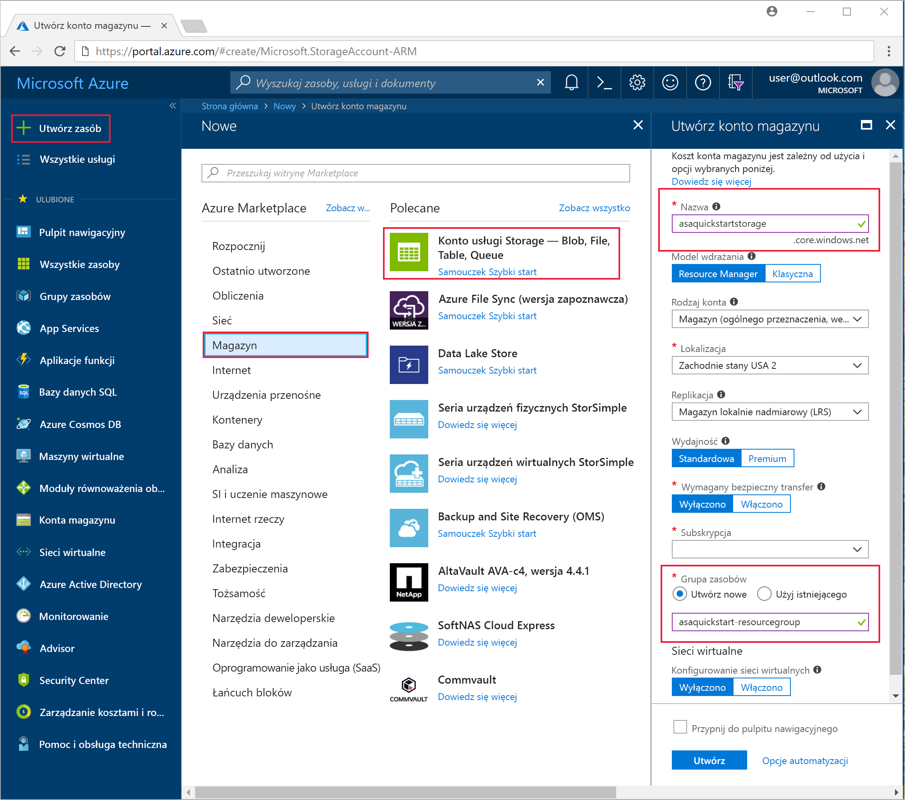
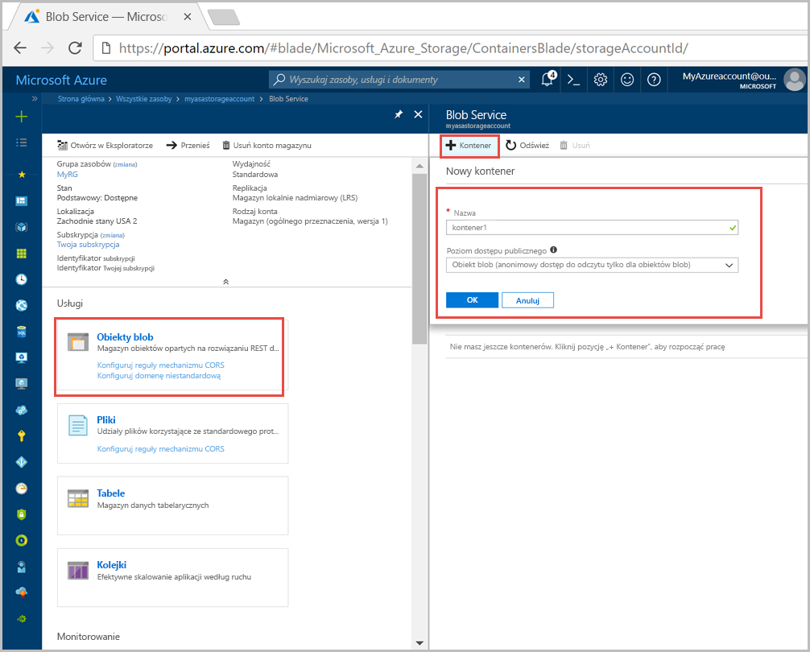
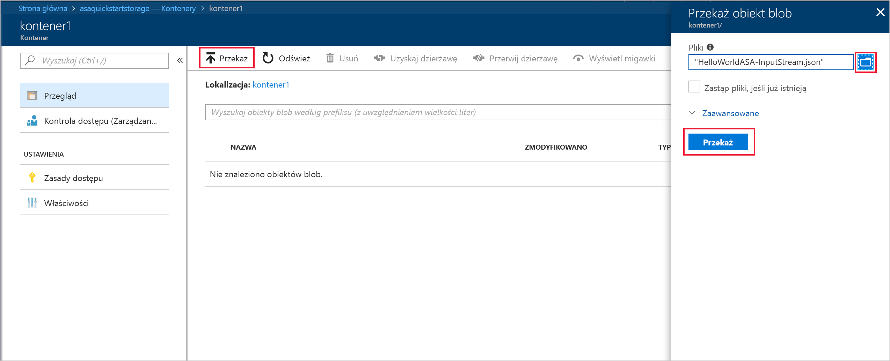
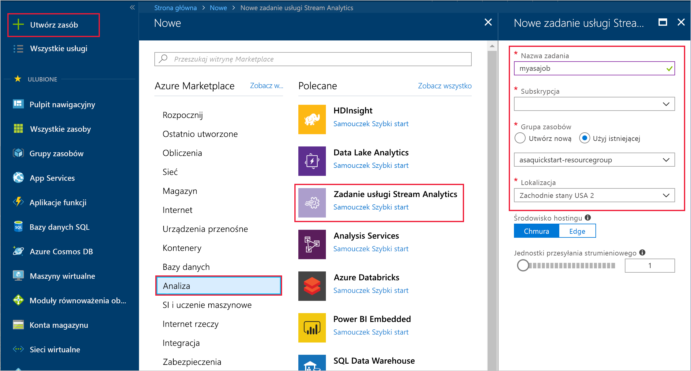
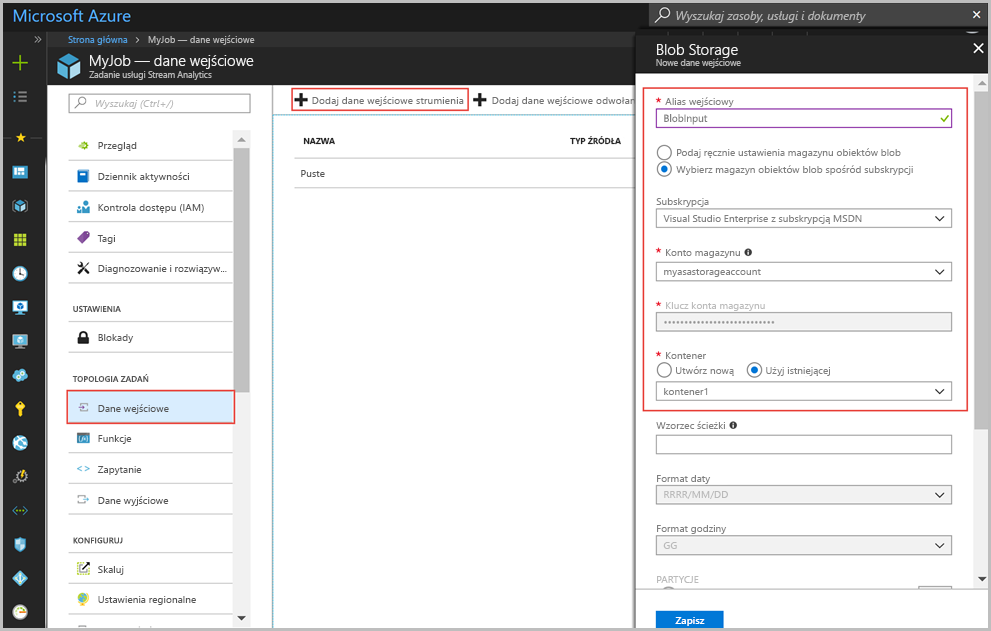
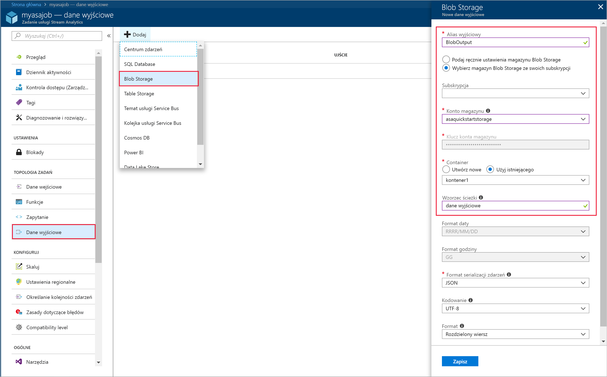
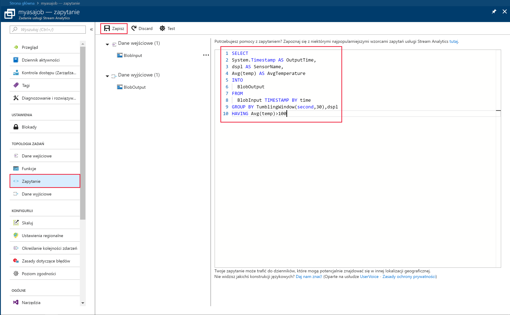
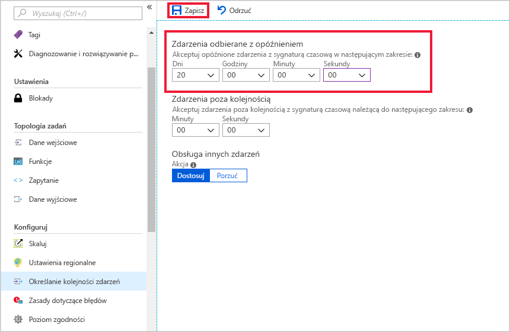
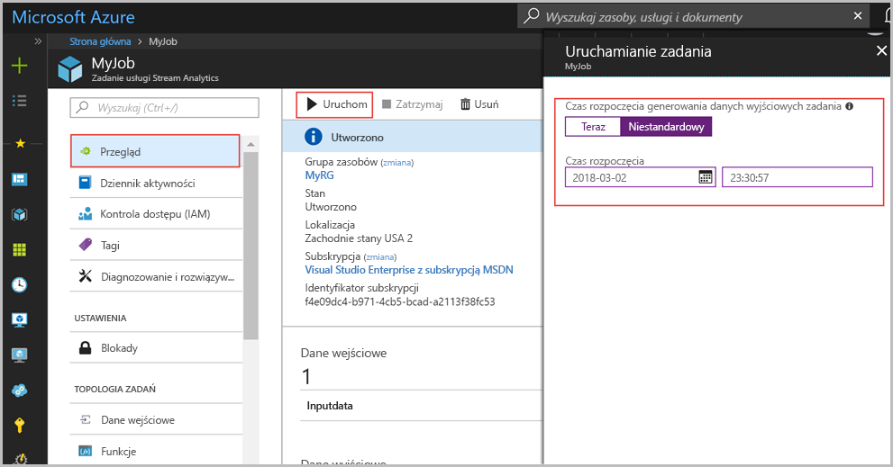
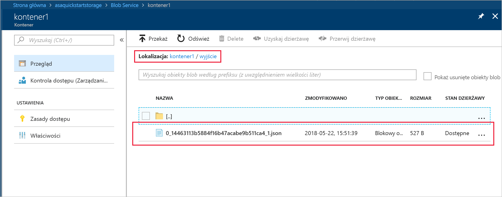

# <a name="quickstart-create-a-stream-analytics-job-by-using-the-azure-portal"></a>Szybki start: tworzenie zadania usługi Stream Analytics przy użyciu witryny Azure Portal

W tym przewodniku Szybki start pokazano, jak rozpocząć tworzenie zadania usługi Stream Analytics. W tym przewodniku Szybki start zdefiniujesz zadanie usługi Stream Analytics, które co 30 sekund będzie odczytywać przykładowe dane czujników i filtrować wiersze, których średnia temperatura przekracza 100. W tym artykule dane są odczytywane z magazynu Blob Storage, przekształcane i zapisywane z powrotem do innego kontenera w tym samym magazynie Blob Storage. Plik danych wejściowych używany w tym przewodniku Szybki start zawiera dane statyczne przeznaczone tylko dla celów ilustracyjnych. W rzeczywistym scenariuszu są używane dane wejściowe przesyłania strumieniowego powiązane z zadaniem usługi Stream Analytics.

## <a name="before-you-begin"></a>Przed rozpoczęciem

* Jeśli nie masz subskrypcji platformy Azure, utwórz [bezpłatne konto](https://azure.microsoft.com/free/).

* Zaloguj się w witrynie [Azure Portal](https://portal.azure.com/).

## <a name="prepare-the-input-data"></a>Przygotowywanie danych wejściowych

Przed zdefiniowaniem zadania usługi Stream Analytics przygotuj dane, które będą konfigurowane jako dane wejściowe zadania. Aby przygotować dane wejściowe wymagane przez zadanie, uruchom następujące kroki:

1. Pobierz [przykładowe dane czujników](https://raw.githubusercontent.com/Azure/azure-stream-analytics/master/Samples/GettingStarted/HelloWorldASA-InputStream.json) z witryny GitHub. Przykładowe dane zawierają informacje z czujnika w następującym formacie JSON:  

   ```json
   {
     "time": "2018-08-19T21:18:52.0000000",
     "dspl": "sensorC",
     "temp": 87,
     "hmdt": 44
   }
   ```
2. Zaloguj się w witrynie [Azure Portal](https://portal.azure.com/).  

3. W lewym górnym rogu witryny Azure Portal wybierz pozycję **Utwórz zasób** > **Magazyn** > **Konto magazynu**. Wypełnij stronę zadania konta usługi Storage, ustawiając pozycję **Nazwa** na wartość „asaquickstartstorage”, pozycję **Lokalizacja** na „Zachodnie stany USA 2”, a pozycję **Grupa zasobów** na „asaquickstart-resourcegroup” (umieść konto magazynu w tej samej grupie zasobów co zadanie przesyłania strumieniowego, aby zwiększyć wydajność). W przypadku pozostałych ustawień można pozostawić ich wartości domyślne.  

   

4. Na stronie **Wszystkie zasoby** znajdź konto magazynu utworzone w poprzednim kroku. Otwórz stronę **Przegląd**, a następnie kafelek **Obiekty blob**.  

5. Na stronie **Blob Service** wybierz pozycję **Kontener**, podaj **nazwę** swojego kontenera, na przykład *container1*, i zmień pozycję **Poziom dostępu publicznego** na wartość Prywatny (bez dostępu anonimowego), a następnie wybierz przycisk **OK**.  

   

6. Przejdź do kontenera utworzonego w poprzednim kroku. Wybierz pozycję **Przekaż**, aby przekazać dane czujników pochodzące z pierwszego kroku.  

   

## <a name="create-a-stream-analytics-job"></a>Tworzenie zadania usługi Stream Analytics

1. Zaloguj się do Portalu Azure.

2. W lewym górnym rogu witryny Azure Portal wybierz pozycję **Utwórz zasób**.  

3. Z listy wyników wybierz pozycję **Dane + analiza** > **Zadanie usługi Stream Analytics**.  

4. Wypełnij stronę zadania usługi Stream Analytics następującymi informacjami:

   |**Ustawienie**  |**Sugerowana wartość**  |**Opis**  |
   |---------|---------|---------|
   |Nazwa zadania   |  myasajob   |   Wprowadź nazwę identyfikującą zadanie usługi Stream Analytics. Nazwa zadania usługi Stream Analytics może zawierać wyłącznie znaki alfanumeryczne, łączniki i podkreślenia oraz musi składać się z od 3 do 63 znaków. |
   |Subskrypcja  | \<Twoja subskrypcja\> |  Wybierz subskrypcję platformy Azure, której chcesz użyć dla tego zadania. |
   |Grupa zasobów   |   asaquickstart-resourcegroup  |   Wybierz pozycję **Utwórz nową** i wprowadź nazwę nowej grupy zasobów dla swojego konta. |
   |Lokalizacja  |  \<Wybierz region, który jest najbliżej Twoich użytkowników\> | Wybierz lokalizację geograficzną, w której możesz hostować swoje zadania usługi Stream Analytics. Użyj lokalizacji, która jest najbliżej Twoich użytkowników, aby zapewnić lepszą wydajność i zmniejszyć koszty transferu danych. |
   |Jednostki przesyłania strumieniowego  | 1  |   Jednostki przesyłania strumieniowego reprezentują zasoby obliczeniowe, które są wymagane do wykonania zadania. Domyślnie to ustawienie ma wartość 1. Aby dowiedzieć się więcej na temat skalowania jednostek przesyłania strumieniowego, zobacz artykuł [Understanding and adjusting streaming units (Opis i dostosowywanie jednostek przesyłania strumieniowego)](stream-analytics-streaming-unit-consumption.md).   |
   |Środowisko hostingu  |  Chmura  |   Zadania usługi Stream Analytics można wdrożyć w chmurze lub na urządzeniu brzegowym. Wartość Chmura umożliwia wdrożenie w usłudze Azure Cloud, a Urządzenie brzegowe umożliwia wdrożenie na urządzeniu usługi IoT Edge. |

   

5. Zaznacz pole wyboru **Przypnij do pulpitu nawigacyjnego**, aby umieścić zadanie na pulpicie nawigacyjnym, a następnie kliknij pozycję **Utwórz**.  

6. W prawym górnym rogu okna przeglądarki powinien być widoczny komunikat „Wdrażanie jest w toku...”. 

## <a name="configure-input-to-the-job"></a>Konfigurowanie danych wejściowych zadania

W tej sekcji skonfigurujesz magazyn usługi Blob Storage jako dane wejściowe do zadania usługi Stream Analytics. Przed skonfigurowaniem danych wejściowych utwórz konto usługi Blob Storage.  

### <a name="add-the-input"></a>Dodawanie danych wejściowych 

1. Przejdź do zadania usługi Stream Analytics.  

2. Wybierz pozycję **Dane wejściowe** > **Dodaj wejście strumienia** > **Blob Storage**.  

3. Wypełnij stronę **Blob Storage** następującymi wartościami:

   |**Ustawienie**  |**Sugerowana wartość**  |**Opis**  |
   |---------|---------|---------|
   |Alias danych wejściowych  |  BlobInput   |  Wprowadź nazwę identyfikującą dane wejściowe zadania.   |
   |Subskrypcja   |  \<Twoja subskrypcja\> |  Wybierz subskrypcję platformy Azure, która ma utworzone konto magazynu. Konto magazynu może być w tej samej lub innej subskrypcji. W tym przykładzie przyjęto założenie, że konto magazynu zostało utworzone w tej samej subskrypcji. |
   |Konto magazynu  |  myasastorageaccount |  Wybierz lub wprowadź nazwę konta magazynu. Nazwy kont magazynu są wykrywane automatycznie, jeśli są one tworzone w tej samej subskrypcji. |
   |Kontener  | container1 | Wybierz nazwę kontenera, w którym znajdują się przykładowe dane. Nazwy kontenerów są wykrywane automatycznie, jeśli są one tworzone w tej samej subskrypcji. |

4. Dla pozostałych opcji pozostaw ich wartości domyślne i wybierz polecenie **Zapisz**, aby zapisać ustawienia.  

   
 
## <a name="configure-output-to-the-job"></a>Konfigurowanie danych wyjściowych zadania

1. Przejdź do utworzonego wcześniej zadania usługi Stream Analytics.  

2. Wybierz pozycję **Dane wyjściowe > Dodaj > Blob Storage**.  

3. Wypełnij stronę **Blob Storage** następującymi wartościami:

   |**Ustawienie**  |**Sugerowana wartość**  |**Opis**  |
   |---------|---------|---------|
   |Alias danych wyjściowych |   BlobOutput   |   Wprowadź nazwę identyfikującą dane wyjściowe zadania. |
   |Subskrypcja  |  \<Twoja subskrypcja\>  |  Wybierz subskrypcję platformy Azure, która ma utworzone konto magazynu. Konto magazynu może być w tej samej lub innej subskrypcji. W tym przykładzie przyjęto założenie, że konto magazynu zostało utworzone w tej samej subskrypcji. |
   |Konto magazynu |  asaquickstartstorage |   Wybierz lub wprowadź nazwę konta magazynu. Nazwy kont magazynu są wykrywane automatycznie, jeśli są one tworzone w tej samej subskrypcji.       |
   |Kontener |   container1  |  Wybierz istniejący kontener utworzony na koncie magazynu.   |
   |Wzorzec ścieżki |   output  |  Wprowadź nazwę jako ścieżkę w ramach istniejącego kontenera dla danych wyjściowych.   |

4. Dla pozostałych opcji pozostaw ich wartości domyślne i wybierz polecenie **Zapisz**, aby zapisać ustawienia.  

   
 
## <a name="define-the-transformation-query"></a>Definiowanie zapytania przekształcenia

1. Przejdź do utworzonego wcześniej zadania usługi Stream Analytics.  

2. Wybierz pozycję **Zapytanie** i zaktualizuj zapytanie w następujący sposób:  

   ```sql
   SELECT 
   System.Timestamp AS OutputTime,
   dspl AS SensorName,
   Avg(temp) AS AvgTemperature
   INTO
     BlobOutput
   FROM
     BlobInput TIMESTAMP BY time
   GROUP BY TumblingWindow(second,30),dspl
   HAVING Avg(temp)>100
   ```

3. W tym przykładzie zapytanie odczytuje dane z obiektu blob i kopiuje je do nowego pliku w obiekcie blob. Wybierz pozycję **Zapisz**.  

   

## <a name="configure-late-arrival-policy"></a>Konfigurowanie zasad spóźnionego przybycia

1. Przejdź do utworzonego wcześniej zadania usługi Stream Analytics.

2. W obszarze **Konfigurowanie** wybierz pozycję **Określanie kolejności zdarzeń**.

3. W obszarze **Zdarzenia przychodzące z opóźnieniem** ustaw wartość 20 dni, a następnie wybierz pozycję **Zapisz**.

   

## <a name="start-the-stream-analytics-job-and-check-the-output"></a>Uruchamianie zadania usługi Stream Analytics i sprawdzanie danych wyjściowych

1. Wróć na stronę przeglądu zadania i wybierz pozycję **Uruchom**.

2. W obszarze **Uruchom zadanie** dla pola **Czas rozpoczęcia** wybierz opcję **Niestandardowy**. Wybierz `2018-01-24` jako datę początkową, ale nie zmieniaj godziny. Ta data początkowa jest wybierana, ponieważ poprzedza znacznik czasu zdarzenia z przykładowych danych. Gdy wszystko będzie gotowe, wybierz pozycję **Uruchom**.

   

3. Po kilku minutach znajdź w portalu konto magazynu i kontener, który został skonfigurowany jako dane wyjściowe zadania. Wybierz ścieżkę wyjściową. Plik wyjściowy jest teraz widoczny w kontenerze. Pierwsze uruchomienie zadania trwa kilka minut, natomiast po uruchomieniu będzie ono działać stale, w miarę nadchodzenia danych.  

   

## <a name="clean-up-resources"></a>Oczyszczanie zasobów

Gdy grupa zasobów, zadanie przesyłania strumieniowego i wszystkie pokrewne zasoby nie będą już potrzebne, usuń je. Usunięcie zadania pozwala uniknąć opłat za jednostki przesyłania strumieniowego zużywane przez zadanie. Jeśli planujesz użyć zadania w przyszłości, możesz je zatrzymać i uruchomić ponownie później, gdy będzie potrzebne. Jeśli nie zamierzasz w przyszłości korzystać z tego zadania, wykonaj następujące kroki, aby usunąć wszystkie zasoby utworzone w ramach tego przewodnika Szybki start:

1. W menu znajdującym się po lewej stronie w witrynie Azure Portal wybierz pozycję **Grupy zasobów**, a następnie wybierz nazwę utworzonego zasobu.  

2. Na stronie grupy zasobów wybierz pozycję **Usuń**, wpisz w polu tekstowym nazwę zasobu do usunięcia, a następnie wybierz pozycję **Usuń**.

## <a name="next-steps"></a>Następne kroki

W tym przewodniku Szybki start zostało wdrożone proste zadanie usługi Stream Analytics. Aby dowiedzieć się więcej o konfigurowaniu innych źródeł danych wejściowych i wykonywaniu wykrywania w czasie rzeczywistym, zapoznaj się z następującym artykułem:

> [!div class="nextstepaction"]
> [Wykrywanie oszustw w czasie rzeczywistym za pomocą usługi Azure Stream Analytics](stream-analytics-real-time-fraud-detection.md)

