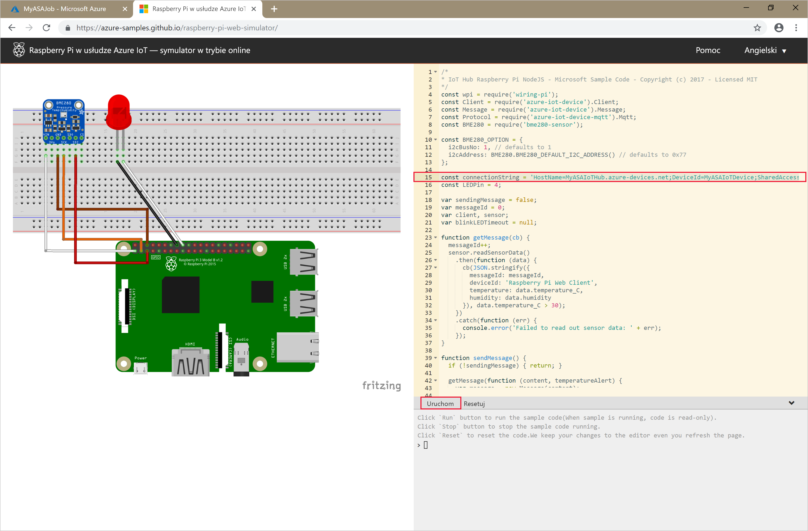

# <a name="quickstart-create-a-stream-analytics-job-using-azure-powershell"></a>Szybki Start: Tworzenie zadania Stream Analytics przy użyciu Azure PowerShell

Moduł Azure PowerShell umożliwia tworzenie zasobów platformy Azure i zarządzanie nimi za pomocą poleceń cmdlet programu PowerShell lub skryptów. W tym przewodniku Szybki start zawarto szczegółowe instrukcje korzystania z modułu Azure PowerShell w celu wdrożenia i uruchomienia zadania usługi Azure Stream Analytics.

Przykładowe zadanie odczytuje dane przesyłane strumieniowo z urządzenia usługi IoT Hub. Dane wejściowe są generowane przez symulator online urządzenia Raspberry Pi. Następnie zadanie usługi Stream Analytics przekształca dane za pomocą języka zapytań usługi Stream Analytics w celu filtrowania komunikatów, w których temperatura przekracza 27°. Na koniec zapisuje wynikowe zdarzenia wyjściowe w pliku w magazynie obiektów blob.

## <a name="before-you-begin"></a>Przed rozpoczęciem

[!INCLUDE [updated-for-az](../../includes/updated-for-az.md)]

* Jeśli nie masz subskrypcji platformy Azure, utwórz [bezpłatne konto](https://azure.microsoft.com/free/).

* Dla tego przewodnika Szybki start jest wymagany moduł Azure PowerShell. Uruchom polecenie `Get-Module -ListAvailable Az`, aby znaleźć wersję zainstalowaną na komputerze lokalnym. Jeśli konieczna będzie instalacja lub uaktualnienie, zobacz [Instalowanie modułu Azure PowerShell](https://docs.microsoft.com/powershell/azure/install-Az-ps).

* Niektóre działania usługi IoT Hub nie są obsługiwane w programie Azure PowerShell i trzeba je wykonać za pomocą interfejsu wiersza polecenia platformy Azure w wersji 2.0.24 lub nowszej i rozszerzenia IoT dla interfejsu wiersza polecenia platformy Azure. [Zainstaluj interfejs wiersza polecenia platformy Azure](https://docs.microsoft.com/cli/azure/install-azure-cli?view=azure-cli-latest) i użyj polecenia `az extension add --name azure-cli-iot-ext`, aby zainstalować rozszerzenie IoT.


## <a name="sign-in-to-azure"></a>Logowanie do platformy Azure

Zaloguj się do subskrypcji platformy Azure za pomocą polecenia `Connect-AzAccount` i wprowadź swoje poświadczenia platformy Azure w podręcznym oknie przeglądarki:

```powershell
# Connect to your Azure account
Connect-AzAccount
```

Jeśli masz więcej niż jedną subskrypcję, wybierz subskrypcję, z której chcesz korzystać na potrzeby tego przewodnika Szybki start, uruchamiając następujące polecenia cmdlet. Pamiętaj, aby zastąpić ciąg `<your subscription name>` nazwą swojej subskrypcji:

```powershell
# List all available subscriptions.
Get-AzSubscription

# Select the Azure subscription you want to use to create the resource group and resources.
Get-AzSubscription -SubscriptionName "<your subscription name>" | Select-AzSubscription
```

## <a name="create-a-resource-group"></a>Utwórz grupę zasobów

Utwórz grupę zasobów platformy Azure za pomocą polecenia [New-AzResourceGroup](https://docs.microsoft.com/powershell/module/az.resources/new-azresourcegroup). Grupa zasobów to logiczny kontener przeznaczony do wdrażania zasobów platformy Azure i zarządzania nimi.

```powershell
$resourceGroup = "StreamAnalyticsRG"
$location = "WestUS2"
New-AzResourceGroup `
    -Name $resourceGroup `
    -Location $location
```

## <a name="prepare-the-input-data"></a>Przygotowywanie danych wejściowych

Przed zdefiniowaniem zadania usługi Stream Analytics przygotuj dane, które będą konfigurowane jako dane wejściowe zadania.

Poniższy blok kodu interfejsu wiersza polecenia platformy Azure wykonuje wiele poleceń, aby przygotować dane wejściowe wymagane przez zadanie. Przejrzyj sekcje, aby zapoznać się z kodem.

1. W oknie programu PowerShell uruchom polecenie [az login](https://docs.microsoft.com/cli/azure/authenticate-azure-cli?view=azure-cli-latest), aby zalogować się na konto platformy Azure.

    Po pomyślnym zalogowaniu interfejs wiersza polecenia platformy Azure zwraca listę subskrypcji. Skopiuj subskrypcję używaną na potrzeby tego przewodnika Szybki Start i uruchom polecenie [az account set](https://docs.microsoft.com/cli/azure/manage-azure-subscriptions-azure-cli?view=azure-cli-latest#change-the-active-subscription), aby wybrać tę subskrypcję. Wybierz tę samą subskrypcję, którą wybrano w poprzedniej sekcji za pomocą programu PowerShell. Pamiętaj, aby zastąpić ciąg `<your subscription name>` nazwą swojej subskrypcji.

    ```azurecli
    az login

    az account set --subscription "<your subscription>"
    ```

2. Utwórz centrum IoT Hub za pomocą polecenia [az iot hub create](../iot-hub/iot-hub-create-using-cli.md#create-an-iot-hub). W tym przykładzie tworzone jest centrum IoT Hub o nazwie **MyASAIoTHub**. Ponieważ nazwy centrów IoT Hub są unikatowe, musisz utworzyć własną nazwę centrum IoT Hub. Ustaw jednostkę SKU F1, aby skorzystać z warstwy bezpłatnej, jeśli jest dostępna w ramach subskrypcji. W przeciwnym razie wybierz kolejną najniższą warstwę.

    ```azurecli
    az iot hub create --name "<your IoT Hub name>" --resource-group $resourceGroup --sku S1
    ```

    Po utworzeniu centrum IoT Hub pobierz parametry połączenia tego centrum IoT Hub za pomocą polecenia [az iot hub show-connection-string](https://docs.microsoft.com/cli/azure/iot/hub?view=azure-cli-latest). Skopiuj całe parametry połączenia i zapisz je, ponieważ będą używane podczas dodawania centrum IoT Hub w danych wejściowych zadania usługi Stream Analytics.

    ```azurecli
    az iot hub show-connection-string --hub-name "MyASAIoTHub"
    ```

3. Dodaj urządzenie do centrum IoT Hub za pomocą polecenia [az iothub device-identity create](../iot-hub/quickstart-send-telemetry-c.md#register-a-device). W tym przykładzie zostanie utworzone urządzenie o nazwie **MyASAIoTDevice**.

    ```azurecli
    az iot hub device-identity create --hub-name "MyASAIoTHub" --device-id "MyASAIoTDevice"
    ```

4. Pobierz parametry połączenia tego urządzenia za pomocą polecenia [az iot hub device-identity show-connection-string](/cli/azure/ext/azure-cli-iot-ext/iot/hub/device-identity#ext-azure-cli-iot-ext-az-iot-hub-device-identity-show-connection-string). Skopiuj całe parametry połączenia i zapisz je, ponieważ będą używane podczas tworzenia symulatora urządzenia Raspberry Pi.

    ```azurecli
    az iot hub device-identity show-connection-string --hub-name "MyASAIoTHub" --device-id "MyASAIoTDevice" --output table
    ```

    **Przykładowe dane wyjściowe:**

    ```azurecli
    HostName=MyASAIoTHub.azure-devices.net;DeviceId=MyASAIoTDevice;SharedAccessKey=a2mnUsg52+NIgYudxYYUNXI67r0JmNubmfVafojG8=
    ```

## <a name="create-blob-storage"></a>Tworzenie magazynu obiektów blob

Poniższy blok kodu programu Azure PowerShell zawiera polecenia służące do utworzenia magazynu obiektów blob, który będzie używany do przechowywania danych wyjściowych zadania. Przejrzyj sekcje, aby zapoznać się z kodem.

1. Utwórz standardowe konto magazynu ogólnego przeznaczenia za pomocą polecenia cmdlet [New-AzStorageAccount](https://docs.microsoft.com/powershell/module/az.storage/New-azStorageAccount).  W tym przykładzie tworzone jest konto magazynu o nazwie **myasaquickstartstorage** z magazynem lokalnie nadmiarowym (LRS, locally redundant storage) i szyfrowaniem obiektów blob (domyślnie włączone).

2. Pobierz kontekst konta magazynu `$storageAccount.Context`, który definiuje konto magazynu do użycia. Podczas pracy z kontami magazynu możesz odwoływać się do kontekstu, zamiast wielokrotnie podawać poświadczenia.

3. Użyj polecenia [New-AzStorageContainer](https://docs.microsoft.com/powershell/module/az.storage/new-azstoragecontainer), aby utworzyć nowy kontener magazynu.

4. Skopiuj klucz magazynu z danych wyjściowych kodu i zapisz go, ponieważ będzie później używany do tworzenia danych wyjściowych zadania przesyłania strumieniowego.

    ```powershell
    $storageAccountName = "myasaquickstartstorage"
    $storageAccount = New-AzStorageAccount `
      -ResourceGroupName $resourceGroup `
      -Name $storageAccountName `
      -Location $location `
      -SkuName Standard_LRS `
      -Kind Storage

    $ctx = $storageAccount.Context
    $containerName = "container1"

    New-AzStorageContainer `
      -Name $containerName `
      -Context $ctx

    $storageAccountKey = (Get-AzStorageAccountKey `
      -ResourceGroupName $resourceGroup `
      -Name $storageAccountName).Value[0]

    Write-Host "The <storage account key> placeholder needs to be replaced in your output json files with this key value:"
    Write-Host $storageAccountKey -ForegroundColor Cyan
    ```

## <a name="create-a-stream-analytics-job"></a>Tworzenie zadania usługi Stream Analytics

Utwórz zadanie usługi Stream Analytics za pomocą polecenia cmdlet [New-AzStreamAnalyticsJob](https://docs.microsoft.com/powershell/module/az.streamanalytics/new-azstreamanalyticsjob). To polecenie cmdlet przyjmuje jako parametry nazwę zadania, nazwę grupy zasobów i definicję zadania. Nazwa zadania może być dowolną przyjazną nazwą, która identyfikuje zadanie. Może ona zawierać wyłącznie znaki alfanumeryczne, łączniki i podkreślenia oraz musi składać się z od 3 do 63 znaków. Definicja zadania to plik JSON, który zawiera właściwości wymagane do utworzenia zadania. Na maszynie lokalnej utwórz plik o nazwie `JobDefinition.json` i dodaj do niego następujące dane JSON:

```json
{
  "location":"WestUS2",
  "properties":{
    "sku":{
      "name":"standard"
    },
    "eventsOutOfOrderPolicy":"adjust",
    "eventsOutOfOrderMaxDelayInSeconds":10,
    "compatibilityLevel": 1.1
  }
}
```

Następnie uruchom polecenie cmdlet `New-AzStreamAnalyticsJob`. Zastąp wartość zmiennej `jobDefinitionFile` ścieżką, w której jest przechowywany plik JSON definicji zadania.

```powershell
$jobName = "MyStreamingJob"
$jobDefinitionFile = "C:\JobDefinition.json"
New-AzStreamAnalyticsJob `
  -ResourceGroupName $resourceGroup `
  -File $jobDefinitionFile `
  -Name $jobName `
  -Force
```

## <a name="configure-input-to-the-job"></a>Konfigurowanie danych wejściowych zadania

Dodaj dane wejściowe do zadania za pomocą polecenia cmdlet [New-AzStreamAnalyticsInput](https://docs.microsoft.com/powershell/module/az.streamanalytics/new-azstreamanalyticsinput). To polecenie cmdlet przyjmuje jako parametry nazwę zadania, nazwę danych wejściowych zadania, nazwę grupy zasobów i definicję danych wejściowych zadania. Definicja danych wejściowych zadania to plik JSON, który zawiera właściwości wymagane do skonfigurowania danych wejściowych zadania. W tym przykładzie jako dane wejściowe utworzysz magazyn obiektów blob.

Na maszynie lokalnej utwórz plik o nazwie `JobInputDefinition.json` i dodaj do niego następujące dane JSON. Pamiętaj o zastąpieniu wartości `accesspolicykey` częścią `SharedAccessKey` z parametrów połączenia centrum IoT Hub zapisanych w poprzedniej sekcji.

```json
{
    "properties": {
        "type": "Stream",
        "datasource": {
            "type": "Microsoft.Devices/IotHubs",
            "properties": {
                "iotHubNamespace": "MyASAIoTHub",
                "sharedAccessPolicyName": "iothubowner",
                "sharedAccessPolicyKey": "accesspolicykey",
                "endpoint": "messages/events",
                "consumerGroupName": "$Default"
                }
        },
        "compression": {
            "type": "None"
        },
        "serialization": {
            "type": "Json",
            "properties": {
                "encoding": "UTF8"
            }
        }
    },
    "name": "IoTHubInput",
    "type": "Microsoft.StreamAnalytics/streamingjobs/inputs"
}
```

Następnie uruchom polecenie cmdlet `New-AzStreamAnalyticsInput`, pamiętając, aby zastąpić wartość zmiennej `jobDefinitionFile` ścieżką, w której jest przechowywany plik JSON definicji danych wejściowych zadania.

```powershell
$jobInputName = "IoTHubInput"
$jobInputDefinitionFile = "C:\JobInputDefinition.json"
New-AzStreamAnalyticsInput `
  -ResourceGroupName $resourceGroup `
  -JobName $jobName `
  -File $jobInputDefinitionFile `
  -Name $jobInputName
```

## <a name="configure-output-to-the-job"></a>Konfigurowanie danych wyjściowych zadania

Dodaj dane wyjściowe do zadania za pomocą polecenia cmdlet [New-AzStreamAnalyticsOutput](https://docs.microsoft.com/powershell/module/az.streamanalytics/new-azstreamanalyticsoutput). To polecenie cmdlet przyjmuje jako parametry nazwę zadania, nazwę danych wyjściowych zadania, nazwę grupy zasobów i definicję danych wyjściowych zadania. Definicja danych wyjściowych zadania to plik JSON, który zawiera właściwości wymagane do skonfigurowania danych wyjściowych zadania. W tym przykładzie jako dane wyjściowe używany jest magazyn obiektów blob.

Na maszynie lokalnej utwórz plik o nazwie `JobOutputDefinition.json` i dodaj do niego następujące dane JSON. Pamiętaj, aby zastąpić wartość `accountKey` kluczem dostępu konta magazynu, czyli wartością zapisaną w zmiennej $storageAccountKey.

```json
{
    "properties": {
        "datasource": {
            "type": "Microsoft.Storage/Blob",
            "properties": {
                "storageAccounts": [
                    {
                      "accountName": "asaquickstartstorage",
                      "accountKey": "<storage account key>"
                    }
                ],
                "container": "container1",
                "pathPattern": "output/",
                "dateFormat": "yyyy/MM/dd",
                "timeFormat": "HH"
            }
        },
        "serialization": {
            "type": "Json",
            "properties": {
                "encoding": "UTF8",
                "format": "LineSeparated"
            }
        }
    },
    "name": "BlobOutput",
    "type": "Microsoft.StreamAnalytics/streamingjobs/outputs"
}
```

Następnie uruchom polecenie cmdlet `New-AzStreamAnalyticsOutput`. Pamiętaj, aby zastąpić wartość zmiennej `jobOutputDefinitionFile` ścieżką, w której jest przechowywany plik JSON definicji danych wyjściowych zadania.

```powershell
$jobOutputName = "BlobOutput"
$jobOutputDefinitionFile = "C:\JobOutputDefinition.json"
New-AzStreamAnalyticsOutput `
  -ResourceGroupName $resourceGroup `
  -JobName $jobName `
  -File $jobOutputDefinitionFile `
  -Name $jobOutputName -Force
```

## <a name="define-the-transformation-query"></a>Definiowanie zapytania przekształcenia

Dodaj przekształcenie zadania przy użyciu polecenia cmdlet [New-AzStreamAnalyticsTransformation](https://docs.microsoft.com/powershell/module/az.streamanalytics/new-azstreamanalyticstransformation). To polecenie cmdlet przyjmuje jako parametry nazwę zadania, nazwę przekształcenia zadania, nazwę grupy zasobów i definicję przekształcenia zadania. Na maszynie lokalnej utwórz plik o nazwie `JobTransformationDefinition.json` i dodaj do niego następujące dane JSON. Plik JSON zawiera parametr zapytania, który definiuje zapytanie przekształcenia:

```json
{
    "name":"MyTransformation",
    "type":"Microsoft.StreamAnalytics/streamingjobs/transformations",
    "properties":{
        "streamingUnits":1,
        "script":null,
        "query":" SELECT * INTO BlobOutput FROM IoTHubInput HAVING Temperature > 27"
    }
}
```

Następnie uruchom polecenie cmdlet `New-AzStreamAnalyticsTransformation`. Pamiętaj, aby zastąpić wartość zmiennej `jobTransformationDefinitionFile` ścieżką, w której jest przechowywany plik JSON definicji przekształcania zadania.

```powershell
$jobTransformationName = "MyJobTransformation"
$jobTransformationDefinitionFile = "C:\JobTransformationDefinition.json"
New-AzStreamAnalyticsTransformation `
  -ResourceGroupName $resourceGroup `
  -JobName $jobName `
  -File $jobTransformationDefinitionFile `
  -Name $jobTransformationName -Force
```
## <a name="run-the-iot-simulator"></a>Uruchamianie symulatora IoT

1. Otwórz symulator [Raspberry Pi Azure IoT Online Simulator](https://azure-samples.github.io/raspberry-pi-web-simulator/).

2. Zastąp symbol zastępczy w wierszu 15 całymi parametrami połączenia urządzenia usługi Azure IoT Hub, które zostały zapisane w poprzedniej sekcji.

3. Kliknij pozycję **Run** (Uruchom). Dane wyjściowe powinny pokazywać dane z czujników i komunikaty, które są wysyłane do usługi IoT Hub.

    

## <a name="start-the-stream-analytics-job-and-check-the-output"></a>Uruchamianie zadania usługi Stream Analytics i sprawdzanie danych wyjściowych

Uruchom zadanie przy użyciu polecenia cmdlet [Start-AzStreamAnalyticsJob](https://docs.microsoft.com/powershell/module/az.streamanalytics/start-azstreamanalyticsjob). To polecenie cmdlet przyjmuje jako parametry nazwę zadania, nazwę grupy zasobów, tryb uruchamiania danych wyjściowych i czas rozpoczęcia. Parametr `OutputStartMode` przyjmuje wartość `JobStartTime`, `CustomTime` lub `LastOutputEventTime`. Aby dowiedzieć się więcej na temat znaczenia poszczególnych wartości, zobacz sekcję [parametrów](https://docs.microsoft.com/powershell/module/az.streamanalytics/start-azstreamanalyticsjob) w dokumentacji programu PowerShell.

Po uruchomieniu poniższego polecenia cmdlet zwróci ono wartość `True` jako dane wyjściowe, jeśli zadanie zostało uruchomione. W kontenerze magazynu zostanie utworzony folder wyjściowy z przekształconymi danymi.

```powershell
Start-AzStreamAnalyticsJob `
  -ResourceGroupName $resourceGroup `
  -Name $jobName `
  -OutputStartMode 'JobStartTime'
```

## <a name="clean-up-resources"></a>Oczyszczanie zasobów

Gdy grupa zasobów, zadanie przesyłania strumieniowego i wszystkie pokrewne zasoby nie będą już potrzebne, usuń je. Usunięcie zadania pozwala uniknąć opłat za jednostki przesyłania strumieniowego zużywane przez zadanie. Jeśli planujesz użyć zadania w przyszłości, możesz pominąć jego usuwanie i na razie je zatrzymać. Jeśli nie planujesz używania tego zadania w przyszłości, usuń wszystkie zasoby utworzone w ramach tego przewodnika Szybki start, uruchamiając następujące polecenie cmdlet:

```powershell
Remove-AzResourceGroup `
  -Name $resourceGroup
```

## <a name="next-steps"></a>Następne kroki

W tym przewodniku Szybki start proste zadanie usługi Stream Analytics zostało wdrożone przy użyciu programu PowerShell. Możesz też wdrażać zadania usługi Stream Analytics przy użyciu witryny [Azure Portal](stream-analytics-quick-create-portal.md) i programu [Visual Studio](stream-analytics-quick-create-vs.md).

Aby dowiedzieć się więcej o konfigurowaniu innych źródeł danych wejściowych i wykonywaniu wykrywania w czasie rzeczywistym, zapoznaj się z następującym artykułem:

> [!div class="nextstepaction"]
> [Wykrywanie oszustw w czasie rzeczywistym za pomocą usługi Azure Stream Analytics](stream-analytics-real-time-fraud-detection.md)
