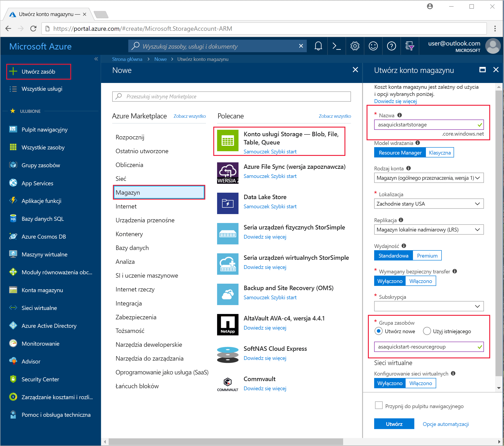
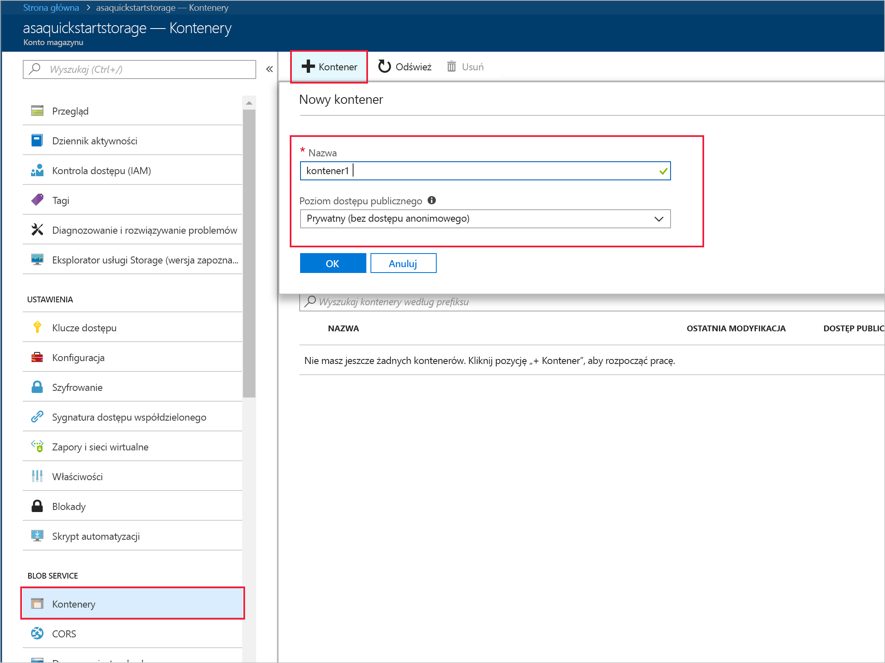
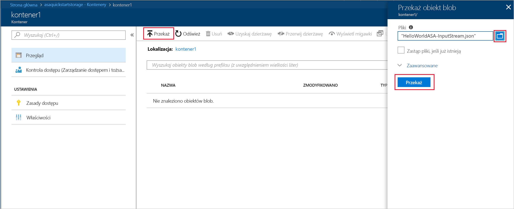

# <a name="quickstart-create-a-stream-analytics-job-by-using-the-azure-stream-analytics-tools-for-visual-studio"></a>Szybki start: tworzenie zadania usługi Stream Analytics przy użyciu narzędzi usługi Azure Stream Analytics Tools for Visual Studio

W tym przewodniku Szybki start przedstawiono sposób tworzenia i uruchamiania zadania usługi Stream Analytics przy użyciu narzędzi usługi Azure Stream Analytics Tools for Visual Studio. Przykładowe zadanie odczytuje dane przesyłane strumieniowo z magazynu obiektów blob platformy Azure. Plik danych wejściowych używany w tym przewodniku Szybki start zawiera dane statyczne przeznaczone tylko dla celów ilustracyjnych. W rzeczywistym scenariuszu są używane dane wejściowe przesyłania strumieniowego powiązane z zadaniem usługi Stream Analytics. W tym przewodniku Szybki Start zdefiniujesz zadanie obliczające średnią temperaturę, gdy wynosi ona ponad 100°, i zapisujące wynikowe zdarzenia wyjściowe w nowym pliku.

## <a name="before-you-begin"></a>Przed rozpoczęciem

* Jeśli nie masz subskrypcji platformy Azure, utwórz [bezpłatne konto](https://azure.microsoft.com/free/).

* Zaloguj się w witrynie [Azure Portal](https://portal.azure.com/).

* Zainstaluj program Visual Studio 2017, Visual Studio 2015 lub Visual Studio 2013 Update 4. Obsługiwane są wersje Enterprise (Ultimate/Premium), Professional i Community. Wersja Express nie jest obsługiwana.

* Postępuj zgodnie z [instrukcjami dotyczącymi instalacji](https://docs.microsoft.com/azure/stream-analytics/stream-analytics-tools-for-visual-studio-install), aby zainstalować narzędzia usługi Stream Analytics for Visual Studio.

## <a name="prepare-the-input-data"></a>Przygotowywanie danych wejściowych

Przed zdefiniowaniem zadania usługi Stream Analytics przygotuj dane, które będą konfigurowane jako dane wejściowe zadania. Aby przygotować dane wejściowe wymagane przez zadanie, uruchom następujące kroki:

1. Pobierz [przykładowe dane czujników](https://raw.githubusercontent.com/Azure/azure-stream-analytics/master/Samples/GettingStarted/HelloWorldASA-InputStream.json) z witryny GitHub. Przykładowe dane zawierają informacje z czujnika w następującym formacie JSON:  

   ```json
   {
     "time": "2018-01-26T21:18:52.0000000",
     "dspl": "sensorC",
     "temp": 87,
     "hmdt": 44
   }
   ```
2. Zaloguj się w witrynie [Azure Portal](https://portal.azure.com/).

3. W lewym górnym rogu witryny Azure Portal wybierz pozycję **Utwórz zasób** > **Magazyn** > **Konto magazynu**. Wypełnij stronę zadania konta usługi Storage, ustawiając pozycję **Nazwa** na wartość „asaquickstartstorage”, pozycję **Lokalizacja** na „Zachodnie stany USA”, a pozycję **Grupa zasobów** na „asaquickstart-resourcegroup” (umieść konto magazynu w tej samej grupie zasobów co zadanie przesyłania strumieniowego, aby zwiększyć wydajność). W przypadku pozostałych ustawień można pozostawić ich wartości domyślne.  

   

4. Na stronie **Wszystkie zasoby** znajdź konto magazynu utworzone w poprzednim kroku. Otwórz stronę **Przegląd**, a następnie kafelek **Obiekty blob**.  

5. Na stronie **Blob Service** wybierz pozycję **Kontener**, podaj **nazwę** swojego kontenera, na przykład *container1*, a następnie wybierz przycisk **OK**.  

   

6. Przejdź do kontenera utworzonego w poprzednim kroku. Wybierz pozycję **Przekaż**, aby przekazać dane czujników pochodzące z pierwszego kroku.  

   

## <a name="create-a-stream-analytics-project"></a>Tworzenie projektu usługi Stream Analytics

1. Uruchom program Visual Studio.

2. Wybierz pozycję **Plik > Nowy projekt**.  

3. Na liście szablonów po lewej stronie wybierz pozycję **Stream Analytics**, a następnie wybierz pozycję **Azure Stream Analytics Application**.  

4. Wprowadź **nazwę**, **lokalizację** oraz **nazwę rozwiązania** dla projektu i wybierz przycisk **OK**.

   

## <a name="choose-the-required-subscription"></a>Wybieranie wymaganej subskrypcji

1. W programie Visual Studio w menu **Widok** wybierz opcję **Eksplorator serwera**.

2. Kliknij prawym przyciskiem myszy pozycję **Azure**, wybierz pozycję **Połącz z subskrypcją platformy Microsoft Azure**, a następnie zaloguj się przy użyciu konta platformy Azure.

## <a name="define-input"></a>Definiowanie danych wejściowych

1. W **Eksploratorze rozwiązań** rozwiń węzeł **Dane wejściowe** i kliknij dwukrotnie pozycję **Input.json**.

2. Wypełnij obszar **Konfiguracja danych wejściowych usługi Stream Analytics** przy użyciu następujących wartości:

   |**Ustawienie**  |**Sugerowana wartość**  |**Opis**   |
   |---------|---------|---------|
   |Alias danych wejściowych  |  Dane wejściowe   |  Wprowadź nazwę identyfikującą dane wejściowe zadania.   |
   |Typ źródła   |  Strumień danych |  Wybierz odpowiednie źródło danych wejściowych: strumień danych lub dane referencyjne.   |
   |Element źródłowy  |  Blob Storage |  Wybierz odpowiednie źródło danych wejściowych.   |
   |Zasób  | Wybierz źródło danych z bieżącego konta | Wybierz ręczne wprowadzenie danych lub wybierz istniejące konto.   |
   |Subskrypcja  |  \<Twoja subskrypcja\>   | Wybierz subskrypcję platformy Azure, która ma utworzone konto magazynu. Konto magazynu może być w tej samej lub innej subskrypcji. W tym przykładzie przyjęto założenie, że konto magazynu zostało utworzone w tej samej subskrypcji.   |
   |Konto magazynu  |  asaquickstartstorage   |  Wybierz lub wprowadź nazwę konta magazynu. Nazwy kont magazynu są wykrywane automatycznie, jeśli są one tworzone w tej samej subskrypcji.   |
   |Kontener  |  container1   |  Wybierz istniejący kontener utworzony na koncie magazynu.   |
   
3. Dla pozostałych opcji pozostaw ich wartości domyślne i wybierz polecenie **Zapisz**, aby zapisać ustawienia.  

   

## <a name="define-output"></a>Definiowanie danych wyjściowych

1. W **Eksploratorze rozwiązań** rozwiń węzeł **Dane wyjściowe** i kliknij dwukrotnie pozycję **Output.json**.

2. Wypełnij obszar **Konfiguracja danych wyjściowych usługi Stream Analytics** przy użyciu następujących wartości:

   |**Ustawienie**  |**Sugerowana wartość**  |**Opis**   |
   |---------|---------|---------|
   |Alias danych wyjściowych  |  Dane wyjściowe   |  Wprowadź nazwę identyfikującą dane wyjściowe zadania.   |
   |Ujście   |  Blob Storage |  Wybierz odpowiednie ujście.    |
   |Zasób  |  Wprowadź ręcznie ustawienia źródła danych |  Wybierz ręczne wprowadzenie danych lub wybierz istniejące konto.   |
   |Subskrypcja  |  \<Twoja subskrypcja\>   | Wybierz subskrypcję platformy Azure, która ma utworzone konto magazynu. Konto magazynu może być w tej samej lub innej subskrypcji. W tym przykładzie przyjęto założenie, że konto magazynu zostało utworzone w tej samej subskrypcji.   |
   |Konto magazynu  |  asaquickstartstorage   |  Wybierz lub wprowadź nazwę konta magazynu. Nazwy kont magazynu są wykrywane automatycznie, jeśli są one tworzone w tej samej subskrypcji.   |
   |Kontener  |  container1   |  Wybierz istniejący kontener utworzony na koncie magazynu.   |
   |Wzorzec ścieżki  |  output   |  Wprowadź nazwę ścieżki pliku, który ma zostać utworzony w kontenerze.   |
   
3. Dla pozostałych opcji pozostaw ich wartości domyślne i wybierz polecenie **Zapisz**, aby zapisać ustawienia.  

   

## <a name="define-the-transformation-query"></a>Definiowanie zapytania przekształcenia

1. Otwórz plik **Script.asaql** w **Eksploratorze rozwiązań** programu Visual Studio.

2. Dodaj następujące zapytanie:

   ```sql
   SELECT 
   System.Timestamp AS OutputTime,
   dspl AS SensorName,
   Avg(temp) AS AvgTemperature
   INTO
     Output
   FROM
     Input TIMESTAMP BY time
   GROUP BY TumblingWindow(second,30),dspl
   HAVING Avg(temp)>100
   ```

## <a name="submit-a-stream-analytics-query-to-azure"></a>Przesyłanie zapytania usługi Stream Analytics do platformy Azure

1. W **edytorze zapytań** wybierz pozycję **Prześlij do platformy Azure** w edytorze skryptów.

2. Wybierz pozycję **Utwórz nowe zadanie usługi Azure Stream Analytics**, a następnie wprowadź **nazwę zadania**. W polach **Subskrypcja**, **Grupa zasobów** i **Lokalizacja** wybierz wartości użyte na początku tego przewodnika Szybki start.

   

## <a name="start-the-stream-analytics-job-and-check-output"></a>Uruchamianie zadania usługi Stream Analytics i sprawdzanie danych wyjściowych

1. Po utworzeniu zadania zostanie automatycznie otwarty widok zadania. Wybierz przycisk z zieloną strzałką, aby uruchomić zadanie.

   

2. Zmień datę w polu **Godzina niestandardowa** na `2018-01-01` i wybierz pozycję **Uruchom**.

   

3. Stan zadania został zmieniony na **Uruchomione** i istnieją zdarzenia wejściowe/wyjściowe. Może to potrwać kilka minut.

   

4. Aby wyświetlić wyniki, w menu **Widok** wybierz pozycję **Eksplorator chmury**, a następnie przejdź do konta magazynu w grupie zasobów. W obszarze **Kontenery obiektów blob** kliknij dwukrotnie pozycję **container1**, a następnie ścieżkę pliku **output**.

   

## <a name="clean-up-resources"></a>Oczyszczanie zasobów

Gdy grupa zasobów, zadanie przesyłania strumieniowego i wszystkie pokrewne zasoby nie będą już potrzebne, usuń je. Usunięcie zadania pozwala uniknąć opłat za jednostki przesyłania strumieniowego zużywane przez zadanie. Jeśli planujesz użyć zadania w przyszłości, możesz je zatrzymać i uruchomić ponownie później, gdy będzie potrzebne. Jeśli nie zamierzasz w przyszłości korzystać z tego zadania, wykonaj następujące kroki, aby usunąć wszystkie zasoby utworzone w ramach tego przewodnika Szybki start:

1. W menu znajdującym się po lewej stronie w witrynie Azure Portal wybierz pozycję **Grupy zasobów**, a następnie wybierz nazwę utworzonego zasobu.  

2. Na stronie grupy zasobów wybierz pozycję **Usuń**, wpisz w polu tekstowym nazwę zasobu do usunięcia, a następnie wybierz pozycję **Usuń**.

## <a name="next-steps"></a>Następne kroki

W tym przewodniku Szybki start zostało wdrożone proste zadanie usługi Stream Analytics. Aby dowiedzieć się więcej o konfigurowaniu innych źródeł danych wejściowych i wykonywaniu wykrywania w czasie rzeczywistym, zapoznaj się z następującym artykułem:

> [!div class="nextstepaction"]
> [Wykrywanie oszustw w czasie rzeczywistym za pomocą usługi Azure Stream Analytics](stream-analytics-real-time-fraud-detection.md)
