# <a name="quickstart-create-a-stream-analytics-job-by-using-the-azure-stream-analytics-tools-for-visual-studio"></a>Szybki start: Tworzenie zadania usługi Stream Analytics przy użyciu narzędzi Azure Stream Analytics Tools for Visual Studio

W tym przewodniku Szybki start przedstawiono sposób tworzenia i uruchamiania zadania usługi Stream Analytics przy użyciu narzędzi usługi Azure Stream Analytics Tools for Visual Studio. Przykładowe zadanie odczytuje dane przesyłane strumieniowo z urządzenia usługi IoT Hub. Zdefiniujesz zadanie obliczające średnią temperaturę, gdy wynosi ona ponad 27°, i zapisujące wynikowe zdarzenia wyjściowe w magazynie obiektów blob.

## <a name="before-you-begin"></a>Przed rozpoczęciem

* Jeśli nie masz subskrypcji platformy Azure, utwórz [bezpłatne konto](https://azure.microsoft.com/free/).

* Zaloguj się w witrynie [Azure Portal](https://portal.azure.com/).

* Zainstaluj program Visual Studio 2019 r, program Visual Studio 2015 lub Visual Studio 2013 Update 4. Obsługiwane są wersje Enterprise (Ultimate/Premium), Professional i Community. Wersja Express nie jest obsługiwana.

* Postępuj zgodnie z [instrukcjami dotyczącymi instalacji](https://docs.microsoft.com/azure/stream-analytics/stream-analytics-tools-for-visual-studio-install), aby zainstalować narzędzia usługi Stream Analytics for Visual Studio.

## <a name="prepare-the-input-data"></a>Przygotowywanie danych wejściowych

Przed zdefiniowaniem zadania usługi Stream Analytics przygotuj dane, które następnie zostaną skonfigurowane jako dane wejściowe zadania. Aby przygotować dane wejściowe wymagane przez zadanie, wykonaj następujące czynności:

1. Zaloguj się w witrynie [Azure Portal](https://portal.azure.com/).

2. Wybierz pozycję **Utwórz zasób** > **Internet rzeczy** > **IoT Hub**.

3. W okienku **IoT Hub** wprowadź następujące informacje:
   
   |**Ustawienie**  |**Sugerowana wartość**  |**Opis**  |
   |---------|---------|---------|
   |Subskrypcja  | \<Twoja subskrypcja\> |  Wybierz subskrypcję platformy Azure, której chcesz użyć. |
   |Grupa zasobów   |   asaquickstart-resourcegroup  |   Wybierz pozycję **Utwórz nową** i wprowadź nazwę nowej grupy zasobów dla swojego konta. |
   |Region  |  \<Wybierz region, który jest najbliżej Twoich użytkowników\> | Wybierz lokalizację geograficzną, w której możesz hostować swoje centrum IoT Hub. Użyj lokalizacji znajdującej się najbliżej użytkowników. |
   |Nazwa centrum IoT Hub  | MyASAIoTHub  |   Wybierz nazwę swojego centrum IoT Hub.   |

   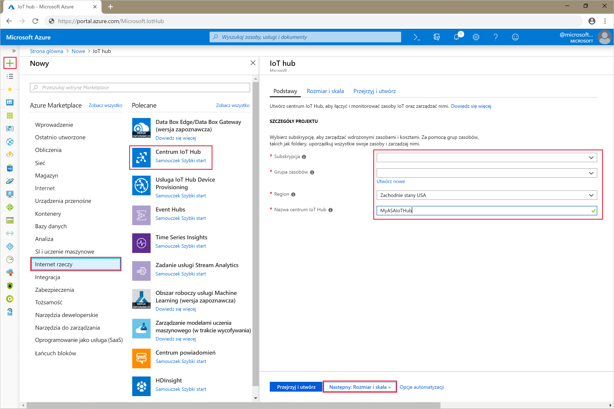

4. Wybierz opcję **Dalej: Ustaw rozmiar i skalę**.

5. Wybierz wartość pozycji **Warstwa cenowa i warstwa skali**. Na potrzeby tego przewodnika Szybki start wybierz warstwę **F1 — Bezpłatna**, jeśli jest ona nadal dostępna w ramach subskrypcji. Jeśli warstwa bezpłatna jest niedostępna, użyj najniższej dostępnej warstwy. Aby uzyskać więcej informacji, zobacz [cennik usługi IoT Hub](https://azure.microsoft.com/pricing/details/iot-hub/).

   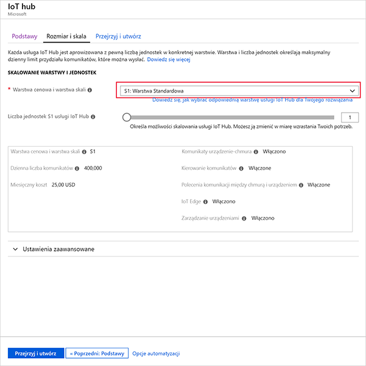

6. Wybierz pozycję **Przegląd + utwórz**. Przejrzyj informacje o centrum IoT Hub, a następnie kliknij pozycję **Utwórz**. Proces tworzenia centrum IoT Hub może potrwać kilka minut. Postępy możesz monitorować w okienku **Powiadomienia**.

7. W menu nawigacji centrum IoT Hub kliknij pozycję **Dodaj** w obszarze **Urządzenia IoT**. Dodaj **identyfikator urządzenia** i kliknij przycisk **Zapisz**.

   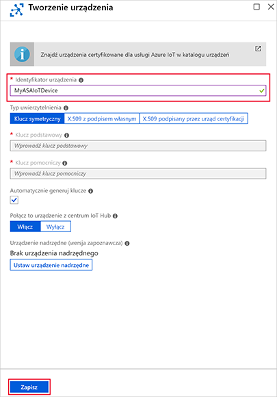

8. Po utworzeniu urządzenia otwórz je z poziomu listy **Urządzenia IoT**. Skopiuj wartość pola **Parametry połączenia — klucz podstawowy** i zapisz ją w notatniku do późniejszego użycia.

   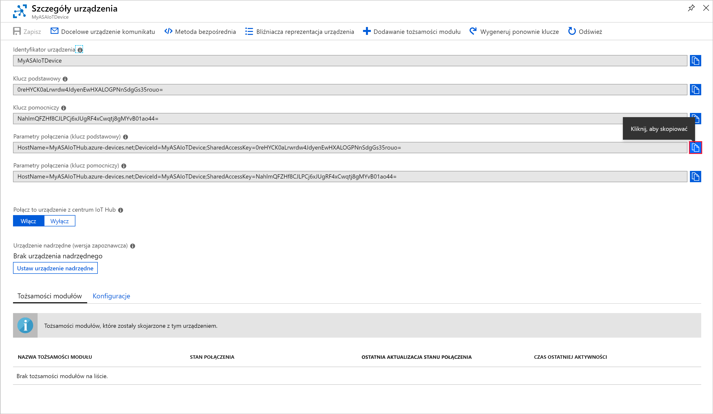

## <a name="create-blob-storage"></a>Tworzenie magazynu obiektów blob

1. W lewym górnym rogu witryny Azure Portal wybierz pozycję **Utwórz zasób** > **Magazyn** > **Konto magazynu**.

2. W okienku **Utwórz konto magazynu** wprowadź nazwę konta magazynu, lokalizację i grupę zasobów. Wybierz tę samą lokalizację i grupę zasobów, co w przypadku utworzonego centrum IoT Hub. Następnie kliknij pozycję **Przeglądanie + tworzenie**, aby utworzyć konto.

   

3. Po utworzeniu konta magazynu wybierz kafalek **Obiekty blob** w okienku **Przegląd**.

   

4. Na stronie **Blob Service** wybierz pozycję **Kontener** i podaj nazwę swojego kontenera, na przykład *container1*. W polu **Poziom dostępu publicznego** pozostaw wartość **Prywatny (bez dostępu anonimowego)** i wybierz przycisk **OK**.

   

## <a name="create-a-stream-analytics-project"></a>Tworzenie projektu usługi Stream Analytics

1. Uruchom program Visual Studio.

2. Wybierz pozycję **Plik > Nowy projekt**.  

3. Na liście szablonów po lewej stronie wybierz pozycję **Stream Analytics**, a następnie wybierz pozycję **Azure Stream Analytics Application**.  

4. Wprowadź **nazwę**, **lokalizację** oraz **nazwę rozwiązania** dla projektu i wybierz przycisk **OK**.

   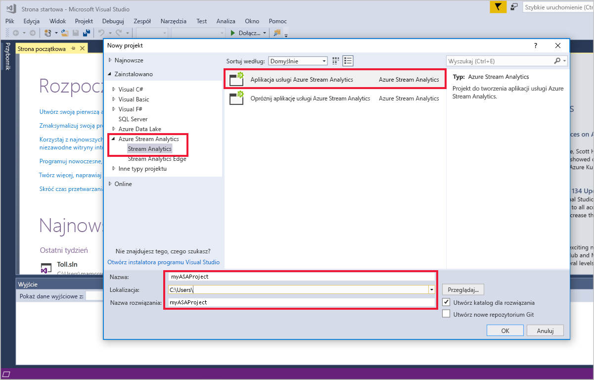

Zwróć uwagę na elementy uwzględnione w projekcie usługi Azure Stream Analytics.

   


## <a name="choose-the-required-subscription"></a>Wybieranie wymaganej subskrypcji

1. W programie Visual Studio w menu **Widok** wybierz opcję **Eksplorator serwera**.

2. Kliknij prawym przyciskiem myszy pozycję **Azure**, wybierz pozycję **Połącz z subskrypcją platformy Microsoft Azure**, a następnie zaloguj się przy użyciu konta platformy Azure.

## <a name="define-input"></a>Definiowanie danych wejściowych

1. W **Eksploratorze rozwiązań** rozwiń węzeł **Dane wejściowe** i kliknij dwukrotnie pozycję **Input.json**.

2. Wypełnij obszar **Konfiguracja danych wejściowych usługi Stream Analytics** przy użyciu następujących wartości:

   |**Ustawienie**  |**Sugerowana wartość**  |**Opis**   |
   |---------|---------|---------|
   |Alias danych wejściowych  |  Dane wejściowe   |  Wprowadź nazwę identyfikującą dane wejściowe zadania.   |
   |Typ źródła   |  Strumień danych |  Wybierz odpowiednie źródło danych wejściowych: Strumień danych lub Dane referencyjne.   |
   |source  |  Usługa IoT Hub |  Wybierz odpowiednie źródło danych wejściowych.   |
   |Resource  | Wybierz źródło danych z bieżącego konta | Wybierz ręczne wprowadzenie danych lub wybierz istniejące konto.   |
   |Subskrypcja  |  \<Twoja subskrypcja\>   | Wybierz subskrypcję platformy Azure, która zawiera utworzone centrum IoT Hub.   |
   |Usługa IoT Hub  |  MyASAIoTHub   |  Wybierz lub wprowadź nazwę centrum IoT Hub. Nazwy centrów IoT Hub są wykrywane automatycznie, jeśli są one tworzone w tej samej subskrypcji.   |
   
3. Dla pozostałych opcji pozostaw ich wartości domyślne i wybierz polecenie **Zapisz**, aby zapisać ustawienia.  

   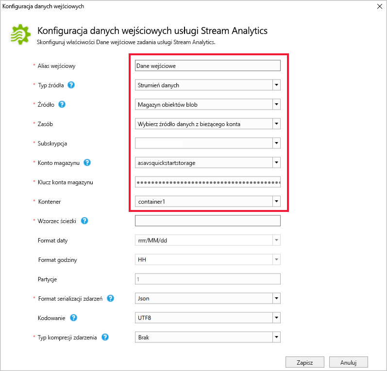

## <a name="define-output"></a>Definiowanie danych wyjściowych

1. W **Eksploratorze rozwiązań** rozwiń węzeł **Dane wyjściowe** i kliknij dwukrotnie pozycję **Output.json**.

2. Wypełnij obszar **Konfiguracja danych wyjściowych usługi Stream Analytics** przy użyciu następujących wartości:

   |**Ustawienie**  |**Sugerowana wartość**  |**Opis**   |
   |---------|---------|---------|
   |Alias danych wyjściowych  |  Dane wyjściowe   |  Wprowadź nazwę identyfikującą dane wyjściowe zadania.   |
   |Ujście   |  Blob Storage |  Wybierz odpowiednie ujście.    |
   |Resource  |  Wprowadź ręcznie ustawienia źródła danych |  Wybierz ręczne wprowadzenie danych lub wybierz istniejące konto.   |
   |Subskrypcja  |  \<Twoja subskrypcja\>   | Wybierz subskrypcję platformy Azure, która ma utworzone konto magazynu. Konto magazynu może być w tej samej lub innej subskrypcji. W tym przykładzie przyjęto założenie, że konto magazynu zostało utworzone w tej samej subskrypcji.   |
   |Konto magazynu  |  asaquickstartstorage   |  Wybierz lub wprowadź nazwę konta magazynu. Nazwy kont magazynu są wykrywane automatycznie, jeśli są one tworzone w tej samej subskrypcji.   |
   |Kontener  |  container1   |  Wybierz istniejący kontener utworzony na koncie magazynu.   |
   |Wzorzec ścieżki  |  wyjście   |  Wprowadź nazwę ścieżki pliku, który ma zostać utworzony w kontenerze.   |
   
3. Dla pozostałych opcji pozostaw ich wartości domyślne i wybierz polecenie **Zapisz**, aby zapisać ustawienia.  

   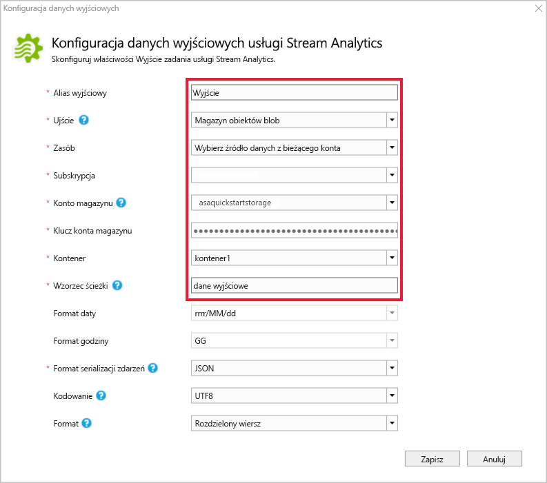

## <a name="define-the-transformation-query"></a>Definiowanie zapytania przekształcenia

1. Otwórz plik **Script.asaql** w **Eksploratorze rozwiązań** programu Visual Studio.

2. Dodaj następujące zapytanie:

   ```sql
   SELECT *
   INTO BlobOutput
   FROM IoTHubInput
   HAVING Temperature > 27
   ```

## <a name="submit-a-stream-analytics-query-to-azure"></a>Przesyłanie zapytania usługi Stream Analytics do platformy Azure

1. W **edytorze zapytań** wybierz pozycję **Prześlij do platformy Azure** w edytorze skryptów.

2. Wybierz pozycję **Utwórz nowe zadanie usługi Azure Stream Analytics**, a następnie wprowadź **nazwę zadania**. W polach **Subskrypcja**, **Grupa zasobów** i **Lokalizacja** wybierz wartości użyte na początku tego przewodnika Szybki start.

   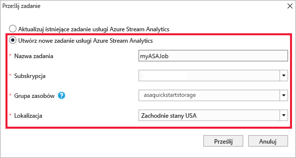

## <a name="run-the-iot-simulator"></a>Uruchamianie symulatora IoT

1. Otwórz symulator [Raspberry Pi Azure IoT Online Simulator](https://azure-samples.github.io/raspberry-pi-web-simulator/) w nowej karcie lub nowym oknie przeglądarki.

2. Zamień symbol zastępczy w wierszu 15 na parametry połączenia urządzenia usługi Azure IoT Hub, które zostały zapisane w poprzedniej sekcji.

3. Kliknij pozycję **Run** (Uruchom). Dane wyjściowe powinny pokazywać dane z czujników i komunikaty, które są wysyłane do usługi IoT Hub.

   

## <a name="start-the-stream-analytics-job-and-check-output"></a>Uruchamianie zadania usługi Stream Analytics i sprawdzanie danych wyjściowych

1. Po utworzeniu zadania zostanie automatycznie otwarty widok zadania. Wybierz przycisk z zieloną strzałką, aby uruchomić zadanie.

   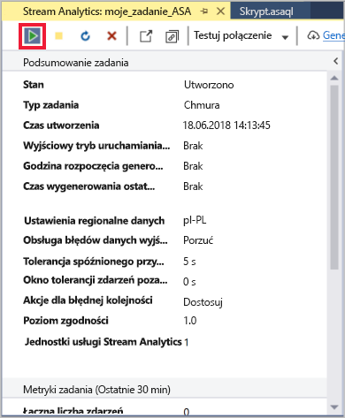

2. Zmień ustawienie **Wyjściowy tryb uruchamiania zadania** na **JobStartTime**, a następnie wybierz pozycję **Uruchom**.

   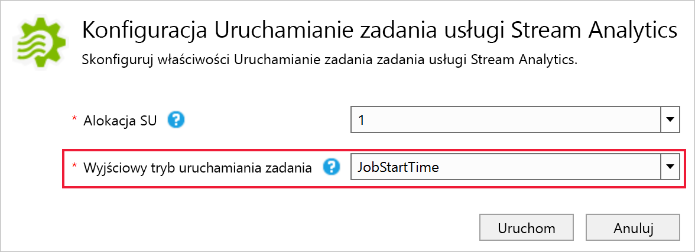

3. Stan zadania został zmieniony na **Uruchomione** i istnieją zdarzenia wejściowe/wyjściowe. Może to potrwać kilka minut.

   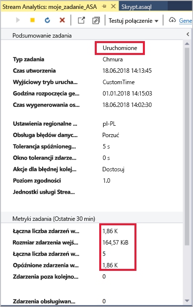

4. Aby wyświetlić wyniki, w menu **Widok** wybierz pozycję **Eksplorator chmury**, a następnie przejdź do konta magazynu w grupie zasobów. W obszarze **Kontenery obiektów blob** kliknij dwukrotnie pozycję **container1**, a następnie ścieżkę pliku **output**.

   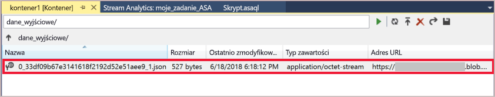

## <a name="clean-up-resources"></a>Oczyszczanie zasobów

Gdy grupa zasobów, zadanie przesyłania strumieniowego i wszystkie pokrewne zasoby nie będą już potrzebne, usuń je. Usunięcie zadania pozwala uniknąć opłat za jednostki przesyłania strumieniowego zużywane przez zadanie. Jeśli planujesz użyć zadania w przyszłości, możesz je zatrzymać i uruchomić ponownie później, gdy będzie potrzebne. Jeśli nie zamierzasz w przyszłości korzystać z tego zadania, wykonaj następujące kroki, aby usunąć wszystkie zasoby utworzone w ramach tego przewodnika Szybki start:

1. W menu znajdującym się po lewej stronie w witrynie Azure Portal wybierz pozycję **Grupy zasobów**, a następnie wybierz nazwę utworzonego zasobu.  

2. Na stronie grupy zasobów wybierz pozycję **Usuń**, wpisz w polu tekstowym nazwę zasobu do usunięcia, a następnie wybierz pozycję **Usuń**.

## <a name="next-steps"></a>Kolejne kroki

W tym przewodniku Szybki start wdrożono proste zadanie usługi Stream Analytics przy użyciu programu Visual Studio. Możesz też wdrażać zadania usługi Stream Analytics przy użyciu witryny [Azure Portal](stream-analytics-quick-create-portal.md) i programu [PowerShell](stream-analytics-quick-create-powershell.md). 

Aby dowiedzieć się więcej na temat narzędzi Azure Stream Analytics Tools for Visual Studio, przejdź do następującego artykułu:

> [!div class="nextstepaction"]
> [Use Visual Studio to view Azure Stream Analytics jobs (Wyświetlanie zadań usługi Azure Stream Analytics za pomocą programu Visual Studio)](stream-analytics-vs-tools.md)
