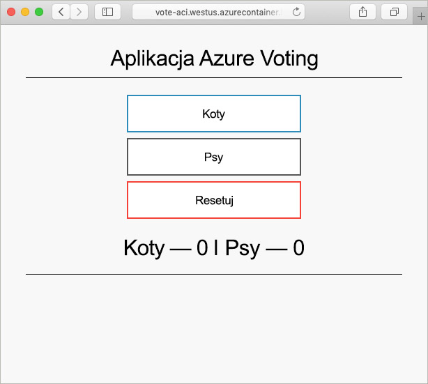

# <a name="create-a-terraform-configuration-for-azure"></a>Tworzenie konfiguracji programu Terraform na platformie Azure

Dzięki informacjom zawartym w tym przykładzie zyskasz doświadczenie w tworzeniu konfiguracji programu Terraform i wdrażaniu jej na platformie Azure. W tym przykładzie będzie miało miejsce wdrożenie wystąpienia usługi Azure Cosmos DB, usługi Azure Container Instance i aplikacji, która działa w obrębie tych dwóch zasobów. W tym dokumencie przyjęto założenie, że cała praca odbywa się w usłudze Azure Cloud Shell, w ramach której program Terraform jest wstępnie zainstalowany. Jeśli chcesz pracować z tym przykładem we własnym systemie, możesz zainstalować program Terraform, korzystając z instrukcji znajdujących się [tutaj](../virtual-machines/linux/terraform-install-configure.md).

## <a name="create-first-configuration"></a>Tworzenie pierwszej konfiguracji

W tej sekcji utworzysz konfigurację wystąpienia usługi Azure Cosmos DB.

Wybierz pozycję **wypróbuj teraz**, aby otworzyć usługę Azure Cloud Shell. Po jej otwarciu wprowadź polecenie `code .`, aby otworzyć edytor kodu usługi Cloud Shell.

```azurecli-interactive
code .
```

Skopiuj i wklej poniższą konfigurację programu Terraform.

Ta konfiguracja modeluje grupę zasobów platformy Azure, losową liczbę całkowitą i wystąpienie usługi Azure Cosmos DB. W nazwie wystąpienia usługi Cosmos DB używana jest losowa liczba całkowita. Konfigurowanych jest również kilka ustawień usługi Cosmos DB. Aby uzyskać pełną listę konfiguracji usługi Cosmos DB w narzędziu Terraform, zobacz [dokumentację programu Terraform w usłudze DB Cosmos](https://www.terraform.io/docs/providers/azurerm/r/cosmosdb_account.html).

Po zakończeniu zapisz plik jako `main.tf`. Tę operację można wykonać przy użyciu wielokropka w prawej górnej części edytora kodu.

```azurecli-interactive
resource "azurerm_resource_group" "vote-resource-group" {
  name     = "vote-resource-group"
  location = "westus"
}

resource "random_integer" "ri" {
  min = 10000
  max = 99999
}

resource "azurerm_cosmosdb_account" "vote-cosmos-db" {
  name                = "tfex-cosmos-db-${random_integer.ri.result}"
  location            = "${azurerm_resource_group.vote-resource-group.location}"
  resource_group_name = "${azurerm_resource_group.vote-resource-group.name}"
  offer_type          = "Standard"
  kind                = "GlobalDocumentDB"

  consistency_policy {
    consistency_level       = "BoundedStaleness"
    max_interval_in_seconds = 10
    max_staleness_prefix    = 200
  }

  geo_location {
    location          = "westus"
    failover_priority = 0
  }
}
```

Polecenie [terraform init](https://www.terraform.io/docs/commands/init.html) inicjuje katalog roboczy. Uruchom polecenie `terraform init` w terminalu usługi Cloud Shell, aby przygotować się do wdrożenia nowej konfiguracji.

```azurecli-interactive
terraform init
```

Za pomocą polecenia [terraform plan](https://www.terraform.io/docs/commands/plan.html) można zweryfikować, czy konfiguracja jest poprawnie sformatowana, a także zwizualizować, jakie zasoby zostaną utworzone, zaktualizowane lub zniszczone. Wyniki można zapisać w pliku i użyć w późniejszym czasie, aby zastosować konfigurację.

Uruchom polecenie `terraform plan`, aby przetestować nową konfigurację programu Terraform.

```azurecli-interactive
terraform plan --out plan.out
```

Zastosuj konfigurację, używając polecenia [terraform apply](https://www.terraform.io/docs/commands/apply.html) i określając nazwę pliku planu. To polecenie służy do wdrożenia zasobów w ramach subskrypcji platformy Azure.

```azurecli-interactive
terraform apply plan.out
```

Po zakończeniu zobaczysz, że grupa zasobów została utworzona, a wystąpienie usługi Azure Cosmos DB umieszczone w grupie zasobów.

## <a name="update-configuration"></a>Aktualizowanie konfiguracji

Zaktualizuj konfigurację, aby uwzględniała usługę Azure Container Instance. Kontener uruchamia aplikację, która odczytuje i zapisuje dane w usłudze Cosmos DB.

Skopiuj poniższą konfigurację do dolnej części pliku `main.tf`. Zapisz plik po zakończeniu.

Ustawiane są dwie zmienne środowiskowe — `COSMOS_DB_ENDPOINT` i `COSMOS_DB_MASTERKEY`. Te zmienne przechowują lokalizację i klucz na potrzeby uzyskiwania dostępu do bazy danych. Wartości tych zmiennych są uzyskiwane z wystąpienia bazy danych utworzonego w poprzednim kroku. Ten proces jest nazywany interpolacją. Aby dowiedzieć się więcej na temat interpolacji programu Terraform, zobacz [Interpolation Syntax](https://www.terraform.io/docs/configuration/interpolation.html) (Składnia interpolacji).


Konfiguracja obejmuje również blok danych wyjściowych, który zwraca w pełni kwalifikowaną nazwę domeny (FQDN) wystąpienia kontenera.

```azurecli-interactive
resource "azurerm_container_group" "vote-aci" {
  name                = "vote-aci"
  location            = "${azurerm_resource_group.vote-resource-group.location}"
  resource_group_name = "${azurerm_resource_group.vote-resource-group.name}"
  ip_address_type     = "public"
  dns_name_label      = "vote-aci"
  os_type             = "linux"

  container {
    name   = "vote-aci"
    image  = "microsoft/azure-vote-front:cosmosdb"
    cpu    = "0.5"
    memory = "1.5"
    ports {
      port     = 80
      protocol = "TCP"
    }

    secure_environment_variables = {
      "COSMOS_DB_ENDPOINT"  = "${azurerm_cosmosdb_account.vote-cosmos-db.endpoint}"
      "COSMOS_DB_MASTERKEY" = "${azurerm_cosmosdb_account.vote-cosmos-db.primary_master_key}"
      "TITLE"               = "Azure Voting App"
      "VOTE1VALUE"          = "Cats"
      "VOTE2VALUE"          = "Dogs"
    }
  }
}

output "dns" {
  value = "${azurerm_container_group.vote-aci.fqdn}"
}
```

Uruchom polecenie `terraform plan`, aby utworzyć zaktualizowany plan i zwizualizować wprowadzane zmiany. Powinna zostać wyświetlona informacja, że zasób usługi Azure Container Instance został dodany do konfiguracji.

```azurecli-interactive
terraform plan --out plan.out
```

Na koniec uruchom polecenie `terraform apply`, aby zastosować konfigurację.

```azurecli-interactive
terraform apply plan.out
```

Po zakończeniu zapisz nazwę FQDN wystąpienia kontenera.

## <a name="test-application"></a>Testowanie aplikacji

Przejdź do nazwy FQDN wystąpienia kontenera. Jeśli wszystko zostało skonfigurowane prawidłowo, powinna być widoczna następująca aplikacja.



## <a name="clean-up-resources"></a>Oczyszczanie zasobów

Gdy skończysz, zasoby i grupy zasobów platformy Azure można usunąć za pomocą polecenia [terraform destroy](https://www.terraform.io/docs/commands/destroy.html).

```azurecli-interactive
terraform destroy -auto-approve
```

## <a name="next-steps"></a>Kolejne kroki

W tym przykładzie utworzono, wdrożono i zniszczono konfigurację programu Terraform. Aby uzyskać więcej informacji na temat korzystania z programu Terraform na platformie Azure, zapoznaj się z dokumentacją dostawcy programu Terraform na platformie Azure.

> [!div class="nextstepaction"]
> [Dostawca programu Terraform na platformie Azure](https://www.terraform.io/docs/providers/azurerm/)
