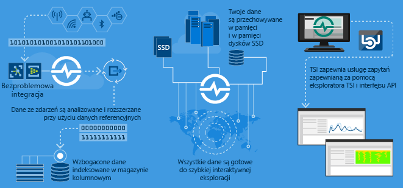
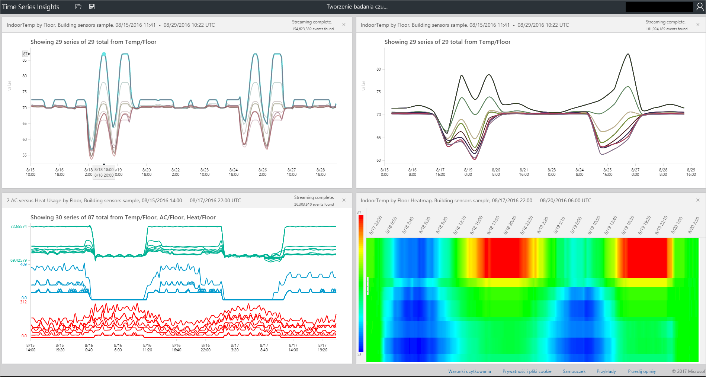

# Co to jest usługa Azure Time Series Insights?

Usługa Azure Time Series Insights został opracowany pod kątem przechowywania oraz ich wizualizowanie i zapytania dużych ilości danych szeregów czasowych, takich jak wygenerowany przez urządzenia IoT. Jeśli chcesz przechowywać, odpytywać i wizualizować dane szeregów czasowych w chmurze oraz zarządzać nimi, usługa Time Series Insights będzie prawdopodobnie odpowiednia dla Ciebie. 

Usługa Time Series Insights ma cztery kluczowe zadania:

- Jest w pełni zintegrowany z bramy chmury, takich jak usługi Azure IoT Hub i Azure Event Hubs. Łatwo łączy się z takimi źródłami zdarzeń i analizuje kod JSON z komunikatów i struktur z danymi w postaci czytelnych wierszy i kolumn. Łączy metadane z telemetrią i indeksuje dane w magazynie kolumnowym.
- Usługa Time Series Insights zarządza magazynu danych. Aby upewnić się, że dane zawsze są łatwo dostępne, przechowuje dane w pamięci i dysków SSD dla maksymalnie 400 dni. Można tworzyć interaktywne zapytania miliardów zdarzeń w ciągu kilku sekund na żądanie.
- Usługa Time Series Insights zapewnia wizualizacji out-of--box za pomocą Eksploratora usługi Time Series Insights. 
- Usługa Time Series Insights udostępnia usługi zapytań w Eksploratorze usługi Time Series Insights i za pomocą interfejsów API, który można łatwo zintegrować do osadzania danych szeregów czasowych w aplikacjach niestandardowych.

W przypadku tworzenia aplikacji do użytku wewnętrznego lub zewnętrznego klienci będą mogli używać można użyć usługi Time Series Insights jako zaplecza. Służy ona do indeksu, magazynu i łączny czas serii danych. Aby utworzyć niestandardowe wizualizacje i środowisko użytkownika na górze, użyj [zestawu SDK klienta](tutorial-explore-js-client-lib.md). Usługa Time Series Insights jest również wyposażony w kilka [interfejsów API zapytań](how-to-shape-query-json.md) Aby włączyć te dostosowaną scenariuszy.

Dane szeregów czasowych przedstawiają, jak zasób lub proces zmienia się wraz z upływem czasu. Dane szeregów czasowych jest indeksowane według sygnatur czasowych, a czas jest największe znaczenie osi, na której takie dane są organizowane. Dane szeregów czasowych zwykle nadejściu w kolejności sekwencyjnej, więc zwykle jest ona traktowana jako wstawiania, a nie aktualizacji do bazy danych.

Może być wyzwaniem wymagającym przechowywania, indeks, zapytania, analizowanie i wizualizowanie danych szeregów czasowych w dużych woluminów.
Azure Time Series Insights powoduje przechwycenie i każdego nowego zdarzenia są przechowywane jako wiersz, a zmiana efektywnie jest mierzony wraz z upływem czasu. W rezultacie możesz przejrzeć wstecz do rysowania szczegółowe informacje z przeszłości w celu przewidywania przyszłych zmian.

## Połączenia wideo

### Dowiedz się więcej na temat usługi Azure Time Series Insights, platforma analiz IoT opartych na chmurze. 

## Podstawowe scenariusze

- Store danych szeregów czasowych w skalowalny sposób. 

   Zasadniczo usługa Time Series Insights ma bazę danych zaprojektowaną z myślą o danych szeregów czasowych. Ponieważ jest skalowalna i w pełni zarządzana usługa Time Series Insights obsługuje pracy przechowywania i zarządzania nimi zdarzenia.

- Eksplorowanie danych w czasie zbliżonym do rzeczywistego. 

   Usługi Time Series Insights zapewnia ono Eksploratora, która wizualizuje wszystkie dane tego strumieni w środowisku. Wkrótce, po nawiązaniu połączenia ze źródłem zdarzeń, można wyświetlać, zapoznaj się z i wykonywanie zapytań o dane zdarzeń w ramach usługi Time Series Insights. Dane pomaga sprawdzić, czy urządzenie emituje dane zgodnie z oczekiwaniami i monitorowanie zasobów IoT kondycji, wydajności i ogólną efektywność. 

- Przeprowadź analizę głównej przyczyny i wykrywania anomalii.

   Usługa Time Series Insights ma narzędzi, takich jak wzorce i widoki perspektywy do prowadzenia i zapisać analizy wieloetapowego przyczyny. Usługa Time Series Insights również współdziała z alertów usług, takich jak Azure Stream Analytics, tak aby wyświetlać alerty i wykryte anomalie w czasie zbliżonym do rzeczywistego w Eksploratorze usługi Time Series Insights. 

- Uzyskaj globalny widok danych szeregów czasowych, który przesyła strumieniowo z różnych lokalizacji dla porównania wielu zasobów lub witryny.

   Ze środowiskiem usługi Time Series Insights można połączyć wiele źródeł zdarzeń. W ten sposób możesz wyświetlić dane strumieniowo w z wielu różnych lokalizacji razem w niemal w czasie rzeczywistym. Użytkownicy mogą wykorzystać ten widoczność udostępniania danych Liderzy w branży. Mogą one współpracować lepiej eksperci domeny mogą stosować swoją wiedzę, aby ułatwić rozwiązywanie problemów, zastosować najlepsze rozwiązania i wnioski dotyczące udostępniania.

- Tworzenie aplikacji klienta na podstawie usługi Time Series Insights. 

   Usługa Time Series Insights udostępnia interfejsy API zapytań REST używanego do tworzenia aplikacji, które używają danych szeregów czasowych.

## Możliwości

- **Szybko Rozpocznij pracę**: Usługa Azure Time Series Insights nie wymaga wcześniejszego przygotowania danych, dzięki czemu możesz szybko nawiązać milionów zdarzeń w usłudze IoT hub lub Centrum zdarzeń. Po połączeniu możesz wizualizować i wchodzić w interakcje z danymi czujników w celu szybkie weryfikowanie rozwiązań IoT. Możesz mogą wchodzić w interakcje z danymi bez konieczności pisania kodu, a nie musisz uczyć się nowego języka. Usługa Time Series Insights zapewnia powierzchni szczegółowe, dowolny tekst zapytania dla użytkowników zaawansowanych i kliknięcia eksploracji.

- **Uzyskiwanie wglądu**: Usługa Time Series Insights może pozyskiwać milionów zdarzeń czujników dziennie z jednominutowym opóźnieniem. Usługa Time Series Insights pomaga uzyskać wgląd w dane czujników. Go użyć do wykrywania trendów i anomalii, przeprowadzanie analiz głównych przyczyn i unikanie kosztownych przestojów. Krzyżowe korelacji między informacjami uzyskiwanymi w czasie rzeczywistym i danymi historycznymi ułatwia znajdowanie ukryte trendy w danych.

- **Twórz niestandardowe rozwiązania**: Osadzanie danych usługi Azure Time Series Insights w istniejących aplikacji. Możesz również utworzyć nowe niestandardowe rozwiązania przy użyciu interfejsów API REST usługi Insights serii czasu. Utwórz widoki spersonalizowane, które można udostępniać innym, aby umożliwić im eksplorowanie Twoich szczegółowych danych.

- **Skalowalność**: usługa Time Series Insights obsługuje urządzenia IoT na dużą skalę. Umożliwia pozyskiwanie od 1 miliona do 100 milionów zdarzeń dziennie, które domyślnie są przechowywane przez 31 dni. Możesz wizualizować i analizować strumienie bieżących danych niemal w czasie rzeczywistym, wraz z danych historycznych.

## Rozpoczęcie pracy

Aby rozpocząć pracę, wykonaj następujące kroki.

1. Aprowizowanie środowiska usługi Time Series Insights w witrynie Azure portal.
1. Łączenie ze źródłem zdarzeń, takich jak usługi IoT hub lub Centrum zdarzeń. 
1. Przekazywanie danych referencyjnych. Nie jest to dodatkową usługę.
1. Po kilku minutach zobaczysz swoje dane w eksploratorze usługi Time Series Insights.

## Eksplorator usługi Time Series Insights

Ten diagram przedstawia przykład szeregów czasowych danych usługi insights wyświetlane za pomocą Eksploratora usługi Time Series Insights.

## Kolejne kroki

- Zapoznaj się z ogólną dostępność usługi Azure Time Series Insights [bezpłatnym środowisku pokazowym](./time-series-quickstart.md).
- Dowiedz się więcej na temat [planu usługi Time Series Insights](time-series-insights-environment-planning.md) środowiska.
