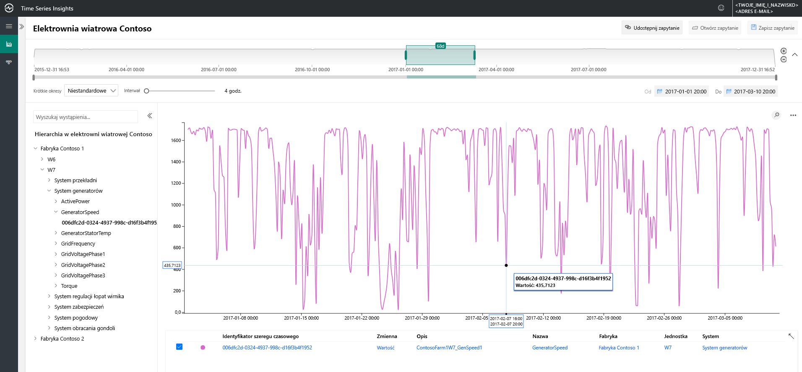
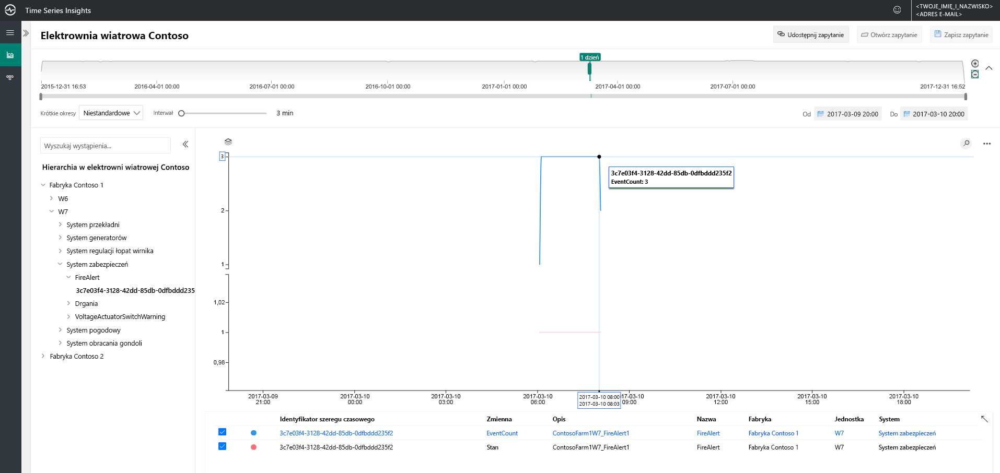
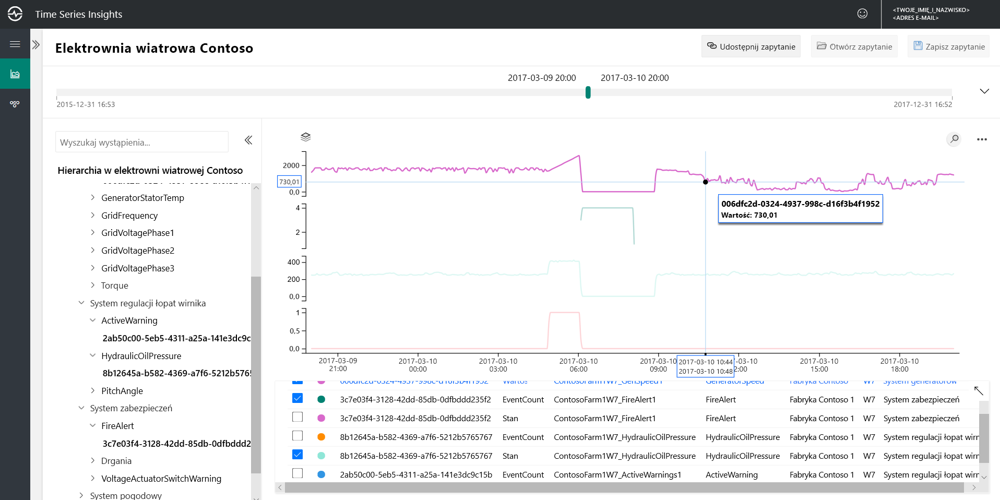
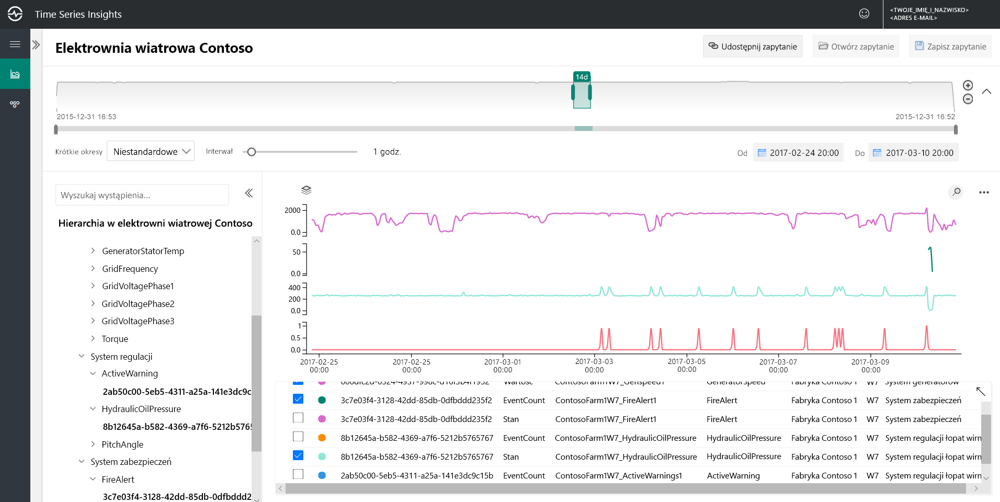
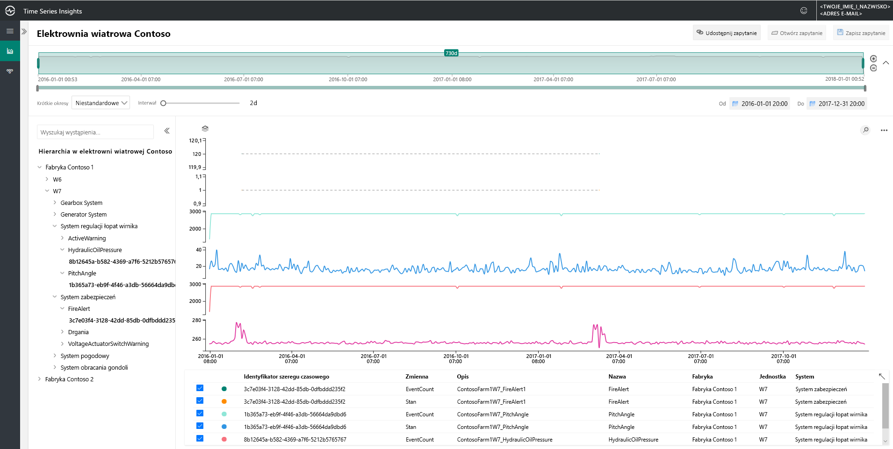
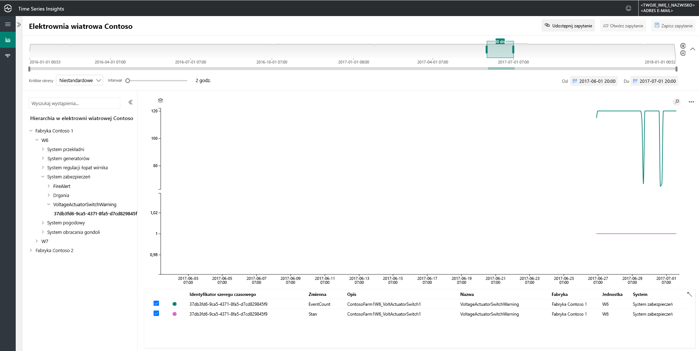
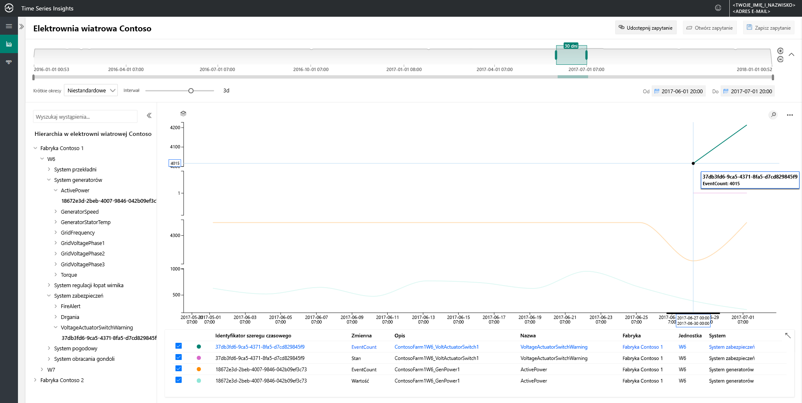
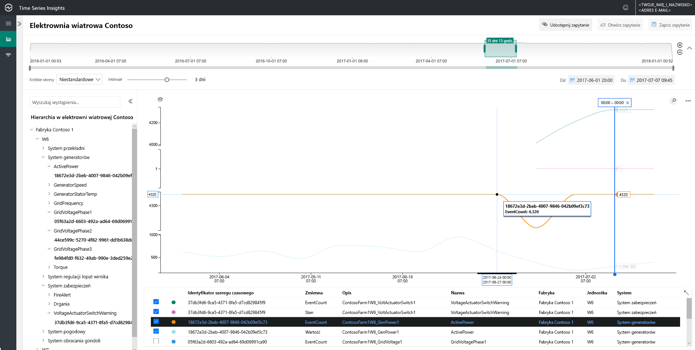
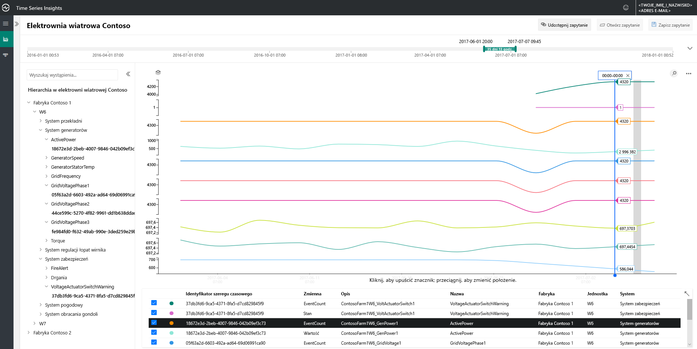

# Szybki start: Poznawanie środowiska pokazowego usługi Azure Time Series Insights w wersji zapoznawczej

Ten przewodnik Szybki Start umożliwia rozpoczęcie pracy z programem Azure Time Series Insights w wersji zapoznawczej. Bezpłatna wersja demonstracyjna zawiera najważniejsze funkcje, które zostały dodane do Time Series Insights wersji zapoznawczej.

Środowisko demonstracyjne w wersji zapoznawczej programu Time Series Insights zawiera firmę firmy Contoso, która działa w dwóch farmach z wiatru. Każda Farma ma 10 turbin. Każda turbina jest wyposażona w 20 czujników raportujących dane co minutę do usługi Azure IoT Hub. Czujniki zbierają informacje o warunkach pogodowych, skoku bloku i położeniu Yaw. Rejestrowane są również informacje na temat wydajności generatora, zachowania skrzyni biegów i monitorów bezpieczeństwa.

W tym przewodniku szybki start dowiesz się, jak używać Time Series Insights, aby znaleźć szczegółowe informacje umożliwiające podejmowanie działań w danych firmy Contoso. Przeprowadzamy również krótką analizę głównych przyczyn w celu lepszego przewidywania błędów krytycznych i przeprowadzenia konserwacji.

> [!IMPORTANT]
> Utwórz  [bezpłatne konto platformy Azure](https://azure.microsoft.com/free/?ref=microsoft.com&utm_source=microsoft.com&utm_medium=docs&utm_campaign=visualstudio), jeśli go nie masz.

## Poznawanie eksploratora usługi Time Series Insights w środowisku pokazowym

W Eksploratorze Time Series Insights w wersji zapoznawczej przedstawiono dane historyczne i główne przyczyny analizy. Aby rozpocząć pracę:

1. Przejdź do środowiska [demonstracyjnego farmy wiatrów firmy Contoso](https://insights.timeseries.azure.com/preview/samples) .  

1. Jeśli zostanie wyświetlony monit, zaloguj się do Eksploratora Time Series Insights przy użyciu poświadczeń konta platformy Azure.

## Pracuj z danymi historycznymi

1. W firmie **contoso 1**zapoznaj się z tematem wiatr turbin **W7**.  

   1. Zmień zakres widoku na **1/1/17 20:00 na 3/10/17 20:00 (UTC)** .
   1. Aby wybrać czujnik, wybierz pozycję **contoso roślina 1** > **W7** > **Generator system** > **GeneratorSpeed**. Następnie przejrzyj wyświetlane wartości.

      

1. Niedawno firma Contoso wykryła pożar w turbinie **W7**. Opinie różnią się w zależności od tego, co spowodowało pożar. W Time Series Insights widzimy, że czujnik alertów o zapłonie został aktywowany podczas uruchamiania.

   1. Zmień zakres widoku na **3/9/17 20:00 na 3/10/17 20:00 (UTC)** .
   1. Wybierz pozycję**FireAlert** **systemu** > bezpieczeństwa.

      

1. Zapoznaj się z innymi zdarzeniami w czasie działania, aby zrozumieć, co się stało. Wykorzystanie ropy naftowej i aktywne ostrzeżenia, które zostały wprowadzone tuż przed pożarem.

   1. Wybierz pozycję**HydraulicOilPressure** **system** > (gęstość).
   1. Wybierz pozycję**ActiveWarning** **system** > (gęstość).

      

1. Czujniki ropy naftowej i aktywne ostrzeżenia są napowietrzane bezpośrednio przed pożarem. Rozwiń wyświetlaną serię czasową, aby zobaczyć inne oznaki wskazujące na ogień. Obie czujniki zmieniają się w miarę upływu czasu. Wahania wskazują, że wzorzec trwały i worrisome.

    * Zmień zakres widoku na **2/24/17 20:00 na 3/10/17 20:00 (UTC)** .

      

1. Badanie dwóch lat danych historycznych ujawnia inne zdarzenie pożaru, które miało takie same wahania czujnika.

    * Zmień zakres widoku na **1/1/16 na 12/31/17** (wszystkie dane).

      

Korzystając z Time Series Insights i naszej telemetrii czujnika, wykryliśmy długoterminowy i problematyczny trend ukryty w danych historycznych. Dzięki tym nowym szczegółowym informacjom możemy:

* Wyjaśnij, co się stało.
* Rozwiąż problem.
* Umieść doskonałe systemy powiadomień o alertach.

## Analiza głównych przyczyn

1. Niektóre scenariusze wymagają zaawansowanej analizy, aby odkryć drobne wskazówki dotyczące danych. Wybierz Windmill **W6** w dniu **6/25**.

    1. Zmień zakres widoku na **6/1/17 20:00 na 7/1/17 20:00 (UTC)** .
    1. Wybierz **contoso roślina 1** > **W6** > **Safety system** > **VoltageActuatorSwitchWarning**.

       

1. To ostrzeżenie wskazuje na problem z napięciem wyjściowym generatora. Ogólne dane wyjściowe mocy generatora działają w ramach normalnych parametrów w bieżącym interwale. Przez zwiększenie naszego interwału okazuje się, że kolejny wzór zostanie spowodowany. Nieznaczny element docelowy jest oczywisty.

    1. Usuń czujnik **VoltageActuatorSwitchWarning** .
    1. Wybierz pozycję **Generator systemu** > **ActivePower**.
    1. Zmień interwał na **3D**.

       

1. Zwiększając zakres czasu, możemy określić, czy problem został zatrzymany, czy nadal.

    * Zwiększ przedział czasu do 60 dni.

      

1. Inne punkty danych czujników można dodać, aby zapewnić większy kontekst. Im więcej czujników jest wyświetlanych, tym pełniejsze zrozumienie problemu jest. Ustawmy znacznik, aby zobaczyć rzeczywiste wartości. 

    1. Wybierz pozycję **system generatora**, a następnie wybierz pozycję trzy czujniki: **GridVoltagePhase1**, **GridVoltagePhase2**i **GridVoltagePhase3**.
    1. Ustaw znacznik na ostatnim punkcie danych w widocznym obszarze.

       

    Dwie czujniki napięcia działają w sposób porównywalny i w ramach zwykłych parametrów. Wygląda na to, że czujnik **GridVoltagePhase3** jest przyczyna.

1. Po dodaniu wysoce kontekstowych danych, lista rozwijana fazy 3 pojawia się jeszcze bardziej, aby rozwiązać ten problem. Teraz mamy dobry lider w zakresie przyczyny ostrzeżenia. Jesteśmy gotowi do rozpatrzenia problemu z naszym zespołem obsługi.  

    * Zmień widok tak, aby wszystkie czujniki **systemu generatora** były nakładane na tę samą skalę wykresu.

      

## Oczyszczanie zasobów

Po ukończeniu samouczka Wyczyść utworzone zasoby:

1. W menu po lewej stronie w [Azure Portal](https://portal.azure.com)wybierz pozycję **wszystkie zasoby**, Znajdź Azure Time Series Insights grupę zasobów.
1. Usuń całą grupę zasobów (i wszystkie znajdujące się w niej zasoby), wybierając pozycję **Usuń** lub Usuń osobno każdy zasób.

## Następne kroki

Wszystko jest gotowe do utworzenia własnego środowiska Time Series Insights w wersji zapoznawczej. Aby rozpocząć:

> [!div class="nextstepaction"]
> [Planowanie środowiska usługi Time Series Insights w wersji zapoznawczej](time-series-insights-update-plan.md)

Dowiedz się, jak nawigować po demonstracji i jej funkcjach:

> [!div class="nextstepaction"]
> [Eksplorator Time Series Insights w wersji zapoznawczej](time-series-insights-update-explorer.md)
