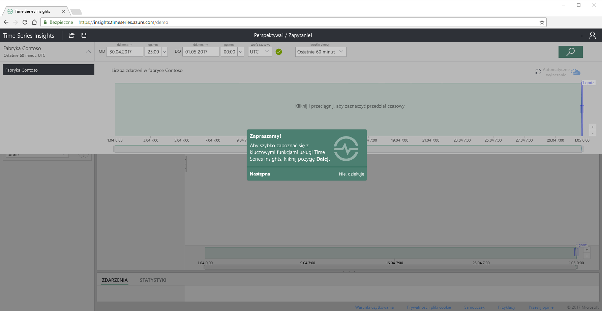
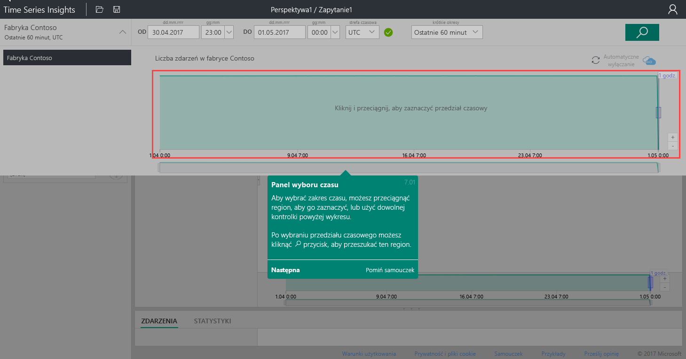
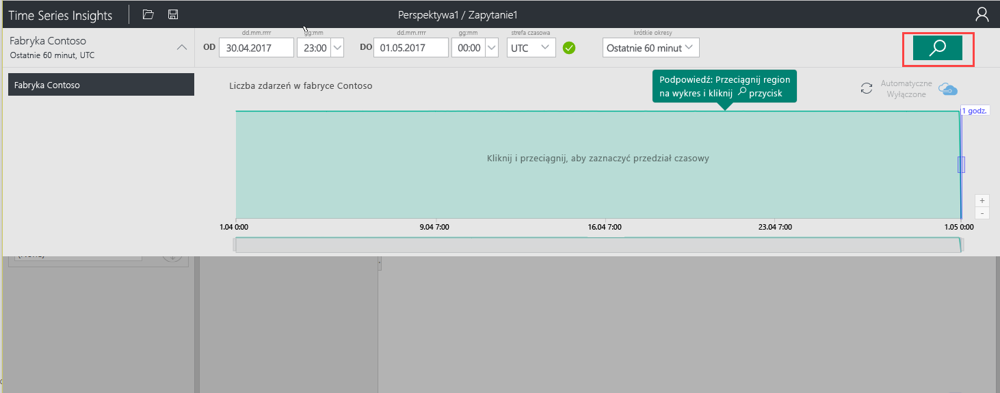
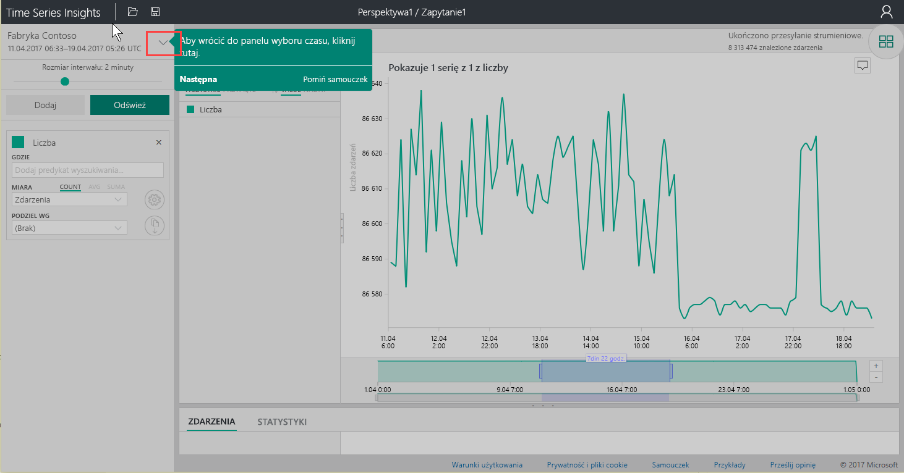
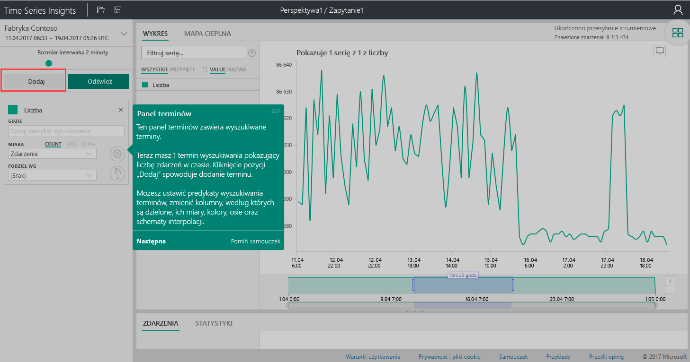
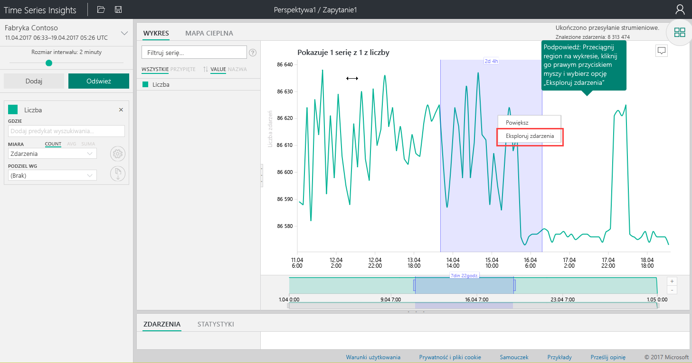
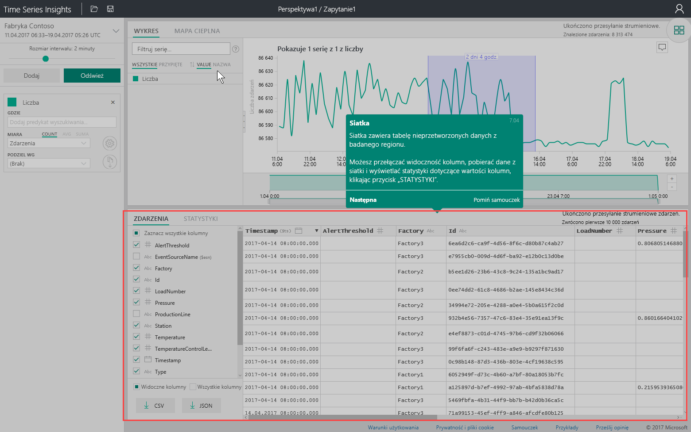
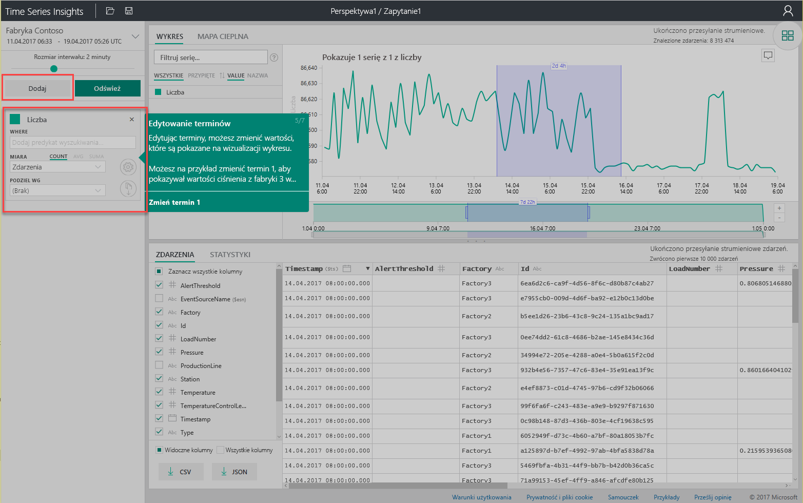
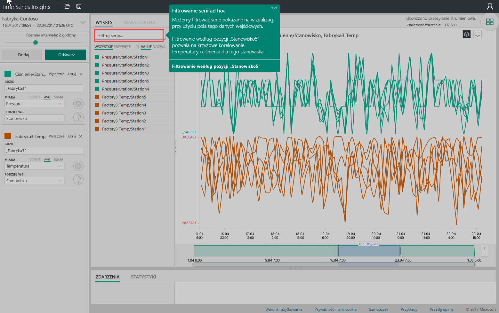

# Szybki start: poznawanie usługi Azure Time Series Insights

Ten Azure Time Series Insights przewodniku szybki start ułatwia rozpoczęcie pracy z usługą Time Series Insights w wolnym środowisku demonstracyjnym. W tym przewodniku szybki start dowiesz się, jak za pomocą przeglądarki sieci Web wizualizować duże ilości danych IoT i funkcji kluczowych przewodników, które są ogólnie dostępne.

Azure Time Series Insights to w pełni zarządzana usługa analizy, magazynu i wizualizacji, która upraszcza, jak eksplorować i analizować miliardy zdarzeń IoT jednocześnie. Zapewnia ona globalny widok danych, dzięki czemu możesz szybko zweryfikować swoje rozwiązanie IoT i uniknąć kosztownych przestojów w przypadku urządzeń o krytycznym znaczeniu. Azure Time Series Insights pomaga w odnajdywaniu ukrytych trendów, wykrytych anomalii i przeprowadzaniu analiz głównych przyczyn w czasie zbliżonym do rzeczywistego.

Aby uzyskać dodatkową elastyczność, można dodać Azure Time Series Insights do istniejącej aplikacji za pomocą jej zaawansowanych [interfejsów API REST](./time-series-insights-update-tsq.md) i [zestawu SDK klienta](https://github.com/microsoft/tsiclient). Za pomocą interfejsów API można przechowywać dane szeregów czasowych, wykonywać zapytania i korzystać z nich w wybranej aplikacji klienckiej. Można również użyć zestawu SDK klienta, aby dodać składniki interfejsu użytkownika do istniejącej aplikacji.

Ten przewodnik Szybki Start dla programu Time Series Insights Explorer oferuje funkcje, które są ogólnie dostępne.

> [!IMPORTANT]
> Utwórz [bezpłatne konto platformy Azure](https://azure.microsoft.com/free/?ref=microsoft.com&utm_source=microsoft.com&utm_medium=docs&utm_campaign=visualstudio) , jeśli jeszcze tego nie zrobiono.

## Przygotowanie środowiska demonstracyjnego

1. W przeglądarce przejdź do [głównej wersji demonstracyjnej](https://insights.timeseries.azure.com/demo).

1. Jeśli zostanie wyświetlony monit, zaloguj się do Eksploratora Time Series Insights przy użyciu poświadczeń konta platformy Azure.

1. Zostanie wyświetlona strona Time Series Insights Quick przewodnika. Wybierz pozycję **dalej** , aby rozpocząć szybkie samouczki.

   

## Eksplorowanie środowiska demonstracyjnego

1. Zostanie wyświetlony **panel wybór czasu** . Użyj tego panelu, aby wybrać przedział czasu do wizualizacji.

   [Panel wyboru](media/quickstart/quickstart2.png#lightbox)

1. Wybierz przedział czasu i przeciągnij go w regionie. Następnie wybierz pozycję **Wyszukaj**.

   

   Usługa Time Series Insights wyświetli wizualizację wykresu dla określonego przedziału czasu. Na wykresie liniowym można wykonywać różne czynności. Na przykład można filtrować, przypinać, sortować i stosu.

   Aby powrócić do **panelu wyboru czasu**, wybierz strzałkę w dół, jak pokazano:

   [Wykres](media/quickstart/quickstart4.png#lightbox)

1. Wybierz pozycję **Dodaj** na **panelu warunki** , aby dodać nowy termin wyszukiwania.

   

1. Na wykresie możesz wybrać region, kliknąć prawym przyciskiem myszy ten region i wybrać polecenie **Eksploruj zdarzenia**.

   

   Siatka danych pierwotnych jest wyświetlana w regionie, w którym jest przeprowadzana Eksplorowanie.

   [Widok siatki](media/quickstart/quickstart7.png#lightbox)

## Wybieranie i filtrowanie danych

1. Edytuj swoje warunki, aby zmienić wartości na wykresie. Dodaj kolejny termin, aby skorelować krzyżowo różne typy wartości.

   

1. Wprowadź termin filtru w polu **Seria filtru** dla filtrowania serii Improvised. Na potrzeby tego przewodnika Szybki start wprowadź termin **Station5** (Stacja5), aby skorelować temperaturę i ciśnienie dla tej stacji.

   [Seria filtru](media/quickstart/quickstart9.png#lightbox)

Po zakończeniu przewodnika Szybki start możesz poeksperymentować z zestawem danych przykładowych, aby tworzyć różne wizualizacje.

## Oczyszczanie zasobów

Po ukończeniu samouczka Wyczyść utworzone zasoby:

1. W menu po lewej stronie w [Azure Portal](https://portal.azure.com)wybierz pozycję **wszystkie zasoby**, Znajdź Azure Time Series Insights grupę zasobów.
1. Usuń całą grupę zasobów (i wszystkie znajdujące się w niej zasoby), wybierając pozycję **Usuń** lub Usuń osobno każdy zasób.

## Następne kroki

Wszystko jest gotowe do utworzenia własnego środowiska Time Series Insightsowego:
> [!div class="nextstepaction"]
> [Planowanie środowiska usługi Time Series Insights](time-series-insights-environment-planning.md)
