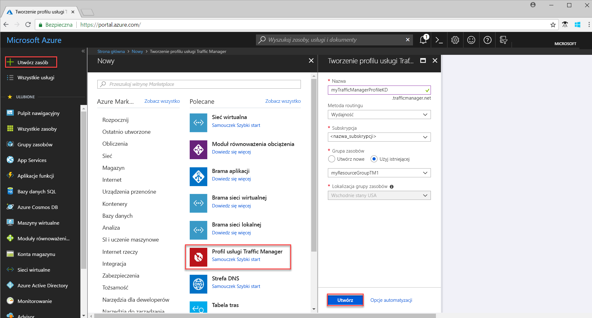
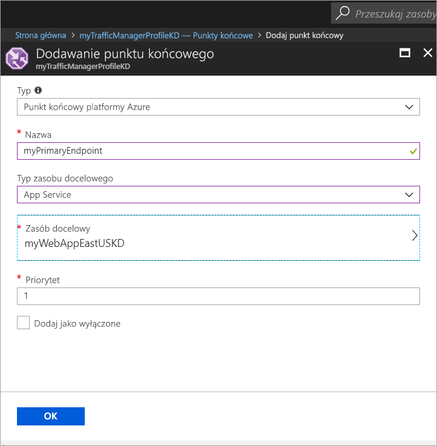

# Szybki start: tworzenie profilu usługi Traffic Manager dla aplikacji internetowej o wysokiej dostępności

W tym przewodniku Szybki start opisano tworzenie profilu usługi Traffic Manager, który zapewni wysoką dostępność aplikacji internetowej. 

Scenariusz opisany w tym przewodniku Szybki start uwzględnia dwa wystąpienia aplikacji internetowej działające w różnych regionach platformy Azure. Zostanie utworzony profil usługi Traffic Manager oparty na [priorytecie punktu końcowego](traffic-manager-routing-methods.md#priority), który ułatwi kierowanie ruchu użytkowników do podstawowej witryny z uruchomioną aplikacją. Usługa Traffic Manager stale monitoruje aplikację internetową i zapewnia automatyczne przełączanie do trybu failover w witrynie zapasowej, gdy witryna podstawowa jest niedostępna.

Jeśli nie masz subskrypcji platformy Azure, przed rozpoczęciem utwórz [bezpłatne konto](https://azure.microsoft.com/free/?WT.mc_id=A261C142F).

## Logowanie do platformy Azure 
Zaloguj się do witryny Azure Portal pod adresem https://portal.azure.com.

## Wymagania wstępne
Ten przewodnik Szybki Start wymaga wdrożenia dwóch wystąpień aplikacji internetowej działających w różnych regionach platformy Azure (*Wschodnie stany USA* i *Europa Zachodnia*). Te dwa wystąpienia aplikacji internetowej są używane jako podstawowy i zapasowy punkt końcowy dla usługi Traffic Manager.

1. W lewym górnym rogu ekranu wybierz pozycję **Utwórz zasób** > **Sieć Web** > **Aplikacja internetowa** > **Utwórz**.
2. W obszarze **Aplikacja internetowa** wprowadź lub wybierz poniższe informacje oraz wprowadź domyślne ustawienia tam, gdzie ustawienia nie są określone:

     | Ustawienie         | Wartość     |
     | ---              | ---  |
     | Name (Nazwa)           | Wprowadź unikatową nazwę aplikacji internetowej  |
     | Grupa zasobów          | Wybierz pozycję **Nowa**, a następnie wpisz *myResourceGroupTM1* |
     | Plan usługi App Service/lokalizacja         | Wybierz pozycję **Nowy**.  W obszarze Plan usługi App Service wprowadź *myAppServicePlanEastUS*, a następnie wybierz pozycję **OK**. 
     |      Lokalizacja  |   Wschodnie stany USA        |
    |||

3. Wybierz pozycję **Utwórz**.
4. Po pomyślnym wdrożeniu aplikacji internetowej zostanie utworzona domyślna witryna internetowa.
5. Powtórz kroki 1–3, aby utworzyć drugą witrynę internetową w innym regionie platformy Azure z następującymi ustawieniami:

     | Ustawienie         | Wartość     |
     | ---              | ---  |
     | Name (Nazwa)           | Wprowadź unikatową nazwę aplikacji internetowej  |
     | Grupa zasobów          | Wybierz pozycję **Nowa**, a następnie wpisz *myResourceGroupTM2* |
     | Plan usługi App Service/lokalizacja         | Wybierz pozycję **Nowy**.  W obszarze Plan usługi App Service wprowadź *myAppServicePlanWestEurope*, a następnie wybierz pozycję **OK**. 
     |      Lokalizacja  |   Europa Zachodnia      |
    |||

## Tworzenie profilu usługi Traffic Manager
Utwórz profil usługi Traffic Manager kierujący ruch użytkowników na podstawie priorytetu punktu końcowego.

1. W lewej górnej części ekranu wybierz pozycję **Utwórz zasób** > **Sieć** > **Profil usługi Traffic Manager** > **Utwórz**.
2. W obszarze **Tworzenie profilu usługi Traffic Manager** wprowadź lub wybierz poniższe informacje, zaakceptuj wartości domyślne pozostałych ustawień, a następnie wybierz pozycję **Utwórz**:
    
    | Ustawienie                 | Wartość                                              |
    | ---                     | ---                                                |
    | Name (Nazwa)                   | Ta nazwa musi być unikatowa w obrębie strefy trafficmanager.net. Na jej podstawie zostanie utworzona nazwa DNS (**trafficmanager.net**) służąca do uzyskiwania dostępu do profilu usługi Traffic Manager.|
    | Metoda routingu          | Wybierz metodę routingu **Priorytet**.|
    | Subskrypcja            | Wybierz subskrypcję.|
    | Grupa zasobów          | Wybierz pozycję **Istniejąca** i wybierz grupę *myResourceGroupTM1*.|
    |Lokalizacja |To ustawienie dotyczy lokalizacji grupy zasobów i nie ma wpływu na profil usługi Traffic Manager, który będzie wdrażany globalnie.|
    |||
    
    
   

## Dodawanie punktów końcowych usługi Traffic Manager

Dodaj witrynę internetową w regionie *Wschodnie stany USA* jako podstawowy punkt końcowy w celu kierowania całego ruchu użytkowników. Dodaj witrynę internetową w regionie *Europa Zachodnia* jako zapasowy punkt końcowy. Gdy podstawowy punkt końcowy będzie niedostępny, ruch będzie automatycznie kierowany do pomocniczego punktu końcowego.

1. Na pasku wyszukiwania portalu wyszukaj nazwę profilu usługi Traffic Manager, który został utworzony w poprzedniej sekcji, a następnie wybierz ten profil w wyświetlonych wynikach.
2. W obszarze **Profil usługi Traffic Manager** w sekcji **Ustawienia** kliknij pozycję **Punkty końcowe**, a następnie kliknij pozycję **Dodaj**.
3. Wprowadź lub wybierz poniższe informacje, zaakceptuj wartości domyślne pozostałych ustawień, a następnie wybierz przycisk **OK**:

    | Ustawienie                 | Wartość                                              |
    | ---                     | ---                                                |
    | Typ                    | Punkt końcowy platformy Azure                                   |
    | Name (Nazwa)           | myPrimaryEndpoint                                        |
    | Typ zasobu docelowego           | App Service                          |
    | Zasób docelowy          | **Wybierz usługę aplikacji**, aby wyświetlić listę aplikacji internetowych w tej samej subskrypcji. W obszarze **Zasoby** wybierz usługę aplikacji, którą chcesz dodać jako pierwszy punkt końcowy. |
    | Priorytet               | Wybierz pozycję **1**. Spowoduje to kierowanie całego ruchu do tego punktu końcowego, jeśli jest on w dobrej kondycji.    |
    
4. Powtórz kroki 2 i 3 dla następnego punktu końcowego aplikacji internetowej. Dla tego punktu końcowego ustaw opcję **Priorytet** na wartość **2**.
5.  Po zakończeniu dodawania obu punktów końcowych będą one wyświetlane w obszarze **Profil usługi Traffic Manager** ze stanem monitorowania **Online**.

    

## Testowanie profilu usługi Traffic Manager
W tej sekcji najpierw ustalisz nazwę domeny profilu usługi Traffic Manager, a następnie zobaczysz, jak usługa Traffic Manager zapewnia przełączanie do trybu failover w pomocniczym punkcie końcowym, gdy podstawowy punkt końcowy jest niedostępny.
### Ustalanie nazwy DNS
1.  Na pasku wyszukiwania portalu wyszukaj nazwę **profilu usługi Traffic Manager**, który został utworzony w poprzedniej sekcji. W wyświetlonych wynikach kliknij profil usługi Traffic Manager.
2. Kliknij pozycję **Przegląd**.
3. W obszarze **Profil usługi Traffic Manager** zostanie wyświetlona nazwa DNS nowo utworzonego profilu usługi Traffic Manager.
  
   

### Wyświetlanie informacji o działaniu usługi Traffic Manager

1. W przeglądarce sieci Web wpisz nazwę DNS profilu usługi Traffic Manager, aby wyświetlić domyślną witrynę internetową aplikacji internetowej. W tym scenariuszu Szybki start wszystkie żądania są kierowane do podstawowego punktu końcowego, dla którego jest ustawiona opcja **Priorytet 1**.

2. Aby zobaczyć, jak działa przełączanie do trybu failover w usłudze Traffic Manager, wyłącz witrynę podstawową w następujący sposób:
    1. Na stronie profilu usługi Traffic Manager wybierz pozycję **Ustawienia**>**Punkty końcowe**>*MyPrimaryEndpoint*.
    2. W obszarze *MyPrimaryEndpoint* wybierz pozycję **Wyłączony**. 
    3. Stan podstawowego punktu końcowego *MyPrimaryEndpoint* będzie teraz wyświetlany jako **Wyłączony**.
3. Skopiuj nazwę DNS profilu usługi Traffic Manager z poprzedniego kroku, aby pomyślnie wyświetlić witrynę internetową w przeglądarce sieci Web. Po wyłączeniu podstawowego punktu końcowego ruch użytkowników jest kierowany do pomocniczego punktu końcowego.

## Oczyszczanie zasobów
Gdy grupy zasobów, aplikacje internetowe i wszystkie pokrewne zasoby nie będą już potrzebne, usuń je. Aby to zrobić, wybierz grupy zasobów (*myResourceGroupTM1* i *myResourceGroupTM2*) i kliknij pozycję **Usuń**.

## Następne kroki
W tym przewodniku Szybki Start został utworzony profil usługi Traffic Manager, który pozwala kierować ruch użytkowników dla aplikacji internetowej o wysokiej dostępności. Aby dowiedzieć się więcej o kierowaniu ruchu, przejdź do samouczków usługi Traffic Manager.

> [!div class="nextstepaction"]
> [Samouczki usługi Traffic Manager](tutorial-traffic-manager-improve-website-response.md)

