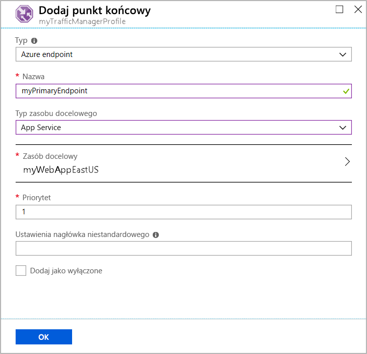
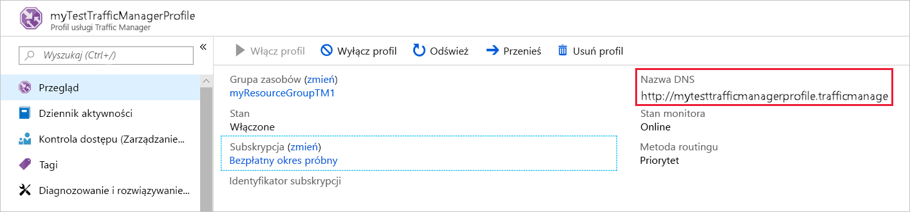
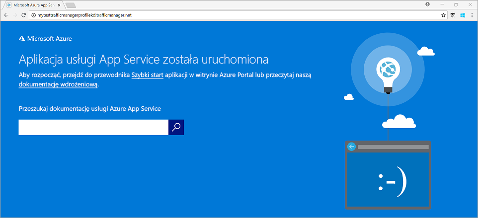

# Szybki start: Tworzenie profilu Traffic Manager przy użyciu Azure Portal

W tym przewodniku Szybki start opisano tworzenie profilu usługi Traffic Manager, który zapewni wysoką dostępność aplikacji internetowej.

W tym przewodniku Szybki start przeczytasz o dwóch wystąpieniach aplikacji internetowej. Każde z nich jest uruchamiane w innym regionie świadczenia usługi Azure. Utworzysz profil usługi Traffic Manager na podstawie [priorytetu punktu końcowego](traffic-manager-routing-methods.md#priority). Profil kieruje ruch użytkowników do lokacji głównej, w której działa aplikacja internetowa. Usługa Traffic Manager stale monitoruje aplikację internetową. Jeśli lokacja główna jest niedostępna, usługa zapewnia automatyczne przejście w tryb failover w lokacji zapasowej.

Jeśli nie masz subskrypcji platformy Azure, utwórz teraz [bezpłatne konto](https://azure.microsoft.com/free/?WT.mc_id=A261C142F).

## Logowanie do platformy Azure

Zaloguj się w witrynie [Azure Portal](https://portal.azure.com).

## Wymagania wstępne

W tym przewodniku Szybki start będą potrzebne dwa wystąpienia aplikacji internetowej wdrożone w dwóch różnych regionach świadczenia usługi Azure (*Wschodnie stany USA* i *Europa Zachodnia*). Każda będzie służyć jako podstawowy punkt końcowy i punkt końcowy trybu failover dla usługi Traffic Manager.

1. W lewej górnej części ekranu wybierz pozycję **Utwórz zasób** > **Sieć Web** > **Aplikacja internetowa**.

1. W obszarze **Tworzenie aplikacji sieci Web**wpisz lub wybierz następujące wartości z karty **podstawowe** :

   - **Subskrypcja** > **Grupa zasobów**: Wybierz pozycję **Utwórz nowy** , a następnie wpisz **myResourceGroupTM1**.
   -  > **Nazwa**szczegółów wystąpienia: Wpisz *myWebAppEastUS*.
   - **Szczegóły wystąpienia —** **publikowanie:**  >  Wybierz pozycję **kod**.
   -  > **Stos środowiska uruchomieniowego**szczegółów wystąpienia: Wybierz **ASP.NET v 4.7**
   -  > **System operacyjny**szczegółów wystąpienia: Wybierz pozycję **Windows**.
   -  > **Region**szczegółów wystąpienia:  Wybierz pozycję **Wschodnie stany USA**.
   - Plan Windows plan App Service **(Wschodnie stany USA):**  >  Wybierz pozycję **Utwórz nowy** , a następnie wpisz **myAppServicePlanEastUS**
   - **App Service planowanej** > **jednostki SKU i rozmiaru**: Wybierz pozycję **standardowa S1**.
   
3. Wybierz kartę **monitorowanie** lub wybierz pozycję **Dalej: monitorowanie**.  W obszarze **monitorowanie**Ustaw **Application Insights** > **Włącz Application Insights** na wartość **nie**.

4. Wybierz pozycję **Przejrzyj i Utwórz**

5. Przejrzyj ustawienia, a następnie kliknij przycisk **Utwórz**.  Po pomyślnym wdrożeniu aplikacji internetowej zostanie utworzona domyślna witryna internetowa.

6. Postępuj zgodnie z instrukcjami, aby utworzyć drugą aplikację sieci Web o nazwie *myWebAppWestEurope*, z nazwą **grupy zasobów** *MyResourceGroupTM2*, **regionem** *Europa Zachodnia*, **App Service nazwą planu**  **myAppServicePlanWestEurope**i wszystkie inne ustawienia takie same jak *myWebAppEastUS*.

## Tworzenie profilu usługi Traffic Manager

Utwórz profil usługi Traffic Manager kierujący ruch użytkowników na podstawie priorytetu punktu końcowego.

1. W lewej górnej części ekranu wybierz pozycję **Utwórz zasób** > **Sieć** > **Profil usługi Traffic Manager**.
2. W sekcji **Tworzenie profilu usługi Traffic Manager** wprowadź lub wybierz następujące ustawienia:

    | Ustawienie | Wartość |
    | --------| ----- |
    | Name (Nazwa) | Wprowadź unikatową nazwę profilu usługi Traffic Manager.|
    | Metoda routingu | Wybierz pozycję **Priorytet**.|
    | Subskrypcja | Wybierz subskrypcję, do której ma należeć profil usługi Traffic Manager. |
    | Grupa zasobów | Wybierz pozycję *myResourceGroupTM1*.|
    | Lokalizacja |To ustawienie dotyczy lokalizacji grupy zasobów. Nie ma ono wpływu na profil usługi Traffic Manager, który zostanie wdrożony globalnie.|

3. Wybierz pozycję **Utwórz**.

## Dodawanie punktów końcowych usługi Traffic Manager

Dodaj witrynę internetową w regionie *Wschodnie stany USA* jako podstawowy punkt końcowy w celu kierowania całego ruchu użytkowników. Dodaj witrynę internetową w regionie *Europa Zachodnia* jako punkt końcowy trybu failover. Gdy podstawowy punkt końcowy będzie niedostępny, ruch będzie automatycznie kierowany do punktu końcowego trybu failover.

1. Na pasku wyszukiwania portalu wprowadź nazwę profilu usługi Traffic Manager, który został utworzony w poprzedniej sekcji.
2. Wybierz profil w wynikach wyszukiwania.
3. W bloku **Profil usługi Traffic Manager** w sekcji **Ustawienia** wybierz pozycję **Punkty końcowe**, a następnie wybierz pozycję **Dodaj**.
4. Wprowadź lub wybierz następujące ustawienia:

    | Ustawienie | Wartość |
    | ------- | ------|
    | Typ | Wybierz pozycję **Punkt końcowy platformy Azure**. |
    | Name (Nazwa) | Wprowadź nazwę *myPrimaryEndpoint*. |
    | Typ zasobu docelowego | Wybierz usługę **App Service**. |
    | Zasób docelowy | Wybierz pozycję **Wybierz usługę aplikacji** > **Wschodnie stany USA**. |
    | Priorytet | Wybierz pozycję **1**. Cały ruch jest kierowany do tego punktu końcowego, gdy jest on w dobrej kondycji. |

    

5. Kliknij przycisk **OK**.
6. Aby utworzyć punkt końcowy trybu failover dla drugiego regionu świadczenia usługi Azure, powtórz kroki 3 i 4 przy użyciu tych ustawień:

    | Ustawienie | Wartość |
    | ------- | ------|
    | Typ | Wybierz pozycję **Punkt końcowy platformy Azure**. |
    | Name (Nazwa) | Wprowadź nazwę *myFailoverEndpoint*. |
    | Typ zasobu docelowego | Wybierz usługę **App Service**. |
    | Zasób docelowy | Wybierz pozycję **Wybierz usługę aplikacji** > **Europa Zachodnia**. |
    | Priorytet | Wybierz wartość **2**. Cały ruch jest kierowany do tego punktu końcowego trybu failover, jeśli podstawowy punkt końcowy jest w złej kondycji. |

7. Kliknij przycisk **OK**.

Po zakończeniu dodawania tych dwóch punktów końcowych zostaną one wyświetlone w obszarze **Profil usługi Traffic Manager**. Zauważ, że ich stan monitorowania ma teraz wartość **Online**.

## Testowanie profilu usługi Traffic Manager

W tej sekcji sprawdzisz nazwę domeny profilu usługi Traffic Manager. Skonfigurujesz również podstawowy punkt końcowy tak, aby był niedostępny. Na końcu zobaczysz, że aplikacja internetowa jest nadal dostępna. Dzieje się tak, ponieważ usługa Traffic Manager wysyła ruch do punktu końcowego trybu failover.

### Sprawdzanie nazwy DNS

1. Na pasku wyszukiwania portalu wyszukaj nazwę **profilu usługi Traffic Manager**, który został utworzony w poprzedniej sekcji.
2. Wybierz profil usługi Traffic Manager. Zostanie wyświetlona strona **Przegląd**.
3. W obszarze **Profil usługi Traffic Manager** zostanie wyświetlona nazwa DNS nowo utworzonego profilu usługi Traffic Manager.
  
   

### Wyświetlanie informacji o działaniu usługi Traffic Manager

1. W przeglądarce internetowej wprowadź nazwę DNS profilu usługi Traffic Manager, aby wyświetlić domyślną witrynę internetową aplikacji internetowej.

    > [!NOTE]
    > W tym scenariuszu Szybki start wszystkie żądania są kierowane do podstawowego punktu końcowego. Jest on ustawiony na wartość **Priorytet 1**.

    

2. Aby zobaczyć, jak działa przełączanie do trybu failover w usłudze Traffic Manager, wyłącz lokację główną:
    1. Na stronie profilu usługi Traffic Manager w sekcji **Przegląd** wybierz pozycję **myPrimaryEndpoint**.
    2. W obszarze *myPrimaryEndpoint* wybierz pozycję **Wyłączone** > **Zapisz**.
    3. Zamknij okno **myPrimaryEndpoint**. Zwróć uwagę, że teraz stan ma wartość **Wyłączone**.
3. Skopiuj nazwę DNS profilu usługi Traffic Manager z poprzedniego kroku, aby wyświetlić witrynę internetową w nowej sesji przeglądarki internetowej.
4. Sprawdź, czy aplikacja internetowa jest nadal dostępna.

Podstawowy punkt końcowy nie jest dostępny, dlatego nastąpiło przekierowanie do punktu końcowego trybu failover.

## Oczyszczanie zasobów

Gdy skończysz pracę, usuń grupy zasobów, aplikacje internetowe i wszystkie powiązane zasoby. Aby to zrobić, wybierz poszczególne elementy na pulpicie nawigacyjnym i wybierz pozycję **Usuń** u góry każdej strony.

## Następne kroki

W tym przewodniku Szybki start utworzono profil usługi Traffic Manager. Pozwala on na kierowanie ruchu użytkowników dla aplikacji internetowej o wysokiej dostępności. Aby dowiedzieć się więcej o kierowaniu ruchu, przejdź do samouczków usługi Traffic Manager.

> [!div class="nextstepaction"]
> [Samouczki usługi Traffic Manager](tutorial-traffic-manager-improve-website-response.md)
