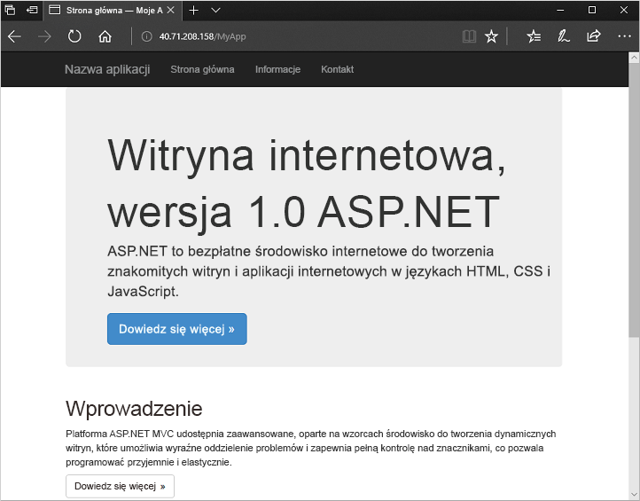

# <a name="quickstart-create-a-virtual-machine-scale-set-with-azure-powershell"></a>Szybki start: tworzenie zestawu skalowania maszyn wirtualnych przy użyciu programu Azure PowerShell


Zestaw skalowania maszyn wirtualnych umożliwia wdrożenie zestawu identycznych, automatycznie skalowanych maszyn wirtualnych, oraz zarządzanie nimi. Maszyny wirtualne w zestawie skalowania możesz skalować ręcznie lub możesz zdefiniować reguły skalowania automatycznego na podstawie użycia takich zasobów jak procesor CPU, zapotrzebowanie na pamięć lub ruch sieciowy. Moduł równoważenia obciążenia platformy Azure następnie dystrybuuje ruch do wystąpień maszyn wirtualnych w zestawie skalowania. W tym przewodniku Szybki start utworzysz zestaw skalowania maszyn wirtualnych i wdrożysz przykładową aplikację przy użyciu programu Azure PowerShell.

Jeśli nie masz subskrypcji platformy Azure, przed rozpoczęciem utwórz [bezpłatne konto](https://azure.microsoft.com/free/?WT.mc_id=A261C142F).

[!INCLUDE [cloud-shell-try-it.md](../../includes/cloud-shell-try-it.md)]


## <a name="create-a-scale-set"></a>Tworzenie zestawu skalowania
Utwórz zestaw skalowania maszyn wirtualnych przy użyciu polecenia [New-AzVmss](/powershell/module/az.compute/new-azvmss). W poniższym przykładzie pokazano tworzenie zestawu skalowania o nazwie *myScaleSet*, używającego obrazu platformy systemu *Windows Server 2016 Datacenter*. Zasoby sieciowe platformy Azure dla sieci wirtualnej, publiczny adres IP i moduł równoważenia obciążenia są tworzone automatycznie. Po wyświetleniu monitu możesz podać własne odpowiednie poświadczenia administracyjne dla wystąpień maszyn wirtualnych w zestawie skalowania:

```azurepowershell-interactive
New-AzVmss `
  -ResourceGroupName "myResourceGroup" `
  -Location "EastUS" `
  -VMScaleSetName "myScaleSet" `
  -VirtualNetworkName "myVnet" `
  -SubnetName "mySubnet" `
  -PublicIpAddressName "myPublicIPAddress" `
  -LoadBalancerName "myLoadBalancer" `
  -UpgradePolicyMode "Automatic"
```

Utworzenie i skonfigurowanie wszystkich zasobów zestawu skalowania i maszyn wirtualnych trwa kilka minut.


## <a name="deploy-sample-application"></a>Wdrażanie przykładowej aplikacji
Aby przetestować zestaw skalowania, należy zainstalować podstawową aplikację internetową. Niestandardowe rozszerzenie skryptu platformy Azure służy do pobierania i uruchamiania skryptu, który instaluje usługi IIS na wystąpieniach maszyn wirtualnych. To rozszerzenie jest przydatne w przypadku konfiguracji po wdrożeniu, instalowania oprogramowania lub każdego innego zadania związanego z konfiguracją lub zarządzaniem. Aby uzyskać więcej informacji, zobacz [Omówienie niestandardowego rozszerzenia skryptu](../virtual-machines/windows/extensions-customscript.md).

Użyj niestandardowego rozszerzenia skryptu, aby zainstalować podstawowy serwer internetowy usług IIS. Zastosuj niestandardowe rozszerzenie skryptu, które instaluje usługi IIS, w następujący sposób:

```azurepowershell-interactive
# Define the script for your Custom Script Extension to run
$publicSettings = @{
    "fileUris" = (,"https://raw.githubusercontent.com/Azure-Samples/compute-automation-configurations/master/automate-iis.ps1");
    "commandToExecute" = "powershell -ExecutionPolicy Unrestricted -File automate-iis.ps1"
}

# Get information about the scale set
$vmss = Get-AzVmss `
            -ResourceGroupName "myResourceGroup" `
            -VMScaleSetName "myScaleSet"

# Use Custom Script Extension to install IIS and configure basic website
Add-AzVmssExtension -VirtualMachineScaleSet $vmss `
    -Name "customScript" `
    -Publisher "Microsoft.Compute" `
    -Type "CustomScriptExtension" `
    -TypeHandlerVersion 1.8 `
    -Setting $publicSettings

# Update the scale set and apply the Custom Script Extension to the VM instances
Update-AzVmss `
    -ResourceGroupName "myResourceGroup" `
    -Name "myScaleSet" `
    -VirtualMachineScaleSet $vmss
```

## <a name="allow-traffic-to-application"></a>Zezwalanie na ruch do aplikacji

 Aby zezwolić na dostęp do podstawowej aplikacji internetowej, utwórz sieciową grupę zabezpieczeń za pomocą poleceń [New-AzNetworkSecurityRuleConfig](/powershell/module/az.network/new-aznetworksecurityruleconfig) i [New-AzNetworkSecurityGroup](/powershell/module/az.network/new-aznetworksecuritygroup). Aby uzyskać więcej informacji, zobacz [Obsługa sieci w kontekście zestawów skalowania maszyn wirtualnych platformy Azure](virtual-machine-scale-sets-networking.md).

 ```azurepowershell-interactive
 # Get information about the scale set
 $vmss = Get-AzVmss `
             -ResourceGroupName "myResourceGroup" `
             -VMScaleSetName "myScaleSet"

 #Create a rule to allow traffic over port 80
 $nsgFrontendRule = New-AzNetworkSecurityRuleConfig `
   -Name myFrontendNSGRule `
   -Protocol Tcp `
   -Direction Inbound `
   -Priority 200 `
   -SourceAddressPrefix * `
   -SourcePortRange * `
   -DestinationAddressPrefix * `
   -DestinationPortRange 80 `
   -Access Allow

 #Create a network security group and associate it with the rule
 $nsgFrontend = New-AzNetworkSecurityGroup `
   -ResourceGroupName  "myResourceGroup" `
   -Location EastUS `
   -Name myFrontendNSG `
   -SecurityRules $nsgFrontendRule

 $vnet = Get-AzVirtualNetwork `
   -ResourceGroupName  "myResourceGroup" `
   -Name myVnet

 $frontendSubnet = $vnet.Subnets[0]

 $frontendSubnetConfig = Set-AzVirtualNetworkSubnetConfig `
   -VirtualNetwork $vnet `
   -Name mySubnet `
   -AddressPrefix $frontendSubnet.AddressPrefix `
   -NetworkSecurityGroup $nsgFrontend

 Set-AzVirtualNetwork -VirtualNetwork $vnet

 # Update the scale set and apply the Custom Script Extension to the VM instances
 Update-AzVmss `
     -ResourceGroupName "myResourceGroup" `
     -Name "myScaleSet" `
     -VirtualMachineScaleSet $vmss
 ```

## <a name="test-your-scale-set"></a>Testowanie zestawu skalowania
Aby zapoznać się z działaniem zestawu skalowania, uzyskaj dostęp do przykładowej aplikacji internetowej w przeglądarce internetowej. Uzyskaj publiczny adres IP modułu równoważenia obciążenia za pomocą polecenia [Get-AzPublicIpAddress](/powershell/module/az.network/get-azpublicipaddress). W poniższym przykładzie pokazano wyświetlanie adresu IP utworzonego w grupie zasobów *myResourceGroup*:

```azurepowershell-interactive
Get-AzPublicIpAddress -ResourceGroupName "myResourceGroup" | Select IpAddress
```

Wprowadź publiczny adres IP modułu równoważenia obciążenia w przeglądarce internetowej. Moduł równoważenia obciążenia kieruje ruch do jednego z wystąpień maszyn wirtualnych, jak pokazano w poniższym przykładzie:




## <a name="clean-up-resources"></a>Oczyszczanie zasobów
Gdy grupa zasobów, zestaw skalowania i wszystkie pokrewne zasoby nie będą już potrzebne, można je usunąć za pomocą polecenia [Remove-AzResourceGroup](/powershell/module/az.resources/remove-azresourcegroup) w następujący sposób. Parametr `-Force` potwierdza, że chcesz usunąć zasoby bez wyświetlania dodatkowego monitu. Parametr `-AsJob` zwraca kontrolę do wiersza polecenia bez oczekiwania na zakończenie operacji.

```azurepowershell-interactive
Remove-AzResourceGroup -Name "myResourceGroup" -Force -AsJob
```


## <a name="next-steps"></a>Kolejne kroki
W tym przewodniku Szybki start utworzyliśmy podstawowy zestaw skalowania i użyliśmy niestandardowego rozszerzenia skryptu w celu zainstalowania podstawowego serwera internetowego usług IIS na wystąpieniach maszyn wirtualnych. Aby dowiedzieć się więcej, przejdź do samouczka dotyczącego sposobu tworzenia zestawów skalowania maszyn wirtualnych platformy Azure i zarządzania nimi.

> [!div class="nextstepaction"]
> [Tworzenie zestawów skalowania maszyn wirtualnych platformy Azure i zarządzanie nimi](tutorial-create-and-manage-powershell.md)
