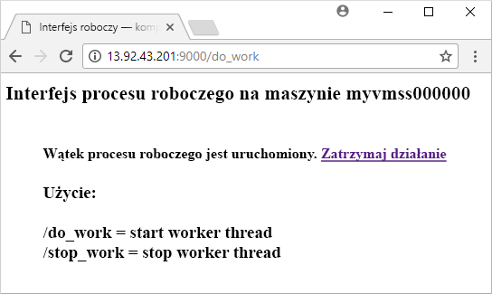

# <a name="quickstart-create-a-linux-virtual-machine-scale-set-with-an-azure-template"></a>Szybki start: tworzenie zestawu skalowania maszyn wirtualnych z systemem Linux przy użyciu szablonu platformy Azure
Zestaw skalowania maszyn wirtualnych umożliwia wdrożenie zestawu identycznych, automatycznie skalowanych maszyn wirtualnych, oraz zarządzanie nimi. Maszyny wirtualne w zestawie skalowania możesz skalować ręcznie lub możesz zdefiniować reguły skalowania automatycznego na podstawie użycia takich zasobów jak procesor CPU, zapotrzebowanie na pamięć lub ruch sieciowy. Moduł równoważenia obciążenia platformy Azure następnie dystrybuuje ruch do wystąpień maszyn wirtualnych w zestawie skalowania. W tym przewodniku Szybki start utworzysz zestaw skalowania maszyn wirtualnych i wdrożysz przykładową aplikację przy użyciu szablonu usługi Azure Resource Manager.

Jeśli nie masz subskrypcji platformy Azure, utwórz [bezpłatne konto](https://azure.microsoft.com/free/?WT.mc_id=A261C142F) przed rozpoczęciem.

[!INCLUDE [cloud-shell-try-it.md](../../includes/cloud-shell-try-it.md)]

Jeśli zdecydujesz się zainstalować interfejs wiersza polecenia i korzystać z niego lokalnie, ten samouczek będzie wymagał interfejsu wiersza polecenia platformy Azure w wersji 2.0.29 lub nowszej. Uruchom polecenie `az --version`, aby dowiedzieć się, jaka wersja jest używana. Jeśli konieczna będzie instalacja lub uaktualnienie, zobacz [Instalowanie interfejsu wiersza polecenia platformy Azure]( /cli/azure/install-azure-cli).


## <a name="define-a-scale-set-in-a-template"></a>Definiowanie zestawu skalowania w szablonie
Szablony usługi Azure Resource Manager umożliwiają wdrażanie grup powiązanych zasobów. Szablony są pisane w formacie JavaScript Object Notation (JSON) i określają środowisko całej infrastruktury platformy Azure dla aplikacji. W jednym szablonie można utworzyć zestaw skalowania maszyn wirtualnych, zainstalować aplikacje i skonfigurować reguły automatycznego skalowania. Korzystając ze zmiennych i parametrów, można ponownie użyć tego szablonu, aby zaktualizować istniejące zestawy skalowania lub utworzyć dodatkowe. Szablony można wdrażać za pośrednictwem witryny Azure Portal, interfejsu wiersza polecenia platformy Azure lub programu Azure PowerShell bądź z poziomu potoków ciągłej integracji/ciągłego dostarczania (CI/CD).

Więcej informacji dotyczących szablonów można znaleźć w temacie [Omówienie usługi Azure Resource Manager](https://docs.microsoft.com/azure/azure-resource-manager/template-deployment-overview#template-deployment-process). Aby poznać składnię JSON i właściwości, zobacz odwołanie do szablonu [Microsoft.Compute/virtualMachineScaleSets](/azure/templates/microsoft.compute/virtualmachinescalesets).

Aby utworzyć skalę przy użyciu szablonu, należy zdefiniować odpowiednie zasoby. Podstawowe elementy typu zasobu zestawu skalowania maszyn wirtualnych są następujące:

| Właściwość                     | Opis właściwości                                  | Przykładowa wartość szablonu                    |
|------------------------------|----------------------------------------------------------|-------------------------------------------|
| type                         | Typ zasobu platformy Azure do utworzenia                            | Microsoft.Compute/virtualMachineScaleSets |
| name                         | Nazwa zestawu skalowania                                       | myScaleSet                                |
| location                     | Lokalizacja utworzenia zestawu skalowania                     | Wschodnie stany USA                                   |
| sku.name                     | Rozmiar maszyny wirtualnej dla każdego wystąpienia zestawu skalowania                  | Standardowa_A1                               |
| sku.capacity                 | Liczba wystąpień maszyn wirtualnych do początkowego utworzenia           | 2                                         |
| upgradePolicy.mode           | Tryb uaktualniania wystąpienia maszyny wirtualnej w przypadku wprowadzenia zmian              | Automatyczny                                 |
| imageReference               | Platforma lub obraz niestandardowy do użycia na potrzeby wystąpień maszyn wirtualnych | Canonical Ubuntu Server 16.04-LTS         |
| osProfile.computerNamePrefix | Prefiks nazwy dla każdego wystąpienia maszyny wirtualnej                     | myvmss                                    |
| osProfile.adminUsername      | Nazwa użytkownika dla każdego wystąpienia maszyny wirtualnej                        | użytkownik_azure                                 |
| osProfile.adminPassword      | Hasło dla każdego wystąpienia maszyny wirtualnej                        | P@ssw0rd!                                 |

 W poniższym przykładzie przedstawiono definicję podstawowych zasobów zestawu skalowania. Aby dostosować szablon zestawu skalowania, można zmienić rozmiar maszyny wirtualnej lub pojemność początkową bądź użyć innej platformy albo obrazu niestandardowego.

```json
{
  "type": "Microsoft.Compute/virtualMachineScaleSets",
  "name": "myScaleSet",
  "location": "East US",
  "apiVersion": "2017-12-01",
  "sku": {
    "name": "Standard_A1",
    "capacity": "2"
  },
  "properties": {
    "upgradePolicy": {
      "mode": "Automatic"
    },
    "virtualMachineProfile": {
      "storageProfile": {
        "osDisk": {
          "caching": "ReadWrite",
          "createOption": "FromImage"
        },
        "imageReference":  {
          "publisher": "Canonical",
          "offer": "UbuntuServer",
          "sku": "16.04-LTS",
          "version": "latest"
        }
      },
      "osProfile": {
        "computerNamePrefix": "myvmss",
        "adminUsername": "azureuser",
        "adminPassword": "P@ssw0rd!"
      }
    }
  }
}
```

 W celu skrócenia przykładu nie pokazano w nim konfiguracji wirtualnej karty sieciowej. Dodatkowe składniki, takie jak moduł równoważenia obciążenia, także nie są widoczne. Pełny szablon zestawu skalowania znajduje się [na końcu tego artykułu](#deploy-the-template).


## <a name="add-a-sample-application"></a>Dodawanie przykładowej aplikacji
Aby przetestować zestaw skalowania, należy zainstalować podstawową aplikację internetową. Gdy wdrażasz zestaw skalowania, rozszerzenia maszyn wirtualnych mogą dostarczać konfigurację po wdrożeniu oraz zadania automatyzacji, takie jak instalowanie aplikacji. Skrypty można pobrać z usługi Azure Storage lub GitHub bądź można je dostarczyć do witryny Azure Portal w czasie wykonywania rozszerzenia. Aby zastosować rozszerzenie do zestawu skalowania, dodaj sekcję *extensionProfile* do przedstawionego wcześniej przykładu zasobów. Profil rozszerzenia zwykle definiuje następujące właściwości:

- Typ rozszerzenia
- Wydawca rozszerzenia
- Wersja rozszerzenia
- Lokalizacja konfiguracji lub skryptów instalacji
- Polecenia do wykonania na wystąpieniach maszyn wirtualnych

Szablon [serwera HTTP Python w systemie Linux](https://github.com/Azure/azure-quickstart-templates/tree/master/201-vmss-bottle-autoscale) używa niestandardowego rozszerzenia skryptu w celu zainstalowania rozwiązania [Bottle](https://bottlepy.org/docs/dev/) — platformy internetowej języka Python — i prostego serwera HTTP. 

Dwa skrypty są zdefiniowane w*installserver.sh* **fileUris** - i *workserver.py*. Te pliki są pobierane z usługi GitHub, a następnie w sekcji *commandToExecute* jest uruchamiane polecenie `bash installserver.sh` w celu zainstalowania i skonfigurowania aplikacji:

```json
"extensionProfile": {
  "extensions": [
    {
      "name": "AppInstall",
      "properties": {
        "publisher": "Microsoft.Azure.Extensions",
        "type": "CustomScript",
        "typeHandlerVersion": "2.0",
        "autoUpgradeMinorVersion": true,
        "settings": {
          "fileUris": [
            "https://raw.githubusercontent.com/Azure/azure-quickstart-templates/master/201-vmss-bottle-autoscale/installserver.sh",
            "https://raw.githubusercontent.com/Azure/azure-quickstart-templates/master/201-vmss-bottle-autoscale/workserver.py"
          ],
          "commandToExecute": "bash installserver.sh"
        }
      }
    }
  ]
}
```


## <a name="deploy-the-template"></a>Wdrożenie szablonu
Szablon [serwera HTTP Python w systemie Linux](https://github.com/Azure/azure-quickstart-templates/tree/master/201-vmss-bottle-autoscale) można wdrożyć za pomocą następującego przycisku **Wdróż na platformie Azure**. Ten przycisk otwiera witrynę Azure Portal, ładuje pełny szablon i wyświetla monit o podanie kilku parametrów, takich jak nazwa zestawu skalowania, liczba wystąpień i poświadczenia administratora.

[](https://portal.azure.com/#create/Microsoft.Template/uri/https%3A%2F%2Fraw.githubusercontent.com%2FAzure%2Fazure-quickstart-templates%2Fmaster%2F201-vmss-bottle-autoscale%2Fazuredeploy.json)

Możesz także użyć interfejsu wiersza polecenia platformy Azure, aby zainstalować serwer HTTP Python w systemie Linux za pomocą polecenia [az group deployment create](/cli/azure/group/deployment) w następujący sposób:

```azurecli-interactive
# Create a resource group
az group create --name myResourceGroup --location EastUS

# Deploy template into resource group
az group deployment create \
    --resource-group myResourceGroup \
    --template-uri https://raw.githubusercontent.com/Azure/azure-quickstart-templates/master/201-vmss-bottle-autoscale/azuredeploy.json
```

Wprowadź dane w monitach, aby podać nazwę zestawu skalowania, liczbę wystąpień i poświadczenia administratora dla wystąpień maszyn wirtualnych. Utworzenie zestawu skalowania i zasobów pomocniczych trwa kilka minut.


## <a name="test-your-scale-set"></a>Testowanie zestawu skalowania
Aby zapoznać się z działaniem zestawu skalowania, uzyskaj dostęp do przykładowej aplikacji internetowej w przeglądarce internetowej. Uzyskaj publiczny adres IP modułu równoważenia obciążenia za pomocą polecenia [az network public-ip list](/cli/azure/network/public-ip) w następujący sposób:

```azurecli-interactive
az network public-ip list \
    --resource-group myResourceGroup \
    --query [*].ipAddress -o tsv
```

Wprowadź publiczny adres IP modułu równoważenia obciążenia w przeglądarce internetowej w formacie *\/http: /publicIpAddress:9000/do_work*. Moduł równoważenia obciążenia kieruje ruch do jednego z wystąpień maszyn wirtualnych, jak pokazano w poniższym przykładzie:




## <a name="clean-up-resources"></a>Oczyszczanie zasobów
Gdy grupa zasobów, zestaw skalowania i wszystkie pokrewne zasoby nie będą już potrzebne, można je usunąć za pomocą polecenia [az group delete](/cli/azure/group) w następujący sposób. Parametr `--no-wait` zwraca kontrolę do wiersza polecenia bez oczekiwania na zakończenie operacji. Parametr `--yes` potwierdza, że chcesz usunąć zasoby bez wyświetlania dodatkowego monitu.

```azurecli-interactive
az group delete --name myResourceGroup --yes --no-wait
```


## <a name="next-steps"></a>Następne kroki
W tym podręczniku Szybki start utworzyliśmy zestaw skalowania systemu Linux za pomocą szablonu platformy Azure i użyliśmy niestandardowego rozszerzenia skryptu w celu zainstalowania podstawowego serwera internetowego Python na wystąpieniach maszyn wirtualnych. Aby dowiedzieć się więcej, przejdź do samouczka dotyczącego sposobu tworzenia zestawów skalowania maszyn wirtualnych platformy Azure i zarządzania nimi.

> [!div class="nextstepaction"]
> [Tworzenie zestawów skalowania maszyn wirtualnych platformy Azure i zarządzanie nimi](tutorial-create-and-manage-cli.md)
