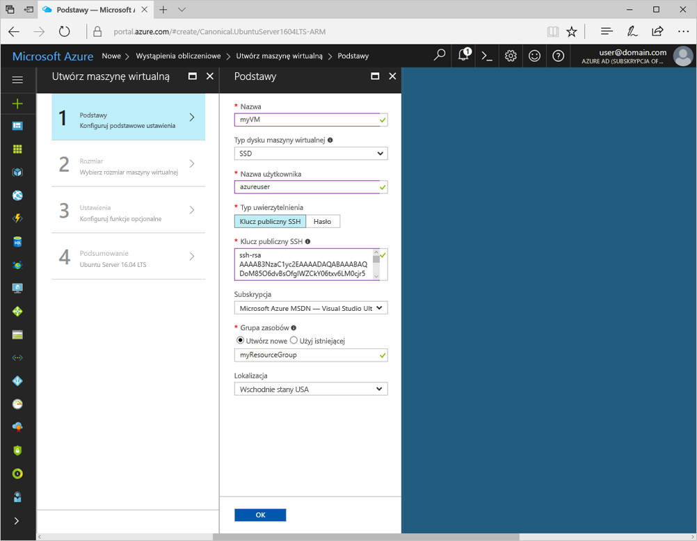
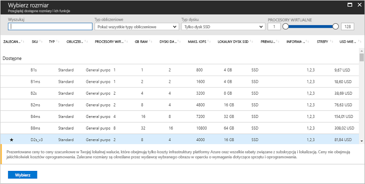

# <a name="quickstart-create-a-linux-virtual-machine-in-the-azure-portal"></a>Szybki start: tworzenie maszyny wirtualnej z systemem Linux w witrynie Azure Portal

Maszyny wirtualne platformy Azure można utworzyć za pomocą witryny Azure Portal. Ta metoda bazuje na opartym na przeglądarce interfejsie użytkownika umożliwiającym tworzenie maszyn wirtualnych i powiązanych z nimi zasobów. Z tego przewodnika Szybki start dowiesz się, jak za pomocą witryny Azure Portal wdrożyć maszynę wirtualną platformy Azure z systemem Ubuntu. Aby następnie zobaczyć działanie maszyny wirtualnej, połączysz się z nią za pomocą protokołu SSH i zainstalujesz serwer internetowy NGINX.

Jeśli nie masz subskrypcji platformy Azure, przed rozpoczęciem utwórz [bezpłatne konto](https://azure.microsoft.com/free/?WT.mc_id=A261C142F).

## <a name="create-ssh-key-pair"></a>Tworzenie pary kluczy SSH

Do wykonania kroków tego przewodnika Szybki start konieczne jest posiadanie pary kluczy SSH. Jeśli masz już parę kluczy SSH, możesz pominąć ten krok.

Aby utworzyć parę kluczy SSH i zalogować się do maszyn wirtualnych systemu Linux, uruchom następujące polecenie z powłoki Bash i postępuj zgodnie z wyświetlanymi instrukcjami. Możesz na przykład użyć aplikacji [Azure Cloud Shell](../../cloud-shell/overview.md) lub [Windows Substem for Linux](/windows/wsl/install-win10). Dane wyjściowe polecenia zawierają nazwę pliku klucza publicznego. Skopiuj zawartość pliku klucza publicznego (`cat ~/.ssh/id_rsa.pub`) do schowka:

```bash
ssh-keygen -t rsa -b 2048
```

Aby uzyskać bardziej szczegółowe informacje na temat tworzenia par kluczy SSH, łącznie z użyciem programu PuTTy, zobacz [Jak używać kluczy SSH w systemie Windows](ssh-from-windows.md).

## <a name="log-in-to-azure"></a>Zaloguj się do platformy Azure.

Zaloguj się do witryny Azure Portal pod adresem http://portal.azure.com

## <a name="create-virtual-machine"></a>Tworzenie maszyny wirtualnej

1. W lewym górnym rogu okna witryny Azure Portal wybierz pozycję **Utwórz zasób**.

2. W polu wyszukiwania nad listą zasobów Microsoft Azure Marketplace wpisz **Ubuntu Server 16.04 LTS by Canonical**, wybierz odpowiednią pozycję i kliknij **Utwórz**.

3. Podaj nazwę maszyny wirtualnej, na przykład *myVM*, pozostaw typ dysku *SSD*, a następnie podaj nazwę użytkownika, na przykład *azureuser*.

4. W obszarze **Typ uwierzytelniania** wybierz pozycję **Klucz publiczny SSH**, a następnie wklej klucz publiczny w polu tekstowym. Pamiętaj, aby z klucza publicznego usunąć wszystkie wiodące i końcowe białe znaki.

    

5. Wybierz opcję **Utwórz nowy**, aby utworzyć grupę zasobów, i podaj jej nazwę, na przykład *myResourceGroup*. Wybierz żądaną wartość z menu **Lokalizacja**, a następnie kliknij **OK**.

4. Wybierz rozmiar maszyny wirtualnej. Możesz filtrować między innymi według wartości *Typ obliczeń* lub *Typ dysku*. Sugerowany rozmiar maszyny wirtualnej to *D2s_v3*.

    

5. Na stronie **Ustawienia** w obszarze **Sieć** > **Sieciowa grupa zabezpieczeń** > **Wybierz publiczne porty wejściowe** wybierz pozycje **HTTP** i **SSH (22)**. Pozostaw resztę ustawień domyślnych, a następnie wybierz pozycję **OK**.

6. Na stronie podsumowania wybierz pozycję **Utwórz**, aby rozpocząć wdrażanie maszyny wirtualnej.

7. Maszyna wirtualna jest przypięta do pulpitu nawigacyjnego witryny Azure Portal. Po zakończeniu wdrażania zostanie automatycznie otwarte podsumowanie maszyny wirtualnej.

## <a name="connect-to-virtual-machine"></a>Nawiązywanie połączenia z maszyną wirtualną

Utwórz połączenie SSH z maszyną wirtualną.

1. Na stronie przeglądu wybierz przycisk **Połącz** dla swojej maszyny wirtualnej. 

    

2. Na stronie **Nawiązywanie połączenia z maszyną wirtualną** zostaw opcje domyślne, aby połączyć się za pomocą nazwy DNS przez port 22. W obszarze **Logowanie za pomocą konta lokalnego maszyny wirtualnej** jest wyświetlane polecenie połączenia. Kliknij przycisk, aby skopiować polecenie. W poniższym przykładzie pokazano, jak wygląda polecenie połączenia SSH:

    ```bash
    ssh azureuser@myvm-123abc.eastus.cloudapp.azure.com
    ```

3. Aby utworzyć połączenie, wklej polecenie połączenia SSH do powłoki, takiej jak Azure Cloud Shell lub Bash systemie Ubuntu rezydującym w systemie Windows. 

## <a name="install-web-server"></a>Instalowanie serwera sieci Web

Aby zobaczyć działanie maszyny wirtualnej, zainstaluj serwer internetowy NGINX. W sesji SSH użyj poniższych poleceń w celu zaktualizowania źródeł pakietów i zainstalowania najnowszego pakietu NGINX:

```bash
# update packages
sudo apt-get -y update

# install NGINX
sudo apt-get -y install nginx
```

Po zakończeniu użyj polecenia `exit` w sesji SSH i wróć do właściwości maszyny wirtualnej w witrynie Azure Portal.


## <a name="view-the-web-server-in-action"></a>Oglądanie działającego serwera internetowego

Po zainstalowaniu serwera NGINX i otwarciu portu 80 dla maszyny wirtualnej można uzyskać dostęp do serwera sieci Web z Internetu. Otwórz przeglądarkę internetową i wpisz publiczny adres IP maszyny wirtualnej. Publiczny adres IP można znaleźć na stronie przeglądu maszyny wirtualnej lub w górnej części strony *Sieć*, na której są dodawane reguły portu wejściowego.


## <a name="clean-up-resources"></a>Oczyszczanie zasobów

Gdy grupa zasobów, maszyna wirtualna i wszystkie pokrewne zasoby nie będą już potrzebne, można je usunąć. Aby to zrobić, wybierz grupę zasobów maszyny wirtualnej, wybierz opcję **Usuń**, a następnie potwierdź nazwę grupy zasobów, którą chcesz usunąć.

## <a name="next-steps"></a>Następne kroki

W tym przewodniku Szybki start wdrożono prostą maszynę wirtualną, utworzono sieciową grupę zabezpieczeń i regułę oraz zainstalowano podstawowy serwer internetowy. Aby dowiedzieć się więcej o maszynach wirtualnych platformy Azure, przejdź do samouczka dla maszyn wirtualnych z systemem Linux.

> [!div class="nextstepaction"]
> [Samouczki dla maszyny wirtualnej platformy Azure z systemem Linux](./tutorial-manage-vm.md)
