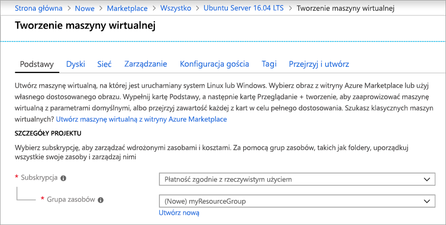
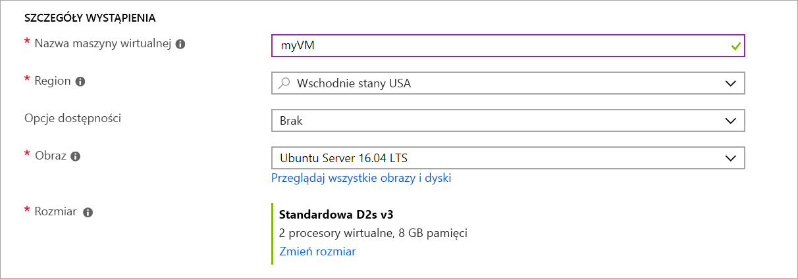
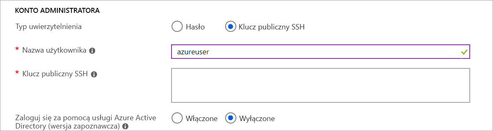
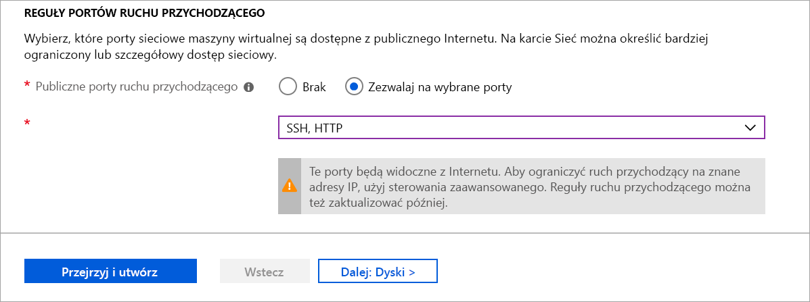

# <a name="quickstart-create-a-linux-virtual-machine-in-the-azure-portal"></a>Szybki start: Utwórz maszynę wirtualną z systemem Linux w Azure Portal

Maszyny wirtualne platformy Azure można utworzyć za pomocą witryny Azure Portal. Azure Portal to oparty na przeglądarce interfejs użytkownika służący do tworzenia zasobów platformy Azure. W tym przewodniku szybki start pokazano, jak za pomocą Azure Portal wdrożyć maszynę wirtualną z systemem Linux przy użyciu programu Ubuntu 18,04 LTS. Aby zobaczyć działanie maszyny wirtualnej, połączysz się z nią za pomocą protokołu SSH i zainstalujesz serwer internetowy NGINX.

Jeśli nie masz subskrypcji platformy Azure, przed rozpoczęciem utwórz [bezpłatne konto](https://azure.microsoft.com/free/?WT.mc_id=A261C142F).

## <a name="create-ssh-key-pair"></a>Tworzenie pary kluczy SSH

Do wykonania kroków tego przewodnika Szybki start konieczne jest posiadanie pary kluczy SSH. Jeśli masz już parę kluczy SSH, możesz pominąć ten krok.

Otwórz powłokę Bash i użyj polecenia [ssh-keygen](https://www.ssh.com/ssh/keygen/), aby utworzyć parę kluczy SSH. Jeśli nie masz powłoki Bash na swoim komputerze lokalnym, możesz użyć usługi [Azure Cloud Shell](https://shell.azure.com/bash).


1. Zaloguj się w witrynie [Azure Portal](https://portal.azure.com).
1. W menu w górnej części strony wybierz `>_` ikonę, aby otworzyć Cloud Shell.
1. Upewnij się, że CloudShell mówi **bash** w lewym górnym rogu. Jeśli mówi programu PowerShell, Użyj listy rozwijanej, aby wybrać **bash** , a następnie wybierz pozycję **Potwierdź** , aby przejść do powłoki bash.
1. Wpisz `ssh-keygen -t rsa -b 2048` , aby utworzyć klucz SSH. 
1. Zostanie wyświetlony monit o wprowadzenie pliku, w którym ma zostać zapisana para kluczy. Naciśnij klawisz **Enter** , aby zapisać w lokalizacji domyślnej, na liście w nawiasach. 
1. Zostanie wyświetlony monit o podanie hasła. Możesz wpisać hasło dla klucza SSH lub nacisnąć klawisz **Enter** , aby kontynuować bez hasła.
1. Polecenie generuje klucze publiczne i prywatne z domyślną `id_rsa` nazwą w `~/.ssh directory`. `ssh-keygen` Polecenie zwraca pełną ścieżkę do klucza publicznego. Użyj ścieżki do klucza publicznego, aby wyświetlić jej zawartość `cat` za pomocą wpisywania. `cat ~/.ssh/id_rsa.pub`
1. Skopiuj dane wyjściowe tego polecenia i Zapisz je w dalszej części tego artykułu. Jest to Twój klucz publiczny, który będzie potrzebny podczas konfigurowania konta administratora, aby zalogować się do maszyny wirtualnej.

## <a name="sign-in-to-azure"></a>Logowanie do platformy Azure

Zaloguj się do [Azure Portal](https://portal.azure.com) , jeśli jeszcze tego nie zrobiono.

## <a name="create-virtual-machine"></a>Tworzenie maszyny wirtualnej

1. Wybierz pozycję **Utwórz zasób** w lewym górnym rogu okna witryny Azure Portal.

1. W obszarze **popularne**wybierz pozycję **Ubuntu Server 18,04 LTS**.

1. Na karcie **Podstawowe**, w obszarze **Szczegóły projektu**, upewnij się, że wybrano poprawną subskrypcję, a następnie wybierz opcję **Utwórz nową** w obszarze **Grupa zasobów**. Wpisz nazwę *zasobu* grupy zasobów, a następnie wybierz przycisk **OK**. 

    

1. W obszarze **Szczegóły wystąpienia** wpisz *myVM* w polu **Nazwa maszyny wirtualnej** i wybierz *Wschodnie stany USA* w polu **Region**. Inne wartości pozostaw domyślne.

    

1. W obszarze **konto administratora**wybierz opcję **klucz publiczny SSH**, wpisz swoją nazwę użytkownika, a następnie wklej ją w kluczu publicznym. Usuń wszystkie wiodące i końcowe białe znaki z klucza publicznego.

    

1. W obszarze **Reguły portów wejściowych** > **Publiczne porty wejściowe** wybierz opcję **Zezwalaj na wybranych portach**, a następnie wybierz z listy rozwijanej pozycje **SSH (22)** i **HTTP (80)** . 

    

1. Pozostaw pozostałe wartości domyślne, a następnie wybierz przycisk **Przejrzyj + utwórz** znajdujący się u dołu strony.

1. Na stronie **Tworzenie maszyny wirtualnej** wyświetlone są szczegółowe informacje o maszynie wirtualnej, którą masz zamiar utworzyć. Gdy wszystko będzie gotowe, wybierz pozycję **Utwórz**.

Wdrożenie maszyny wirtualnej potrwa kilka minut. Po zakończeniu wdrażania przejdź do następnej sekcji.

    
## <a name="connect-to-virtual-machine"></a>Nawiązywanie połączenia z maszyną wirtualną

Utwórz połączenie SSH z maszyną wirtualną.

1. Na stronie przeglądu wybierz przycisk **Połącz** dla swojej maszyny wirtualnej. 

    

2. Na stronie **Nawiązywanie połączenia z maszyną wirtualną** pozostaw opcje domyślne, aby nawiązać połączenie za pomocą adresu IP na porcie 22. W obszarze **Logowanie za pomocą konta lokalnego maszyny wirtualnej** jest wyświetlane polecenie połączenia. Wybierz przycisk, aby skopiować polecenie. W poniższym przykładzie pokazano, jak wygląda polecenie połączenia SSH:

    ```bash
    ssh azureuser@10.111.12.123
    ```

3. Korzystając z tej samej powłoki bash, która została użyta do utworzenia pary kluczy SSH (możesz ponownie otworzyć Cloud Shell, `>_` zaznaczając polecenie lub https://shell.azure.com/bash) przechodząc do lokalizacji, Wklej w tym poleceniu połączenie SSH, aby utworzyć sesję SSH).

## <a name="install-web-server"></a>Instalowanie serwera internetowego

Aby zobaczyć działanie maszyny wirtualnej, zainstaluj serwer internetowy NGINX. Z poziomu sesji SSH zaktualizuj źródła pakietu, a następnie zainstaluj najnowszą wersję pakietu NGINX.

```bash
sudo apt-get -y update
sudo apt-get -y install nginx
```

Gdy skończysz, wpisz polecenie `exit`, aby opuścić sesję SSH.


## <a name="view-the-web-server-in-action"></a>Oglądanie działającego serwera internetowego

Użyj wybranej przeglądarki internetowej, aby wyświetlić domyślną strona powitalną serwera NGINX. Wpisz publiczny adres IP maszyny wirtualnej jako adres sieci Web. Publiczny adres IP można znaleźć na stronie przeglądu maszyny wirtualnej lub jako część wcześniej użytych parametrów połączenia SSH.


## <a name="clean-up-resources"></a>Oczyszczanie zasobów

Gdy grupa zasobów, maszyna wirtualna i wszystkie pokrewne zasoby nie będą już potrzebne, można je usunąć. Aby to zrobić, wybierz grupę zasobów maszyny wirtualnej, wybierz opcję **Usuń**, a następnie potwierdź nazwę grupy zasobów, którą chcesz usunąć.

## <a name="next-steps"></a>Następne kroki

W tym przewodniku Szybki start wdrożono prostą maszynę wirtualną, utworzono sieciową grupę zabezpieczeń i regułę oraz zainstalowano podstawowy serwer internetowy. Aby dowiedzieć się więcej o maszynach wirtualnych platformy Azure, przejdź do samouczka dla maszyn wirtualnych z systemem Linux.

> [!div class="nextstepaction"]
> [Samouczki dla maszyny wirtualnej platformy Azure z systemem Linux](./tutorial-manage-vm.md)
