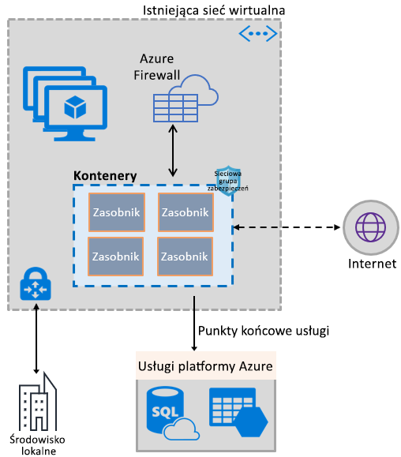
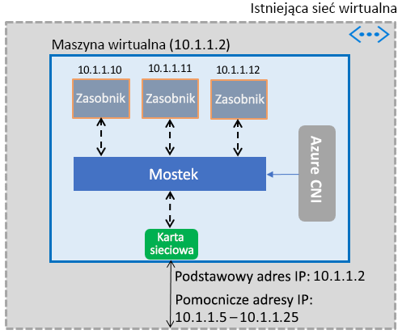

# Umożliwianie kontenerom korzystania z możliwości usługi Azure Virtual Network

Udostępnij kontenerom bogaty zestaw funkcji sieciowych platformy Azure, używając tego samego zdefiniowanego programowo stosu sieci, który umożliwia pracę maszyn wirtualnych. Wtyczka interfejsu sieciowego kontenera (CNI) usługi Azure Virtual Network instaluje się na maszynie wirtualnej platformy Azure. Wtyczka przypisuje adresy IP z sieci wirtualnej do kontenerów przeniesionych na maszynę wirtualną, podłączając je do sieci wirtualnej, a następnie łącząc je bezpośrednio z innymi kontenerami i zasobami sieci wirtualnej. Wtyczka nie uzależnia łączności od nakładających się sieci czy tras i zapewnia taką samą wydajność jak maszyny wirtualne. Na wysokim poziomie wtyczka oferuje następujące możliwości:

- Adres IP sieci wirtualnej jest przypisywany do każdego zasobnika, który może składać się z jednego lub więcej kontenerów.
- Zasobniki mogą łączyć się z równorzędnymi sieciami wirtualnymi i sieciami lokalnymi za pośrednictwem usługi ExpressRoute lub sieci VPN typu lokacja-lokacja. Zasobniki także są dostępne z sieci równorzędnych i lokalnych.
- Zasobniki mają dostęp do usług, takich jak Azure Storage i Azure SQL Database, które są chronione przez punkty końcowe usługi dla sieci wirtualnej.
- Sieciowe grupy zabezpieczeń i trasy można stosować bezpośrednio do zasobników.
- Zasobniki można umieszczać bezpośrednio za wewnętrznym lub publicznym modułem równoważenia obciążenia platformy Azure, podobnie jak maszyny wirtualne.
- Zasobnikom można przypisać publiczny adres IP, dzięki czemu staną się dostępne bezpośrednio z Internetu. Same zasobniki również mają dostęp do Internetu.
- Wtyczka bezproblemowo współpracuje z zasobami platformy Kubernetes, takimi jak usługi, kontrolery ruchu przychodzącego i system Kube DNS. Usługę Kubernetes można również udostępniać wewnętrznie lub zewnętrznie za pośrednictwem usługi Azure Load Balancer.

Na poniższej ilustracji pokazano, w jaki sposób wtyczka oferuje możliwości usługi Azure Virtual Network zasobnikom:

Wtyczka obsługuje zarówno platformy Linux, jak i Windows.

## Łączenie zasobników z siecią wirtualną

Zasobniki są przenoszone na maszynę wirtualną, która jest częścią sieci wirtualnej. Pula adresów IP na potrzeby zasobników jest skonfigurowana w postaci adresów pomocniczych w interfejsie sieciowym maszyny wirtualnej. Wtyczka Azure CNI konfiguruje podstawową łączność sieciową dla zasobników i zarządza wykorzystaniem adresów IP w puli. Gdy zasobnik pojawia się na maszynie wirtualnej, wtyczka Azure CNI przypisuje dostępny adres IP z puli i łączy zasobnik z mostkiem oprogramowania na maszynie wirtualnej. Po zakończeniu pracy zasobnika adres IP jest dodawany z powrotem do puli. Na poniższej ilustracji pokazano, w jaki sposób zasobniki łączą się z siecią wirtualną:

## Dostęp do Internetu

Aby umożliwić zasobnikom dostęp do Internetu, wtyczka konfiguruje reguły *iptables* translacji adresów sieciowych (NAT) ruchu skierowanego z zasobników do Internetu. Źródłowy adres IP pakietu jest tłumaczony na podstawowy adres IP interfejsu sieciowego maszyny wirtualnej. Maszyny wirtualne z systemem Windows automatycznie wyszukują ruch NAT (SNAT) kierowany na adresy IP poza podsiecią, w której znajduje się maszyna wirtualna. Zazwyczaj tłumaczony jest cały ruch kierowany na adres IP spoza zakresu adresów IP sieci wirtualnej.

## Limity

Wtyczka obsługuje maksymalnie 250 zasobników na maszynę wirtualną i maksymalnie 16 000 zasobników w sieci wirtualnej. Limity te są inne w przypadku usługi [Azure Kubernetes Service](../azure-subscription-service-limits.md?toc=%2fazure%2fvirtual-network%2ftoc.json#azure-kubernetes-service-limits).

## Korzystanie z wtyczki

Wtyczka może być używana w dowolny z następujących sposobów, aby zapewnić podstawowe dołączenie do sieci wirtualnej dla zasobników lub kontenerów platformy Docker:

- **Usługa Azure Kubernetes Service**: Wtyczka jest zintegrowana w usłudze Azure Kubernetes Service (AKS) i mogą być używane przez wybranie *zaawansowane sieci* opcji. Zaawansowane funkcje sieciowe umożliwiają wdrożenie klastra Kubernetes w istniejącej lub nowej sieci wirtualnej. Aby dowiedzieć się więcej na temat zaawansowanych funkcji sieciowych i procedur ich konfigurowania, zobacz [Konfiguracja sieci w usłudze AKS](../aks/networking-overview.md?toc=%2fazure%2fvirtual-network%2ftoc.json).
- **Aparat usługi AKS**: Aparat usługi AKS jest narzędziem, które generuje szablonu usługi Azure Resource Manager w przypadku wdrażania klastra Kubernetes na platformie Azure. Aby uzyskać szczegółowe instrukcje, zobacz [wdrażania dodatku typu plug-in klastrów Kubernetes aparatu AKS](deploy-container-networking.md#deploy-the-azure-virtual-network-container-network-interface-plug-in).
- **Tworzenie klastra Kubernetes na platformie Azure**: Wtyczka może służyć do zapewnienia podstawowych sieci na potrzeby zasobników w klastrów Kubernetes wdrażanie samodzielnie, bez konieczności polegania na AKS lub narzędzi, takich jak aparat usługi AKS. W tym przypadku wtyczka jest instalowana i włączana na każdej maszynie wirtualnej w klastrze. Aby uzyskać szczegółowe instrukcje, zobacz [Wdrażanie wtyczki dla samodzielnie wdrażanego klastra Kubernetes](deploy-container-networking.md#deploy-plug-in-for-a-kubernetes-cluster).
- **Sieć wirtualna dołączanie usługi kontenerów platformy Docker na platformie Azure**: Wtyczka może służyć w przypadkach, gdy nie chcesz utworzyć klaster usługi Kubernetes i chcesz ją utworzyć Docker dołączyć kontenerów przy użyciu sieci wirtualnej, w przypadku maszyn wirtualnych. Aby uzyskać szczegółowe instrukcje, zobacz [Wdrażanie wtyczki dla platformy Docker](deploy-container-networking.md#deploy-plug-in-for-docker-containers).

## Kolejne kroki

[Wdrażanie wtyczki](deploy-container-networking.md) dla klastrów Kubernetes lub kontenerów platformy Docker
