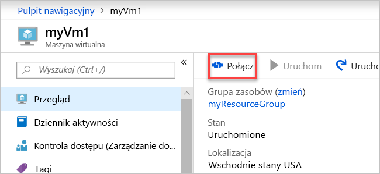

# <a name="quickstart-create-a-virtual-network-using-the-azure-portal"></a>Szybki start: Tworzenie sieci wirtualnej przy użyciu witryny Azure Portal

Dzięki sieci wirtualnej zasoby platformy Azure, takie jak maszyny wirtualne, mogą komunikować się prywatnie ze sobą i z Internetem. W tym przewodniku Szybki start dowiesz się, jak utworzyć sieć wirtualną. Po utworzeniu sieci wirtualnej, wdrożysz w niej dwie maszyny wirtualne. Następnie nawiążesz połączenie z jedną z maszyn wirtualnych z Internetu i rozpoczniesz prywatną komunikację między dwiema maszynami wirtualnymi.

Jeśli nie masz subskrypcji platformy Azure, utwórz teraz [bezpłatne konto](https://azure.microsoft.com/free/?WT.mc_id=A261C142F).

## <a name="sign-in-to-azure"></a>Logowanie do platformy Azure

Zaloguj się w witrynie [Azure Portal](https://portal.azure.com).

## <a name="create-a-virtual-network"></a>Tworzenie sieci wirtualnej

1. W lewym górnym rogu ekranu wybierz pozycję **Utwórz zasób** > **Sieć** > **Sieć wirtualna**.

1. W obszarze **Utwórz sieć wirtualną** wprowadź lub wybierz następujące informacje:

    | Ustawienie | Wartość |
    | ------- | ----- |
    | Name (Nazwa) | Wpisz *myVirtualNetwork*. |
    | Przestrzeń adresowa | Wprowadź adres *10.1.0.0/16*. |
    | Subskrypcja | Wybierz subskrypcję.|
    | Grupa zasobów | Wybierz pozycję **Utwórz nową**, wprowadź nazwę *myResourceGroup*, a następnie wybierz przycisk **OK**. |
    | Lokalizacja | Wybierz pozycję **Wschodnie stany USA**.|
    | Podsieć — nazwa | Wprowadź nazwę *mojaPodsiecWirtualna*. |
    | Zakres adresów podsieci: 10.41.0.0/24 | Wprowadź *10.1.0.0/24*. |

1. Pozostaw resztę ustawień domyślnych, a następnie wybierz pozycję **Utwórz**.

## <a name="create-virtual-machines"></a>Tworzenie maszyn wirtualnych

W sieci wirtualnej utwórz dwie maszyny wirtualne:

### <a name="create-the-first-vm"></a>Tworzenie pierwszej maszyny wirtualnej

1. W lewym górnym rogu ekranu wybierz pozycję **Utwórz zasób** > **Compute** > **Windows Server 2016 Datacenter**.

1. W obszarze **Tworzenie maszyny wirtualnej — ustawienia podstawowe** wprowadź lub wybierz następujące informacje:

    | Ustawienie | Wartość |
    | ------- | ----- |
    | **SZCZEGÓŁY PROJEKTU** | |
    | Subskrypcja | Wybierz subskrypcję. |
    | Grupa zasobów | Wybierz pozycję **MyResourceGroup**. Została ona utworzona w ostatniej sekcji. |
    | **SZCZEGÓŁY WYSTĄPIENIA** |  |
    | Nazwa maszyny wirtualnej | Wprowadź nazwę *myVm1*. |
    | Region | Wybierz pozycję **Wschodnie stany USA**. |
    | Opcje dostępności | Pozostaw wartość domyślną **Brak wymaganej nadmiarowości infrastruktury**. |
    | Image | Pozostaw wartość domyślną **Windows Server 2016 Datacenter**. |
    | Rozmiar | Pozostaw wartość domyślną **Standardowy DS1, wersja 2**. |
    | **KONTO ADMINISTRATORA** |  |
    | Nazwa użytkownika | Wprowadź wybraną nazwę użytkownika. |
    | Hasło | Wprowadź wybrane hasło. Hasło musi mieć co najmniej 12 znaków i spełniać [zdefiniowane wymagania dotyczące złożoności](../virtual-machines/windows/faq.md?toc=%2fazure%2fvirtual-network%2ftoc.json#what-are-the-password-requirements-when-creating-a-vm).|
    | Potwierdź hasło | Ponownie wprowadź hasło. |
    | **REGUŁY PORTÓW WEJŚCIOWYCH** |  |
    | Publiczne porty wejściowe | Pozostaw wartość domyślną **Brak**. |
    | **OSZCZĘDZAJ PIENIĄDZE** |  |
    | Masz już licencję systemu Windows? | Pozostaw wartość domyślną **Nie**. |

1. Wybierz opcję **Dalej: Dyski**.

1. W obszarze **Tworzenie maszyny wirtualnej — dyski** pozostaw wartości domyślne i wybierz przycisk **Dalej: Sieć**.

1. W obszarze **Tworzenie maszyny wirtualnej — sieć** wybierz następujące informacje:

    | Ustawienie | Wartość |
    | ------- | ----- |
    | Sieć wirtualna | Pozostaw wartość domyślną **myVirtualNetwork**. |
    | Podsieć | Pozostaw wartość domyślną **myVirtualSubnet (10.1.0.0/24)**. |
    | Publiczny adres IP | Pozostaw wartość domyślną **(nowy) myVm-ip**. |
    | Porty zabezpieczeń sieci | Wybierz pozycję **Zezwalaj na wybrane porty**. |
    | Wybierz porty wejściowe | Wybierz pozycje **HTTP** i **RDP**.

1. Wybierz opcję **Dalej: Zarządzanie**.

1. W obszarze **Tworzenie maszyny wirtualnej — zarządzanie** dla opcji **Konto magazynu diagnostyki** wybierz ustawienie **Utwórz nowe**.

1. W obszarze **Tworzenie konta magazynu** wprowadź lub wybierz następujące informacje:

    | Ustawienie | Wartość |
    | ------- | ----- |
    | Name (Nazwa) | Wprowadź nazwę *myvmstorageaccount*. |
    | Rodzaj konta | Pozostaw wartość domyślną **Magazyn (ogólnego przeznaczenia, wersja 1)**. |
    | Wydajność | Pozostaw wartość domyślną **Standardowa**. |
    | Replikacja | Pozostaw wartość domyślną **Magazyn lokalnie nadmiarowy (LRS)**. |

1. Kliknij przycisk **OK**

1. Wybierz pozycję **Przegląd + utwórz**. Nastąpi przekierowanie do strony**Przeglądanie + tworzenie**, a platforma Azure zweryfikuje konfigurację.

1. Po wyświetleniu komunikatu **Weryfikacja pomyślna** wybierz opcję **Utwórz**.

### <a name="create-the-second-vm"></a>Tworzenie drugiej maszyny wirtualnej

1. Wykonaj kroki od 1 do 9 przedstawione powyżej.

    > [!NOTE]
    > W kroku 2 w polu **Nazwa maszyny wirtualnej** wprowadź *myVm2*.
    >
    > W kroku 7 w polu **Konto magazynu diagnostyki** wybierz pozycję **myvmstorageaccount**.

1. Wybierz pozycję **Przegląd + utwórz**. Nastąpi przekierowanie do strony**Przeglądanie + tworzenie**, a platforma Azure zweryfikuje konfigurację.

1. Po wyświetleniu komunikatu **Weryfikacja pomyślna** wybierz opcję **Utwórz**.

## <a name="connect-to-a-vm-from-the-internet"></a>Nawiązywanie połączenia z maszyną wirtualną z Internetu

Po utworzeniu maszyny *myVm1* połącz się z nią za pośrednictwem Internetu.

1. Na pasku wyszukiwania portalu wpisz *myVm1*.

1. Wybierz przycisk **Połącz**.

    

    Po wybraniu przycisku **Połącz** zostanie otwarta strona **Łączenie z maszyną wirtualną**.

1. Wybierz opcję **Pobierz plik RDP**. Plik Remote Desktop Protocol (*.rdp*) zostanie utworzony na platformie Azure, a następnie pobrany na komputer.

1. Otwórz pobrany plik *rdp*.

    1. Po wyświetleniu monitu wybierz pozycję **Połącz**.

    1. Wprowadź nazwę użytkownika i hasło określone podczas tworzenia maszyny wirtualnej.

        > [!NOTE]
        > Może okazać się konieczne wybranie pozycji **Więcej opcji** > **Użyj innego konta**, aby podać poświadczenia wprowadzone podczas tworzenia maszyny wirtualnej.

1. Kliknij przycisk **OK**.

1. Podczas procesu logowania może pojawić się ostrzeżenie o certyfikacie. Jeśli zostanie wyświetlone ostrzeżenie o certyfikacie, wybierz opcję **Tak** lub **Kontynuuj**.

1. Po wyświetleniu pulpitu maszyny wirtualnej zminimalizuj ją i wróć z powrotem do pulpitu lokalnego.

## <a name="communicate-between-vms"></a>Nawiązywanie komunikacji między maszynami wirtualnymi

1. Na pulpicie zdalnym maszyny *myVm1* otwórz program PowerShell.

1. Wprowadź polecenie `ping myVm2`.

    Zostanie wyświetlony komunikat podobny do następującego:

    ```powershell
    Pinging myVm2.0v0zze1s0uiedpvtxz5z0r0cxg.bx.internal.clouda
    Request timed out.
    Request timed out.
    Request timed out.
    Request timed out.

    Ping statistics for 10.1.0.5:
    Packets: Sent = 4, Received = 0, Lost = 4 (100% loss),
    ```

    Polecenie `ping` kończy się niepowodzeniem, ponieważ polecenie `ping` używa protokołu ICMP. Domyślnie protokół ICMP jest blokowany przez zaporę Windows.

1. Aby umożliwić wykonanie polecenia ping na maszynie *myVm2* w celu komunikacji z maszyną *myVm1* w późniejszym kroku, wprowadź następujące polecenie:

    ```powershell
    New-NetFirewallRule –DisplayName “Allow ICMPv4-In” –Protocol ICMPv4
    ```

    To polecenie zezwala na ruch przychodzący przy użyciu protokołu ICMP przechodzący przez zaporę Windows:

1. Zamknij podłączanie pulpitu zdalnego z maszyną wirtualną *myVm1*.

1. Ponownie wykonaj kroki opisane w sekcji [Nawiązywanie połączenia z maszyną wirtualną z Internetu](#connect-to-a-vm-from-the-internet), ale tym razem nawiąż połączenie z maszyną wirtualną *myVm2*.

1. W wierszu polecenia wprowadź polecenie `ping myvm1`.

    Zostanie wyświetlony komunikat podobny do następującego:

    ```powershell
    Pinging myVm1.0v0zze1s0uiedpvtxz5z0r0cxg.bx.internal.cloudapp.net [10.1.0.4] with 32 bytes of data:
    Reply from 10.1.0.4: bytes=32 time=1ms TTL=128
    Reply from 10.1.0.4: bytes=32 time<1ms TTL=128
    Reply from 10.1.0.4: bytes=32 time<1ms TTL=128
    Reply from 10.1.0.4: bytes=32 time<1ms TTL=128

    Ping statistics for 10.1.0.4:
        Packets: Sent = 4, Received = 4, Lost = 0 (0% loss),
    Approximate round trip times in milli-seconds:
        Minimum = 0ms, Maximum = 1ms, Average = 0ms
    ```

    Z maszyny wirtualnej *myVm1* zostanie odebrana odpowiedź, ponieważ w poprzednim kroku umożliwiono przekazywanie ruchu protokołu ICMP przez zaporę systemu Windows na maszynie wirtualnej *myVm1*.

1. Zamknij podłączanie pulpitu zdalnego z maszyną wirtualną *myVm2*.

## <a name="clean-up-resources"></a>Oczyszczanie zasobów

Po zakończeniu korzystania z sieci wirtualnej i maszyn wirtualnych usuń grupę zasobów i wszystkie zasoby, które zawiera:

1. Wprowadź ciąg *myResourceGroup* w polu **Szukaj** w górnej części portalu.

1. Gdy pozycja **myResourceGroup** pojawi się w wynikach wyszukiwania, wybierz ją.

1. Wybierz pozycję **Usuń grupę zasobów**.

1. W polu **WPISZ NAZWĘ GRUPY ZASOBÓW:** wprowadź nazwę *myResourceGroup*, a następnie wybierz pozycję **Usuń**.

## <a name="next-steps"></a>Kolejne kroki

W tym przewodniku Szybki start utworzono domyślną sieć wirtualną i dwie maszyny wirtualne. Z Internetu nawiązano połączenie z jedną z maszyn wirtualnych, a następnie rozpoczęto prywatną komunikację między tymi dwiema maszynami wirtualnymi. Aby dowiedzieć się więcej na temat ustawień sieci wirtualnych, zobacz [Manage a virtual network](manage-virtual-network.md) (Zarządzanie siecią wirtualną).

Domyślnie platforma Azure umożliwia nieograniczoną komunikację prywatną między maszynami wirtualnymi. Z drugiej strony zezwala tylko na połączenia przychodzące pulpitu zdalnego z maszynami wirtualnymi Windows z Internetu. Aby dowiedzieć się więcej na temat konfigurowania różnych typów komunikacji sieciowej między maszynami wirtualnymi, przejdź do samouczka [Filtrowanie ruchu sieciowego](tutorial-filter-network-traffic.md).