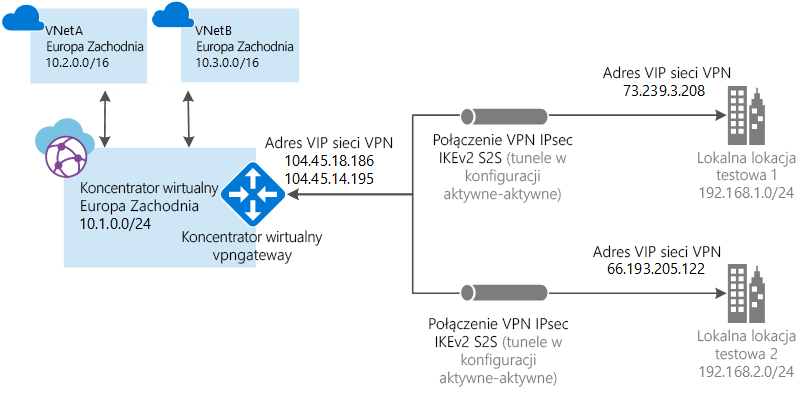

# <a name="tutorial-create-a-site-to-site-connection-using-azure-virtual-wan"></a>Samouczek: tworzenie połączenia lokacja-lokacja przy użyciu usługi Azure Virtual WAN

W tym samouczku pokazano, w jaki sposób przy użyciu usługi Azure Virtual WAN utworzyć połączenie z zasobami na platformie Azure za pośrednictwem połączenia sieci VPN protokołu IPsec/IKE (IKEv1 i IKEv2). Ten typ połączenia wymaga lokalnego urządzenia sieci VPN z przypisanym publicznym adresem IP dostępnym z zewnątrz. Aby uzyskać więcej informacji na temat usługi Virtual WAN, zobacz [Omówienie usługi Virtual WAN](virtual-wan-about.md).

> [!NOTE]
> Jeśli masz wiele lokacji, skorzystaj z usług [partnera usługi Virtual WAN](https://aka.ms/virtualwan) w celu utworzenia tej konfiguracji. Możesz też utworzyć tę konfigurację samodzielnie, jeśli masz wiedzę z zakresu sieci i doświadczenie w konfigurowaniu urządzeń sieci VPN.
>



Ten samouczek zawiera informacje na temat wykonywania następujących czynności:

> [!div class="checklist"]
> * Tworzenie sieci WAN
> * Tworzenie lokacji
> * Tworzenie koncentratora
> * Łączenie koncentratora z lokacją
> * Utwórz zgodną sieć wirtualną (jeśli jeszcze jej nie masz)
> * Łączenie sieci wirtualnej z koncentratorem
> * Pobieranie i stosowanie konfiguracji urządzenia sieci VPN
> * Wyświetlanie wirtualnej sieci WAN
> * Wyświetlanie kondycji zasobu
> * Monitorowanie połączenia

## <a name="before-you-begin"></a>Przed rozpoczęciem

[!INCLUDE [Before you begin](../../includes/virtual-wan-tutorial-vwan-before-include.md)]

## <a name="openvwan"></a>1. Tworzenie wirtualnej sieci WAN

Przejdź w przeglądarce do witryny [Azure Portal](https://aka.ms/azurevirtualwanpreviewfeatures) i zaloguj się przy użyciu konta platformy Azure.

[!INCLUDE [Create a virtual WAN](../../includes/virtual-wan-tutorial-vwan-include.md)]

## <a name="site"></a>2. Tworzenie witryny

Możesz utworzyć dowolną liczbę lokacji, tak aby odpowiadała liczbie lokalizacji fizycznych. Jeśli na przykład masz oddziały w Nowym Jorku, Londynie i Los Angeles, należy utworzyć trzy oddzielne lokacje. W tych lokacjach znajdują się punkty końcowe lokalnych urządzeń sieci VPN. Obecnie można określić tylko jedną prywatną przestrzeń adresową na lokację.

1. Kliknij utworzoną sieć WAN. Na stronie sieci WAN w obszarze **Architektura wirtualnej sieci WAN**kliknij pozycję **Lokacje sieci VPN** , aby otworzyć stronę witryny sieci VPN.
2. Na stronie **Lokacje sieci VPN** kliknij pozycję **+Utwórz lokację**.
3. Na stronie **Tworzenie lokacji** wypełnij następujące pola:

   * **Nazwa** — nazwa, przez którą chcesz odwołać się do lokacji lokalnej.
   * **Publiczny adres IP** — publiczny adres IP urządzenia sieci VPN znajdującego się w lokacji lokalnej.
   * **Prywatna przestrzeń adresowa** — to przestrzeń adresowa IP znajdująca się w lokacji lokalnej. Ruch do tej przestrzeni adresowej jest kierowany do lokacji lokalnej.
   * **Subskrypcja** — sprawdź, czy wybrano właściwą subskrypcję.
   * **Grupa zasobów** — grupa zasobów, której chcesz używać.
   * **Lokalizacja**
4. Kliknij pozycję **Pokaż zaawansowane**, aby wyświetlić dodatkowe ustawienia. 

   Możesz wybrać protokół **BGP** , aby włączyć protokół BGP, co spowoduje włączenie funkcji BGP dla wszystkich połączeń utworzonych dla tej witryny na platformie Azure. Konfigurowanie protokołu BGP w wirtualnej sieci WAN jest równoznaczne z skonfigurowaniem protokołu BGP na bramie sieci VPN platformy Azure. Adres lokalnego elementu równorzędnego protokołu BGP *nie może* być taki sam jak publiczny adres IP sieci VPN do urządzenia lub przestrzeni adresowej sieci wirtualnej witryny sieci VPN. Użyj innego adresu IP na urządzeniu sieci VPN dla adresu IP elementu równorzędnego protokołu BGP. Może to być adres przypisany do interfejsu sprzężenia zwrotnego na urządzeniu. Jednak *nie może* to być adresowanie APIPA (169,254. *x*. *x*). Ten adres należy określić w odpowiedniej bramie sieci lokalnej reprezentującej daną lokalizację. Wymagania wstępne dotyczące protokołu BGP zawiera temat [Informacje o protokole BGP z platformą Azure VPN Gateway](../vpn-gateway/vpn-gateway-bgp-overview.md).

   Możesz też wprowadzić **Informacje o urządzeniu** (pola opcjonalne). Dzięki temu zespół platformy Azure może lepiej zrozumieć swoje środowisko w celu dodania do niego dodatkowych możliwości optymalizacji lub ułatwienia rozwiązywania problemów.
   
5. Kliknij pozycję **Potwierdź**.
6. Po kliknięciu pozycji **Potwierdź** wyświetl stan na stronie lokacji sieci VPN. Stan lokacji zmieni się z **Aprowizowanie** na **Aprowizowano**.

## <a name="hub"></a>3. Tworzenie centrum

[!INCLUDE [Create a hub](../../includes/virtual-wan-tutorial-hub-include.md)]

## <a name="associate"></a>4. Skojarz lokacje z centrum

Zasadniczo koncentratory powinny być skojarzone z lokacjami znajdującymi się w tym samym regionie, w którym znajduje się sieć wirtualna.

1. Na stronie **Lokacje sieci VPN** wybierz lokację lub lokacje, które chcesz skojarzyć z koncentratorem, a następnie kliknij pozycję **+Nowe skojarzenie koncentratora**.
2. Na stronie **Kojarzenie lokacji z co najmniej jednym koncentratorem** wybierz koncentrator z listy rozwijanej. Możesz skojarzyć lokację z dodatkowymi koncentratorami, klikając pozycję **+Dodaj skojarzenie**.
3. Możesz również dodać w tym miejscu określony **klucz wstępny** lub użyć domyślnego.
4. Kliknij pozycję **Potwierdź**.
5. Możesz wyświetlić stan połączenia na stronie **Lokacje sieci VPN**.

## <a name="vnet"></a>5. Tworzenie sieci wirtualnej

Jeśli nie masz jeszcze sieci wirtualnej, możesz ją szybko utworzyć przy użyciu programu PowerShell lub Azure Portal. Jeśli masz już sieć wirtualną, sprawdź, czy spełnia ona wymagane kryteria i nie ma bramy sieci wirtualnej.

[!INCLUDE [Create a virtual network](../../includes/virtual-wan-tutorial-vnet-include.md)]

## <a name="vnet"></a>6. Łączenie sieci wirtualnej z centrum

W tym kroku zostanie utworzone połączenie równorzędne pomiędzy koncentratorem i siecią wirtualną. Powtórz te czynności dla każdej sieci wirtualnej, z którą chcesz się połączyć.

1. Na stronie sieci wirtualnej WAN kliknij pozycję **Połączenia sieci wirtualnych**.
2. Na stronie połączenia sieci wirtualnej kliknij polecenie **+ Dodaj połączenie**.
3. Na stronie **Dodaj połączenie** wypełnij następujące pola:

    * **Nazwa połączenia** — nazwij połączenie.
    * **Koncentratory** — wybierz koncentrator, z którym chcesz skojarzyć to połączenie.
    * **Subskrypcja** — sprawdź, czy wybrano właściwą subskrypcję.
    * **Sieć wirtualna** — wybierz sieć wirtualną, którą chcesz połączyć z tym koncentratorem. Sieć wirtualna nie może mieć istniejącej bramy sieci wirtualnej.
4. Kliknij przycisk **OK**, aby utworzyć połączenie równorzędne.

## <a name="device"></a>7. Pobieranie konfiguracji sieci VPN

Skorzystaj z konfiguracji urządzenia sieci VPN, aby skonfigurować swoje lokalne urządzenie sieci VPN.

1. Na stronie usługi Virtual WAN kliknij pozycję **Przegląd**.
2. W górnej części strony Przegląd kliknij pozycję **Pobierz konfigurację sieci VPN**. Platforma Azure utworzy konto magazynu w grupie zasobów „microsoft-network-[lokalizacja]”, gdzie „lokalizacja” to lokalizacja sieci WAN. Po zastosowaniu konfiguracji na urządzeniach sieci VPN możesz usunąć to konto magazynu.
3. Po zakończeniu tworzenia pliku możesz kliknąć link, aby go pobrać.
4. Zastosuj konfigurację na urządzeniu sieci VPN.

### <a name="understanding-the-vpn-device-configuration-file"></a>Opis pliku konfiguracji urządzenia sieci VPN

Plik konfiguracji urządzenia zawiera ustawienia używane podczas konfigurowania lokalnego urządzenia sieci VPN. Podczas przeglądania tego pliku należy zwrócić uwagę na następujące informacje:

* **vpnSiteConfiguration —** ta sekcja zawiera szczegółowe informacje o urządzeniu skonfigurowanym jako lokacja połączona z wirtualną sieci WAN. Zawiera nazwę i publiczny adres IP urządzenia w oddziale.
* **vpnSiteConnections —** Ta sekcja zawiera informacje o następujących ustawieniach:

    * **Przestrzeń adresowa** sieci wirtualnej koncentratora<br>Przykład:
 
        ```
        "AddressSpace":"10.1.0.0/24"
        ```
    * **Przestrzeń adresowa** sieci wirtualnych, które są połączone z koncentratorem<br>Przykład:

         ```
        "ConnectedSubnets":["10.2.0.0/16","10.30.0.0/16"]
         ```
    * **Adresy IP** bramy vpngateway koncentratora wirtualnego. Ponieważ każde połączenie bramy vpngateway składa się z dwóch tuneli w konfiguracji Active-Active, zobaczysz oba adresy IP wymienione w tym pliku. W tym przykładzie są to wartości „Instance0” i „Instance1” dla każdej lokacji.<br>Przykład:

        ``` 
        "Instance0":"104.45.18.186"
        "Instance1":"104.45.13.195"
        ```
    * **Bramy vpngateway szczegóły konfiguracji połączenia** , takie jak BGP, klucz wstępny itp. PSK to klucz wstępny, który jest generowany automatycznie. Zawsze możesz edytować połączenie na stronie Przegląd, aby użyć niestandardowego klucza wstępnego.
  
### <a name="example-device-configuration-file"></a>Przykładowy plik konfiguracji urządzenia

  ```
  { 
      "configurationVersion":{ 
         "LastUpdatedTime":"2018-07-03T18:29:49.8405161Z",
         "Version":"r403583d-9c82-4cb8-8570-1cbbcd9983b5"
      },
      "vpnSiteConfiguration":{ 
         "Name":"testsite1",
         "IPAddress":"73.239.3.208"
      },
      "vpnSiteConnections":[ 
         { 
            "hubConfiguration":{ 
               "AddressSpace":"10.1.0.0/24",
               "Region":"West Europe",
               "ConnectedSubnets":[ 
                  "10.2.0.0/16",
                  "10.30.0.0/16"
               ]
            },
            "gatewayConfiguration":{ 
               "IpAddresses":{ 
                  "Instance0":"104.45.18.186",
                  "Instance1":"104.45.13.195"
               }
            },
            "connectionConfiguration":{ 
               "IsBgpEnabled":false,
               "PSK":"bkOWe5dPPqkx0DfFE3tyuP7y3oYqAEbI",
               "IPsecParameters":{ 
                  "SADataSizeInKilobytes":102400000,
                  "SALifeTimeInSeconds":3600
               }
            }
         }
      ]
   },
   { 
      "configurationVersion":{ 
         "LastUpdatedTime":"2018-07-03T18:29:49.8405161Z",
         "Version":"1f33f891-e1ab-42b8-8d8c-c024d337bcac"
      },
      "vpnSiteConfiguration":{ 
         "Name":" testsite2",
         "IPAddress":"66.193.205.122"
      },
      "vpnSiteConnections":[ 
         { 
            "hubConfiguration":{ 
               "AddressSpace":"10.1.0.0/24",
               "Region":"West Europe"
            },
            "gatewayConfiguration":{ 
               "IpAddresses":{ 
                  "Instance0":"104.45.18.187",
                  "Instance1":"104.45.13.195"
               }
            },
            "connectionConfiguration":{ 
               "IsBgpEnabled":false,
               "PSK":"XzODPyAYQqFs4ai9WzrJour0qLzeg7Qg",
               "IPsecParameters":{ 
                  "SADataSizeInKilobytes":102400000,
                  "SALifeTimeInSeconds":3600
               }
            }
         }
      ]
   },
   { 
      "configurationVersion":{ 
         "LastUpdatedTime":"2018-07-03T18:29:49.8405161Z",
         "Version":"cd1e4a23-96bd-43a9-93b5-b51c2a945c7"
      },
      "vpnSiteConfiguration":{ 
         "Name":" testsite3",
         "IPAddress":"182.71.123.228"
      },
      "vpnSiteConnections":[ 
         { 
            "hubConfiguration":{ 
               "AddressSpace":"10.1.0.0/24",
               "Region":"West Europe"
            },
            "gatewayConfiguration":{ 
               "IpAddresses":{ 
                  "Instance0":"104.45.18.187",
                  "Instance1":"104.45.13.195"
               }
            },
            "connectionConfiguration":{ 
               "IsBgpEnabled":false,
               "PSK":"YLkSdSYd4wjjEThR3aIxaXaqNdxUwSo9",
               "IPsecParameters":{ 
                  "SADataSizeInKilobytes":102400000,
                  "SALifeTimeInSeconds":3600
               }
            }
         }
      ]
   }
  ```

### <a name="configuring-your-vpn-device"></a>Konfigurowanie urządzenia sieci VPN

>[!NOTE]
> Jeśli używasz rozwiązania partnera usługi Virtual WAN, konfiguracja urządzenia sieci VPN odbywa się automatycznie. Kontroler urządzenia uzyskuje plik konfiguracji z platformy Azure i stosuje go do urządzenia w celu skonfigurowania połączenia z platformą Azure. Oznacza to, że nie musisz wiedzieć, w jaki sposób skonfigurować urządzenie sieci VPN ręcznie.
>

Jeśli chcesz wiedzieć, jak skonfigurować urządzenie, możesz skorzystać z instrukcji na [stronie ze skryptami konfigurowania urządzenia sieci VPN](~/articles/vpn-gateway/vpn-gateway-about-vpn-devices.md#configscripts), z następującymi zastrzeżeniami:

* Instrukcje na stronie urządzeń sieci VPN nie zostały napisane dla usługi Virtual WAN, ale możesz skorzystać z wartości z pliku konfiguracji usługi Virtual WAN, aby ręcznie skonfigurować urządzenie sieci VPN. 
* Skrypty konfiguracji urządzenia do pobrania przeznaczone dla usługi VPN Gateway nie działają w przypadku usługi Virtual WAN, ponieważ ich konfiguracja różni się.
* Nowa usługa Virtual WAN może obsługiwać zarówno protokół IKEv1, jak i IKEv2.
* W usłudze Virtual WAN można używać tylko instrukcji i urządzeń sieci VPN opartych na trasach.

## <a name="viewwan"></a>8. Wyświetl wirtualną sieć WAN

1. Przejdź do wirtualnej sieci WAN.
2. Na stronie Przegląd każdy punkt na mapie przedstawia koncentrator. Umieść kursor na dowolnym punkcie, aby wyświetlić podsumowanie kondycji koncentratora.
3. W sekcji dotyczącej koncentratorów i połączeń możesz wyświetlić stan koncentratora, lokację, region, stan połączenia sieci VPN oraz bajty przychodzące i wychodzące.

## <a name="viewhealth"></a>9. Wyświetl kondycję zasobów

1. Przejdź do sieci WAN.
2. Na stronie sieci WAN w sekcji **Pomoc techniczna i rozwiązywanie problemów** kliknij pozycję **Kondycja** i wyświetl zasób.

## <a name="connectmon"></a>10. monitorowanie połączenia

Utwórz połączenie, aby monitorować komunikację pomiędzy maszyną wirtualną platformy Azure a zdalną lokacją. Aby uzyskać informacje dotyczące konfigurowania monitora połączeń, zobacz [Monitorowanie komunikacji sieciowej](~/articles/network-watcher/connection-monitor.md). Pole Źródło zawiera adres IP maszyny wirtualnej na platformie Azure, a docelowy adres IP to adres IP lokacji.

## <a name="cleanup"></a>11. Wyczyść zasoby

Jeśli te zasoby nie są już potrzebne, możesz usunąć grupę zasobów i wszystkie zawarte w niej zasoby, używając polecenie [Remove-AzResourceGroup](/powershell/module/az.resources/remove-azresourcegroup) . Zastąp wartość „myResourceGroup” nazwą grupy zasobów, a następnie uruchom następujące polecenie programu PowerShell:

```azurepowershell-interactive
Remove-AzResourceGroup -Name myResourceGroup -Force
```

## <a name="next-steps"></a>Następne kroki

W niniejszym samouczku zawarto informacje na temat wykonywania następujących czynności:

> [!div class="checklist"]
> * Tworzenie sieci WAN
> * Tworzenie lokacji
> * Tworzenie koncentratora
> * Łączenie koncentratora z lokacją
> * Łączenie sieci wirtualnej z koncentratorem
> * Pobieranie i stosowanie konfiguracji urządzenia sieci VPN
> * Wyświetlanie wirtualnej sieci WAN
> * Wyświetlanie kondycji zasobu
> * Monitorowanie połączenia

Aby uzyskać więcej informacji na temat usługi Virtual WAN, zobacz stronę [Omówienie usługi Virtual WAN](virtual-wan-about.md).
