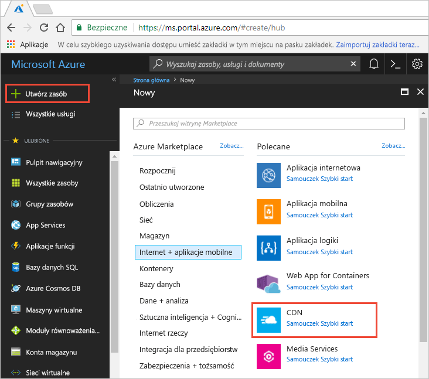
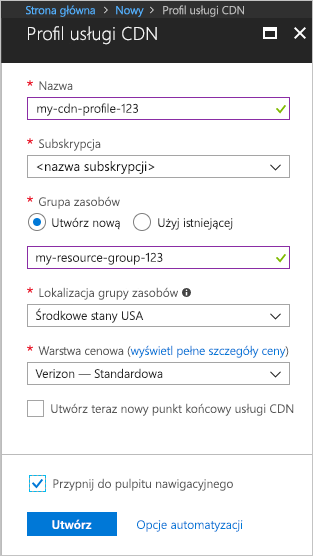

## Tworzenie nowego profilu CDN

Profil usługi CDN jest kontenerem dla punktów końcowych usługi CDN i określa warstwę cenową.

1. W witrynie Azure Portal w lewym górnym rogu wybierz pozycję **Utwórz zasób**.
    
    Zostanie wyświetlone okienko **Nowy**.
   
2. Wybierz pozycję **Sieć Web + aplikacje mobilne**, a następnie wybierz pozycję **CDN**.
   
    

    Zostanie wyświetlone okienko **Profil usługi CDN**.

    Użyj ustawień określonych w tabeli pod obrazem.
   
    

    | Ustawienie  | Wartość |
    | -------- | ----- |
    | **Nazwa** | Jako nazwę profilu wprowadź *my-cdn-profile-123*. Ta nazwa musi być globalnie unikatowa; jeśli jest już używana, wprowadź inną nazwę. |
    | **Subskrypcja** | Z listy rozwijanej wybierz subskrypcję platformy Azure.|
    | **Grupa zasobów** | Wybierz pozycję **Utwórz nowy**, a następnie jako nazwę grupy zasobów wprowadź *my-resource-group-123*. Ta nazwa musi być globalnie unikatowa; jeśli jest już używana, wprowadź inną nazwę. | 
    | **Lokalizacja grupy zasobów** | Z listy rozwijanej wybierz pozycję **Środkowe stany USA**. |
    | **Warstwa cenowa** | Z listy rozwijanej wybierz pozycję **Verizon — Standardowa**. |
    | **Utwórz teraz nowy punkt końcowy CDN** | Pozostaw niezaznaczone. |  
   
3. Wybierz pozycję **Przypnij do pulpitu nawigacyjnego**, aby zapisać profil na pulpicie nawigacyjnym po jego utworzeniu.
    
4. Wybierz pozycję **Utwórz**, aby utworzyć profil. 

