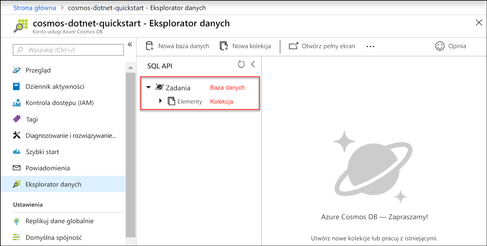

Teraz możesz użyć narzędzia Eksplorator danych w witrynie Azure Portal, aby utworzyć bazę danych i kolekcję. 

1. Kliknij przycisk **Eksplorator danych** > **Nowa kolekcja**. 
    
    Obszar **Dodaj kolekcję** jest wyświetlany po prawej stronie i konieczne może być przewinięcie w prawo w celu wyświetlenia go.

    

2. Na stronie **Dodaj kolekcję** wprowadź ustawienia dla nowej kolekcji.

    Ustawienie|Sugerowana wartość|Opis
    ---|---|---
    Identyfikator bazy danych|*Zadania*|Wprowadź *Zadania* jako nazwę nowej bazy danych. Nazwy baz danych muszą zawierać od 1 do 255 znaków i nie mogą zawierać znaków /, \\, #, ? ani mieć spacji na końcu.
    Identyfikator kolekcji|*Elementy*|Wprowadź *Elementy* jako nazwę nowej kolekcji. W przypadku identyfikatorów kolekcji obowiązują takie same wymagania dotyczące znaków, jak dla nazw baz danych.
    Aprowizacja przepływności bazy danych|Pozostaw puste|Usługa Azure Cosmos DB może aprowizować przepływność na poziomie bazy danych (wszystkie kolekcje w bazie danych dzielą tę samą przepływność) albo na poziomie kolekcji. Pozostaw puste, aby aprowizować przepływności na poziomie kolekcji dla tej określonej kolekcji.
    Pojemność magazynu|*Unlimited (nieograniczony)*|Wybierz pojemność magazynu **Nieograniczona**. 
    Klucz partycji|*/category*|Wprowadź „/category” jako klucz partycji. Ustawienie klucza partycji umożliwia usłudze Azure Cosmos DB skalowanie kolekcji w celu spełnienia wymagań dotyczących magazynu i przepływności Twojej aplikacji. Ogólnie rzecz biorąc, dobry klucz partycji to taki, który ma szeroki zakres unikatowych wartości oraz umożliwia równomierną dystrybucję woluminu żądań i magazynu w obciążeniu. [Dowiedz się więcej na temat partycjonowania.](../articles/cosmos-db/partitioning-overview.md)
    Przepływność|*400 jednostek RU/s*|Zmień przepływność na 400 jednostek żądania na sekundę (RU/s). Jeśli chcesz zmniejszyć opóźnienie, możesz później przeskalować przepływność w górę. 
    
    Oprócz powyższych ustawień, można opcjonalnie dodać **unikatowe klucze** dla kolekcji. W tym przykładzie pozostawmy pole puste. Unikatowe klucze umożliwiają deweloperom dodanie warstwy integralności danych do bazy danych. Tworząc zasady unikatowych kluczy podczas tworzenia kolekcji, można zapewnić unikatowość co najmniej jednej wartości na każdy klucz partycji. Aby dowiedzieć się więcej, zapoznaj się z artykułem [Unique keys in Azure Cosmos DB (Unikatowe klucze w usłudze Azure Cosmos DB)](../articles/cosmos-db/unique-keys.md).
    
    Kliknij przycisk **OK**.

    W Eksploratorze danych zostanie wyświetlona nowa baza danych i kolekcja.

    