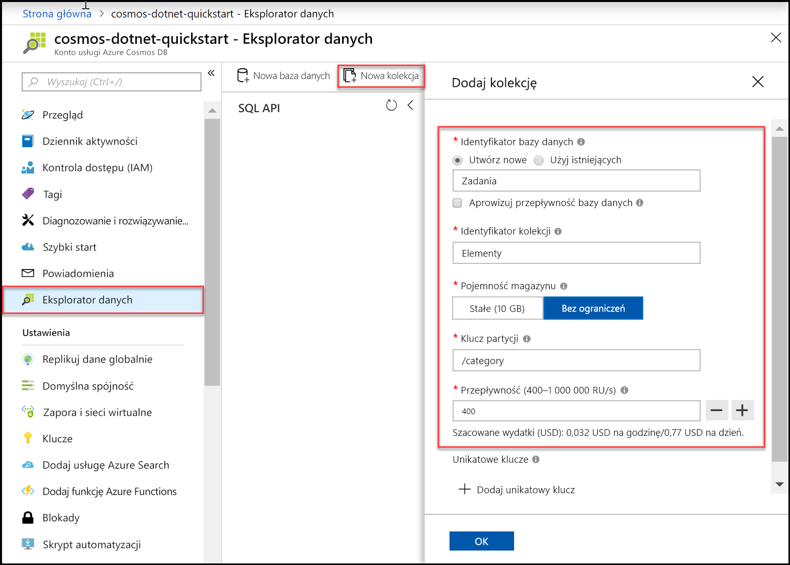

Można teraz użyć narzędzia Eksplorator danych w witrynie Azure portal, aby utworzyć bazę danych i kontener. 

1. Kliknij przycisk **Eksplorator danych** > **nowy kontener**. 
    
    **Dodaj kontener** obszar jest wyświetlany po prawej, konieczne może być przewinięcie w prawo w celu wyświetlenia go.

    

2. W **Dodaj kontener** strony, wprowadź ustawienia dla nowego kontenera.

    |Ustawienie|Sugerowana wartość|Opis
    |---|---|---|
    |**Identyfikator bazy danych**|Zadania|Wprowadź *Zadania* jako nazwę nowej bazy danych. Nazwy baz danych muszą zawierać od 1 do 255 znaków i nie mogą zawierać znaków /, \\, #, ? ani mieć spacji na końcu. Sprawdź **Aprowizowanie przepływności bazy danych** opcji umożliwia udostępnianie przepływnością aprowizowaną do bazy danych we wszystkich kontenerach w bazie danych. Ta opcja pomaga również zmniejszyć koszty. |
    |**Przepływność**|400|Pozostaw przepływność na 400 jednostek żądań na sekundę (RU/s). Jeśli chcesz zmniejszyć opóźnienie, możesz później przeskalować przepływność w górę.| 
    |**Identyfikator kontenera**|Elementy|Wprowadź *elementów* jako nazwa dla nowego kontenera. Identyfikatory kontenerów mają te same wymagania znaków jako nazwy bazy danych.|
    |**Klucz partycji**| /category| W przykładzie opisanych w tym artykule użyto */category* jako klucza partycji. Ustawienie klucza partycji umożliwia usłudze Azure Cosmos DB skalowanie kolekcji w celu spełnienia wymagań dotyczących magazynu i przepływności Twojej aplikacji. Ogólnie rzecz biorąc, dobry klucz partycji to taki, który ma szeroki zakres unikatowych wartości oraz umożliwia równomierną dystrybucję woluminu żądań i magazynu w obciążeniu. [Dowiedz się więcej na temat partycjonowania.](../articles/cosmos-db/partitioning-overview.md)|
    
    Oprócz powyższych ustawień, można opcjonalnie dodać **unikatowe klucze** dla kontenera. W tym przykładzie pozostawmy pole puste. Unikatowe klucze umożliwiają deweloperom dodanie warstwy integralności danych do bazy danych. Tworząc zasady unikatowych kluczy podczas tworzenia kontenera, możesz zapewnić unikatowość co najmniej jedną wartość na klucz partycji. Aby dowiedzieć się więcej, zapoznaj się z artykułem [Unique keys in Azure Cosmos DB (Unikatowe klucze w usłudze Azure Cosmos DB)](../articles/cosmos-db/unique-keys.md).
    
    Kliknij przycisk **OK**. Eksploratorze danych zostanie wyświetlona nowa baza danych i kontener.

