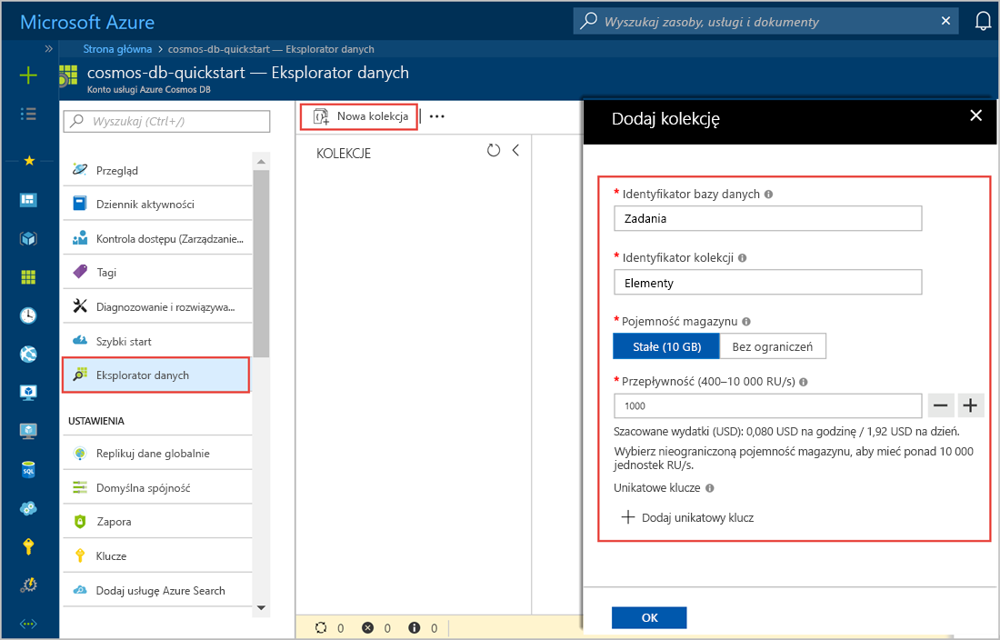
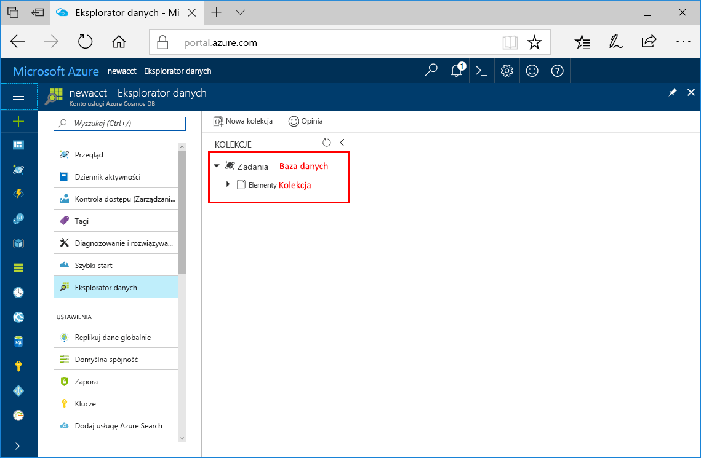

Teraz możesz użyć narzędzia Eksplorator danych w witrynie Azure Portal, aby utworzyć bazę danych i kolekcję. 

1. Kliknij przycisk **Eksplorator danych** > **Nowa kolekcja**. 
    
    Obszar **Dodaj kolekcję** jest wyświetlany po prawej stronie i konieczne może być przewinięcie w prawo w celu wyświetlenia go.

    

2. Na stronie **Dodaj kolekcję** wprowadź ustawienia dla nowej kolekcji.

    Ustawienie|Sugerowana wartość|Opis
    ---|---|---
    Identyfikator bazy danych|Zadania|Wprowadź *Zadania* jako nazwę nowej bazy danych. Nazwy baz danych muszą zawierać od 1 do 255 znaków i nie mogą zawierać znaków `/, \\, #, ?` ani mieć spacji na końcu.
    Identyfikator kolekcji|Items|Wprowadź *Elementy* jako nazwę nowej kolekcji. W przypadku identyfikatorów kolekcji obowiązują takie same wymagania dotyczące znaków, jak dla nazw baz danych.
    Klucz partycji| `<Your partition key>`| Wprowadź klucz partycji, na przykład */userid*.
    Przepływność|400 RU|Zmień przepływność na 400 jednostek żądania na sekundę (RU/s). Jeśli chcesz zmniejszyć opóźnienie, możesz później przeskalować przepływność w górę. 
    
    Oprócz powyższych ustawień, można opcjonalnie dodać **unikatowe klucze** dla kolekcji. W tym przykładzie pozostawmy pole puste. Unikatowe klucze umożliwiają deweloperom dodanie warstwy integralności danych do bazy danych. Tworząc zasady unikatowych kluczy podczas tworzenia kolekcji, można zapewnić unikatowość co najmniej jednej wartości na każdy klucz partycji. Aby dowiedzieć się więcej, zapoznaj się z artykułem [Unique keys in Azure Cosmos DB (Unikatowe klucze w usłudze Azure Cosmos DB)](../articles/cosmos-db/unique-keys.md).
    
    Kliknij przycisk **OK**.

    W Eksploratorze danych zostanie wyświetlona nowa baza danych i kolekcja.

    