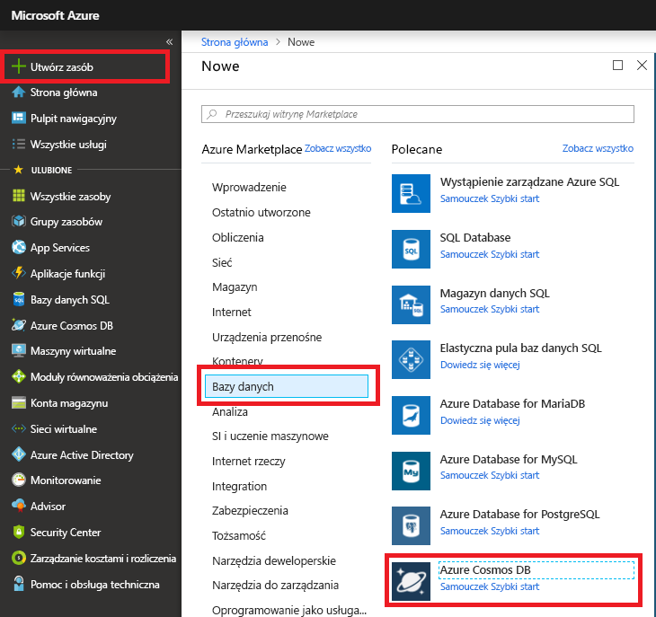

1. Przejdź do witryny [Azure Portal](https://portal.azure.com/), aby utworzyć konto usługi Azure Cosmos DB. Wyszukaj i wybierz usługę **Azure Cosmos DB**.

   

1. Wybierz pozycję **Dodaj**.
1. Na stronie **Tworzenie konta usługi Azure Cosmos DB** wprowadź podstawowe ustawienia nowego konta usługi Azure Cosmos. 

    |Ustawienie|Wartość|Opis |
    |---|---|---|
    |Subskrypcja|Nazwa subskrypcji|Wybierz subskrypcję platformy Azure, której chcesz użyć dla tego konta usługi Azure Cosmos. |
    |Grupa zasobów|Nazwa grupy zasobów|Wybierz grupę zasobów lub wybierz pozycję **Utwórz nową**, a następnie wprowadź unikatową nazwę nowej grupy zasobów. |
    |Nazwa konta|Unikatowa nazwa|Wprowadź nazwę, która będzie identyfikować konto usługi Azure Cosmos. Ponieważ adres *documents.azure.com* jest dołączany do podanej nazwy w celu utworzenia identyfikatora URI, użyj unikatowej nazwy.  Nazwa może zawierać tylko małe litery, cyfry i znaki łącznika (-). Musi mieć długość od 3 do 31 znaków.|
    |Interfejs API|Typ konta do utworzenia|Wybierz pozycję **Core (SQL)** , aby utworzyć bazę danych dokumentów i wykonać zapytanie przy użyciu składni języka SQL.   Interfejs API określa typ konta do utworzenia. Usługa Azure Cosmos DB oferuje pięć interfejsów API: Core (SQL) i MongoDB dla danych dokumentów, Gremlin dla danych grafów, Azure Table i Cassandra. Obecnie dla każdego interfejsu API należy utworzyć oddzielne konto.   [Dowiedz się więcej o interfejsie API SQL](../articles/cosmos-db/documentdb-introduction.md).|
    |Zastosuj rabat na podstawie warstwy Bezpłatna|Zastosuj lub nie stosuj|W ramach warstwy Bezpłatna usługi Azure Cosmos DB uzyskasz bezpłatnie pierwsze 400 jednostek RU/s i 5 GB magazynu na koncie. Dowiedz się więcej o [warstwie Bezpłatna](https://azure.microsoft.com/pricing/details/cosmos-db/).|
    |Lokalizacja|Region najbliżej Twoich użytkowników|Wybierz lokalizację geograficzną, w której będzie hostowane konto usługi Azure Cosmos DB. Użyj lokalizacji znajdującej się najbliżej Twoich użytkowników, aby zapewnić im najszybszy dostęp do danych.|
    |Typ konta|Produkcyjne lub nieprodukcyjne|Wybierz pozycję **Produkcyjne**, jeśli konto będzie używane w obciążeniu produkcyjnym. Wybierz pozycję **Nieprodukcyjne**, jeśli konto będzie używane na potrzeby nieprodukcyjne, na przykład programowania, testowania, kontroli jakości lub wdrażania przejściowego. Jest to ustawienie tagu zasobu platformy Azure, które dostosowuje środowisko portalu, ale nie wpływa na bazowe konto usługi Azure Cosmos DB. Tę wartość można zmienić w dowolnym momencie.|

> [!NOTE]
> W ramach jednej subskrypcji platformy Azure można korzystać z maksymalnie jednego konta usługi Azure Cosmos DB w warstwie Bezpłatna. Tę opcję należy wybrać podczas tworzenia konta. Jeśli opcja zastosowania rabatu na podstawie warstwy Bezpłatna nie jest widoczna, inne konto w subskrypcji już korzysta z warstwy Bezpłatna.
   
   

1. Wybierz pozycję **Przegląd + utwórz**. Sekcje **Sieć** i **Tagi** możesz pominąć.

1. Przejrzyj ustawienia konta, a następnie wybierz pozycję **Utwórz**. Utworzenie konta trwa kilka minut. Poczekaj na wyświetlenie komunikatu **Wdrożenie zostało ukończone** na stronie portalu. 

    

1. Wybierz pozycję **Przejdź do zasobu**, aby przejść do strony konta usługi Azure Cosmos DB. 

    
