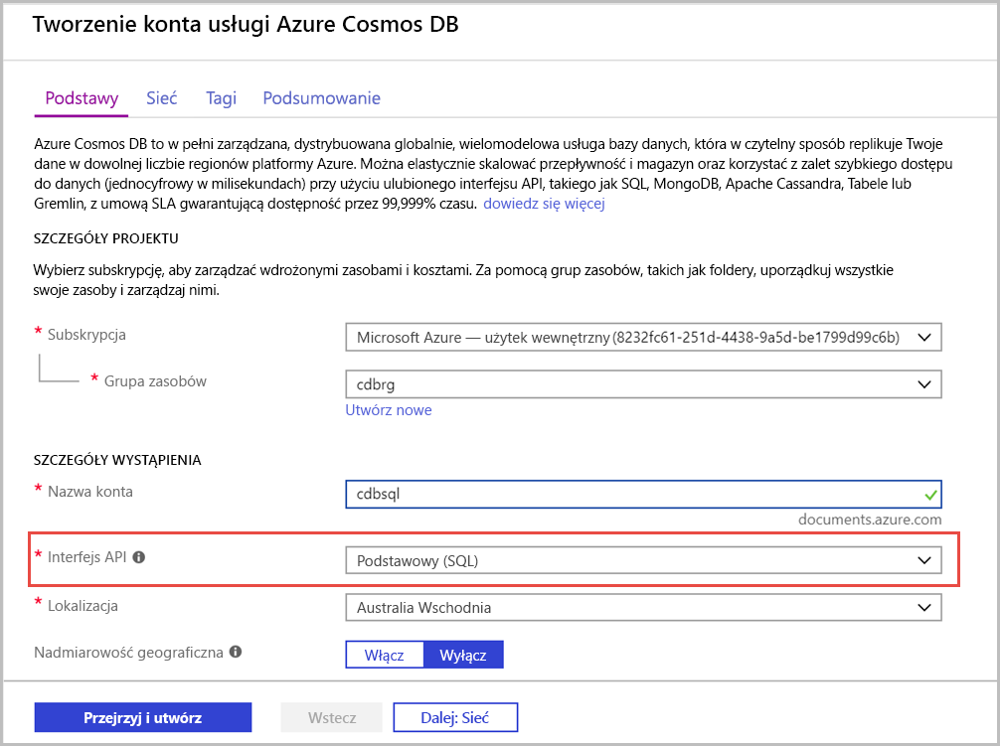

1. Zaloguj się w witrynie [Azure Portal](https://portal.azure.com/).
1. Wybierz kolejno pozycje **Utwórz zasób** > **Bazy danych** > **Azure Cosmos DB**.
   
   

1. Na stronie **Tworzenie konta Azure Cosmos DB** wprowadź podstawowe ustawienia dla nowego konta usługi Azure Cosmos. 
 
    |Ustawienie|Wartość|Opis |
    |---|---|---|
    |Subscription|Nazwa subskrypcji|Wybierz subskrypcję platformy Azure, która ma być używana dla tego konta usługi Azure Cosmos. |
    |Grupa zasobów|Nazwa grupy zasobów|Wybierz grupę zasobów lub wybierz pozycję **Utwórz nową**, a następnie wprowadź unikatową nazwę nowej grupy zasobów. |
    | Nazwa konta|Wprowadź unikatową nazwę|Wprowadź nazwę, aby zidentyfikować konto usługi Azure Cosmos. Ponieważ adres *documents.azure.com* jest dołączany do podanego identyfikatora w celu utworzenia identyfikatora URI, użyj unikatowego identyfikatora.  Identyfikator może zawierać tylko małe litery, cyfry i znaki łącznika (-). Długość musi należeć do zakresu 3-31 znaków.|
    | interfejs API|Core (SQL)|Interfejs API określa typ konta do utworzenia. Usługa Azure Cosmos DB oferuje pięć interfejsów API: Podstawowe (SQL) i MongoDB dla danych dokumentów, Gremlin dla danych grafów, Azure Table i Cassandra. Obecnie dla każdego interfejsu API należy utworzyć oddzielne konto.   Wybierz pozycję **rdzeń (SQL)** , aby utworzyć bazę danych dokumentów i zapytanie przy użyciu składni SQL.   [Dowiedz się więcej o interfejsie API SQL](../articles/cosmos-db/documentdb-introduction.md).|
    | Location|Wybierz region najbliżej Twoich użytkowników|Wybierz lokalizację geograficzną, w której będzie hostowane konto usługi Azure Cosmos DB. Użyj lokalizacji znajdującej się najbliżej Twoich użytkowników, aby zapewnić im najszybszy dostęp do danych.|
   
   

1. Wybierz pozycję **Przegląd + utwórz**. Możesz pominąć sekcje **sieci** i **Tagi** . 

1. Przejrzyj ustawienia konta, a następnie wybierz pozycję **Utwórz**. Utworzenie konta może potrwać kilka minut. Poczekaj, aż Strona portalu **zostanie**wyświetlona. 

    

1. Wybierz pozycję **Przejdź do zasobu** , aby przejść do strony konta Azure Cosmos DB. 

    
