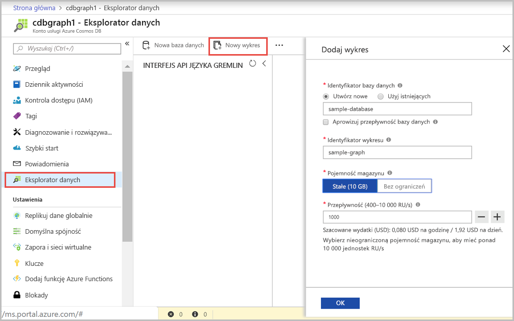

Teraz możesz użyć narzędzia Eksplorator danych w witrynie Azure Portal, aby utworzyć bazę danych grafów. 

1. Wybierz pozycję **Eksplorator danych** > **Nowy Graf**.

    Obszar **Dodaj graf** jest wyświetlany po prawej stronie i konieczne może być przewinięcie w prawo w celu wyświetlenia go.

    

2. Na stronie **Dodaj graf** wprowadź ustawienia dla nowego grafu.

    Ustawienie|Sugerowana wartość|Opis
    ---|---|---
    Identyfikator bazy danych|sample-database|Wprowadź *sample-database* jako nazwę nowej bazy danych. Nazwy baz danych muszą zawierać od 1 do 255 znaków i nie mogą zawierać znaków `/ \ # ?` ani mieć spacji na końcu.
    Przepływność|400 jednostek żądania|Zmień przepływność na 400 jednostek żądania na sekundę (RU/s). Jeśli chcesz zmniejszyć opóźnienie, możesz później przeskalować przepływność w górę.
    Identyfikator grafu|sample-graph|Wprowadź *sample-graph* jako nazwę nowej kolekcji. W przypadku nazw grafów obowiązują takie same wymagania dotyczące znaków jak dla identyfikatorów baz danych.
    Klucz partycji| /pk |Wszystkie konta Cosmos DB muszą mieć klucz partycji w poziomie. Dowiedz się, jak wybrać odpowiedni klucz partycji w [artykule Partycjonowanie danych grafu](https://docs.microsoft.com/azure/cosmos-db/graph-partitioning).

3. Po wypełnieniu formularza wybierz **przycisk OK**.
