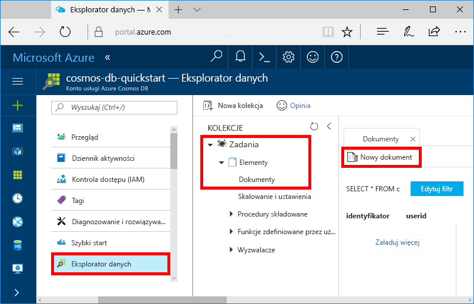
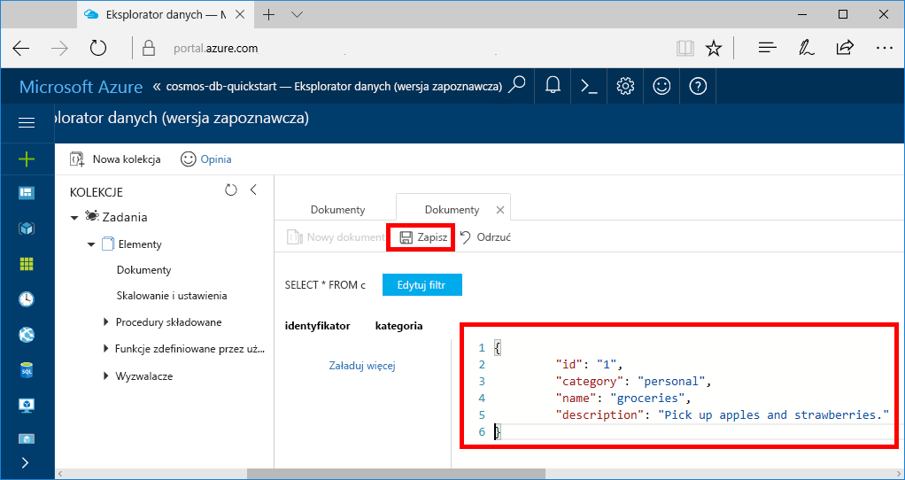

Teraz możesz dodawać dane do nowego kontenera przy użyciu Eksplorator danych.

1. W **Eksplorator danych**rozwiń bazę danych **zadania** , rozwiń kontener **elementy** . Wybierz pozycję **elementy**, a następnie wybierz pozycję **nowy element**.

   
  
2. Teraz Dodaj dokument do kontenera z następującą strukturą.

     ```json
     {
         "id": "1",
         "category": "personal",
         "name": "groceries",
         "description": "Pick up apples and strawberries.",
         "isComplete": false
     }
     ```

3. Po dodaniu pliku JSON do karty **dokumenty** wybierz pozycję **Zapisz**.

    

4.  Utwórz i zapisz jeszcze jeden dokument, w którym wstawisz unikatową wartość dla właściwości `id` i zmienisz inne właściwości wedle uznania. Nowe dokumenty mogą mieć dowolną strukturę, ponieważ usługa Azure Cosmos DB nie wymusza żadnego schematu danych.