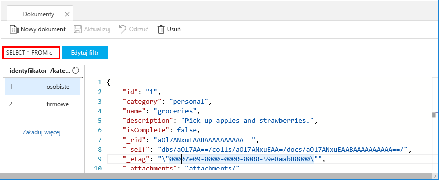
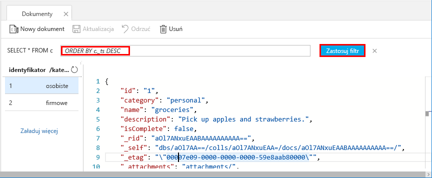

Zapytania w Eksploratorze danych służy do pobrania i filtrowania danych.

1. W górnej części **dokumenty** kartę w Eksploratorze danych, przejrzyj zapytanie domyślne `SELECT * FROM c`. To zapytanie pobiera i wyświetla wszystkie dokumenty w kolekcji według Identyfikatora. 
   
   
   
1. Aby zmienić kwerendę, zaznacz **Edytuj filtr**, Zastąp domyślne zapytanie za pomocą `ORDER BY c._ts DESC`, a następnie wybierz pozycję **Zastosuj filtr**.
   
   

   Wyświetla zmodyfikowane zapytanie, dokumenty w kolejności malejącej według ich sygnatury czasowej, więc drugi dokument jest wymienione jako pierwsze. 
   
   

Jeśli znasz składnię SQL, możesz wprowadzić dowolne obsługiwane [zapytania SQL](../articles/cosmos-db/sql-api-sql-query.md) w pola predykatu zapytania. Eksplorator danych umożliwia również tworzenie procedur składowanych, funkcji zdefiniowanych przez użytkownika i Wyzwalacze dla logiki biznesowej po stronie serwera. 

Eksplorator danych udostępnia proste Azure portal wszystkie wbudowane programowe funkcje dostępu do danych w interfejsach API. Możesz także użyć portalu skalowanie przepływności, klucze i parametry połączenia i przejrzeć metryki i umowy SLA dla swojego konta usługi Azure Cosmos DB. 

