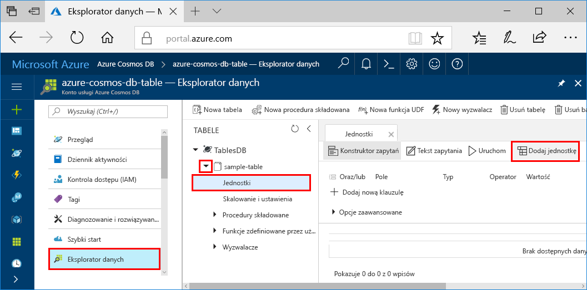
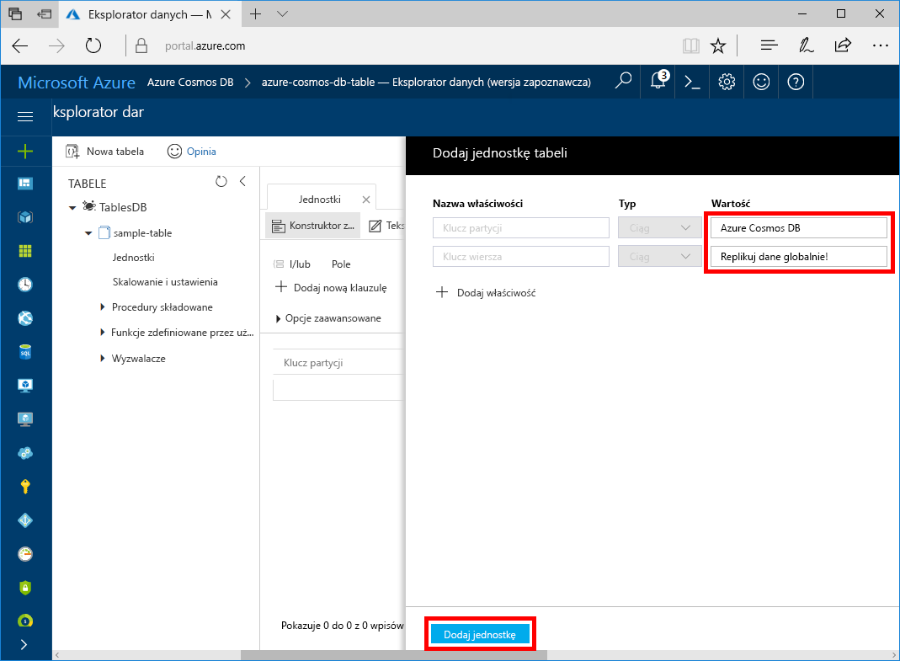

Teraz możesz dodać dane do swojej nowej tabeli za pomocą Eksploratora danych.

1. W Eksploratorze danych rozwiń węzeł **sample-table**, kliknij pozycję **Jednostki**, a następnie kliknij przycisk **Dodaj jednostkę**.

   

2. Teraz dodaj dane do pól wartości PartitionKey i RowKey, a następnie kliknij przycisk **Dodaj jednostkę**.

   
  
    Teraz możesz dodać więcej jednostek do swojej tabeli, edytować jednostki lub przeszukiwać dane w Eksploratorze danych. W Eksploratorze danych możesz również skalować przepływność oraz dodawać do tabeli procedury składowane, funkcje zdefiniowane przez użytkownika i wyzwalacze.