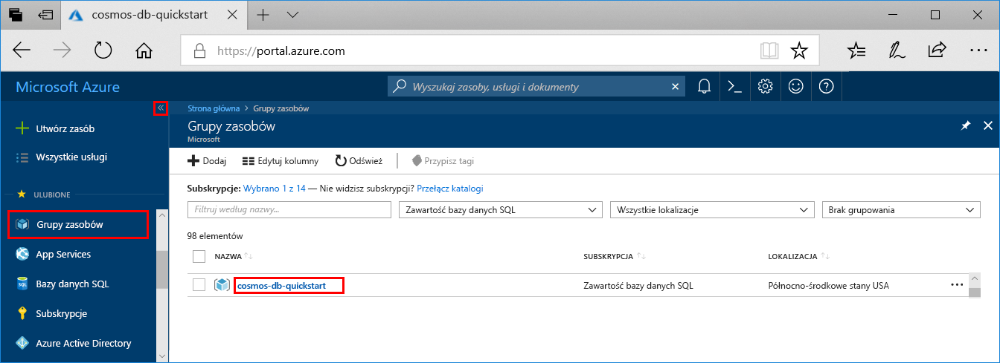
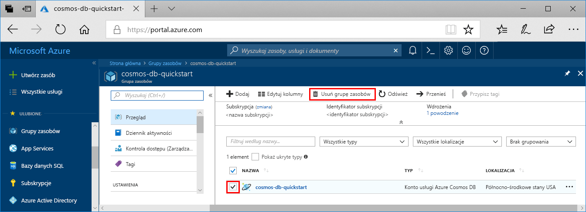

Po zakończeniu korzystania z aplikacji sieci web i usługi Azure Cosmos DB, możesz usunąć zasoby platformy Azure, który został utworzony, więc nie powodują naliczania opłat więcej. Aby usunąć zasoby:

1. W witrynie Azure Portal na końcu z lewej strony wybierz pozycję **Grupy zasobów**. Jeśli menu po lewej stronie jest zwinięte, wybierz  aby ją rozwinąć.

2. Wybierz grupę zasobów, utworzone dla tego przewodnika Szybki Start.  

   

2. W nowym oknie Wybierz **Usuń grupę zasobów**.

      

3. W następnym oknie wpisz nazwę grupy zasobów do usunięcia, a następnie wybierz pozycję **Usuń**.

