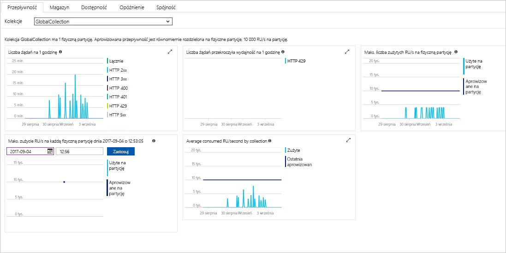

Azure portal monitoruje przepływności konta usługi Cosmos DB, storage, dostępności, opóźnienia i spójności. Wykresy metryk skojarzone z [Cosmos DB z umowy dotyczącej poziomu (SLA)](https://azure.microsoft.com/support/legal/sla/cosmos-db/) Pokaż wartość SLA w porównaniu do rzeczywistej wydajności. Tego zestawu metryk sprawia, że monitorowanie umowach SLA przezroczysty.

Aby przejrzeć metryki i umowy SLA: 

1. Wybierz **metryki** w menu nawigacyjnym konta usługi Cosmos DB.
   
2. Wybierz kartę, takich jak **opóźnienie**i wybierz przedział czasu, po prawej stronie. Porównaj **rzeczywisty** i **SLA** wierszy na wykresach.
   
   
   
3. Przejrzyj metryki na innych kartach. 

