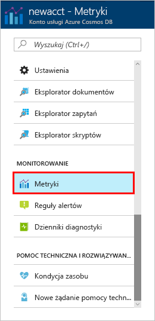

Przepływność, wielkość magazynu, dostępność, opóźnienie i spójność zasobów w ramach konta są monitorowane w witrynie Azure Portal. Przyjrzyjmy się bliżej tym metrykom. 

1. Kliknij przycisk **Metryki** w menu nawigacji.

   

2. Kliknij każdą z kart, aby zapoznać się z metrykami udostępnianymi przez usługę Azure Cosmos DB. 

    Każdy wykres skojarzony z [umową dotyczącą poziomu usług (SLA, Service Level Agreement) dla usługi Azure Cosmos DB](https://azure.microsoft.com/support/legal/sla/cosmos-db/) zawiera linię przedstawiającą ewentualne naruszenie którejkolwiek z umów SLA. Ten zestaw metryk zapewnia przejrzyste monitorowanie umów SLA w usłudze Azure Cosmos DB. 

   