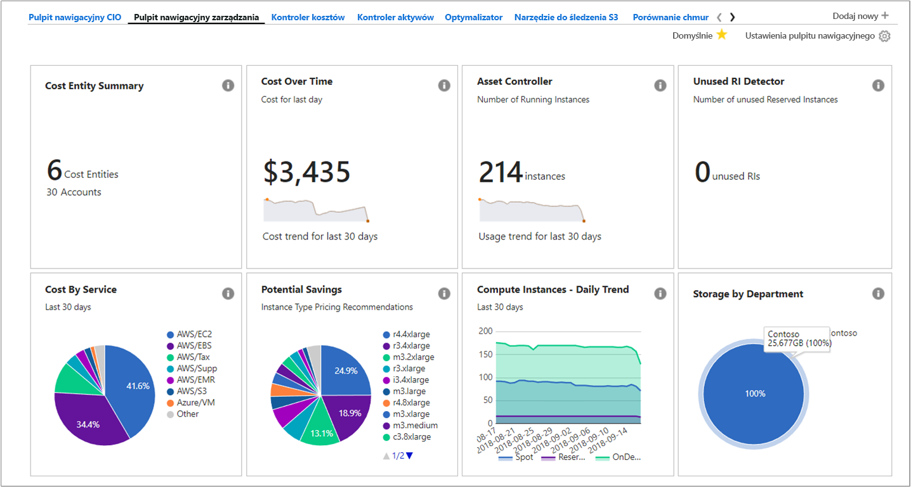
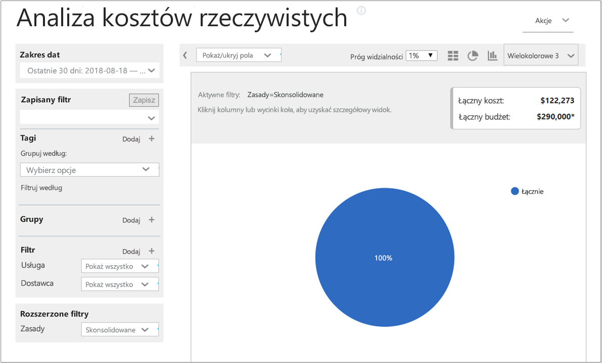
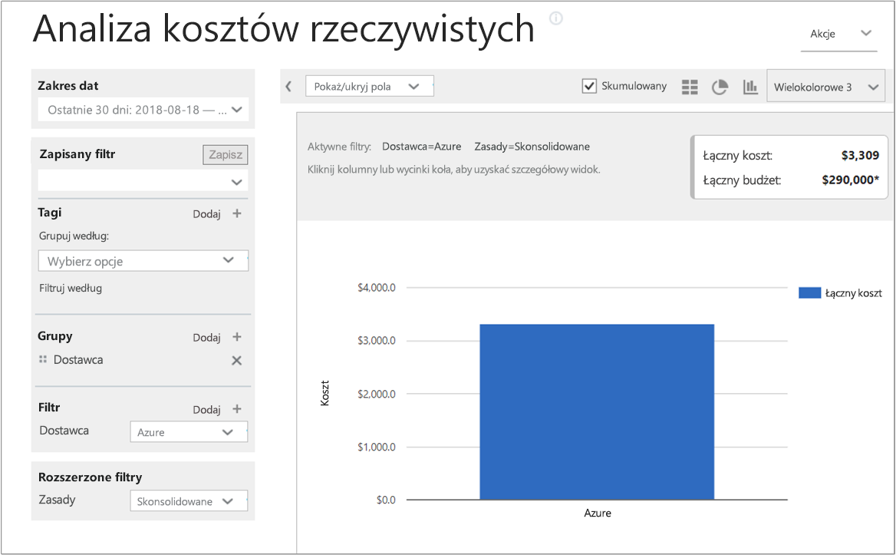
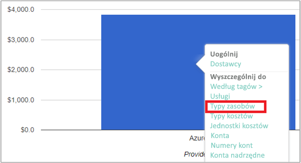
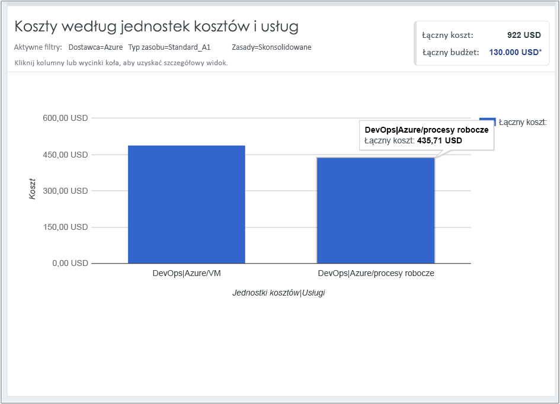

## Wyświetlanie danych kosztów

Rozwiązanie Azure Cost Management firmy Cloudyn zapewnia dostęp do wszystkich danych zasobów w chmurze. Pulpit nawigacyjny zawiera standardowe i niestandardowe raporty wyświetlane w widoku z kartami. Poniżej przedstawiono przykłady popularnego pulpitu nawigacyjnego i raportu, który umożliwia natychmiastowe przedstawienie danych kosztów.

W tym przykładzie pulpit nawigacyjny zarządzania obejmuje skonsolidowane koszty wszystkich zasobów w chmurze firmy Contoso. Firma Contoso używa platformy Azure, usług AWS i usługi Google. Pulpity nawigacyjne zapewniają wgląd w informacje i umożliwiają szybkie przechodzenie do raportów.  

Jeśli nie masz pewności, jaki jest cel raportu na pulpicie nawigacyjnym, umieść kursor na symbolu **i**, aby wyświetlić wyjaśnienie. Kliknij dowolny raport na pulpicie nawigacyjnym, aby wyświetlić pełny raport.

Możesz też wyświetlać raporty za pomocą menu raportów w górnej części portalu. Spójrzmy na wydatki związane z zasobami platformy Azure w firmie Contoso z ostatnich 30 dni. Kliknij pozycję **Koszty** > **Analiza kosztów** > **Rzeczywista analiza kosztów**. Wyczyść wszelkie wartości ustawione dla tagów, grup lub filtrów w raporcie.

W tym przykładzie łączny koszt wynosi 122 273 USD, a budżet wynosi 290 000 USD.

Teraz zmodyfikujemy format raportu oraz ustawimy grupy i filtry, aby zawęzić wyniki dla kosztów związanych z platformą Azure. Jako **zakres dat** ustaw ostatnich 30 dni. W prawym górnym rogu kliknij symbol kolumny, aby zastosować formatowanie wykresu słupkowego, a następnie w obszarze Grupy wybierz pozycję **Dostawca**. Następnie jako filtr **Dostawca** ustaw wartość **Azure**.

W tym przykładzie łączny koszt zasobów platformy Azure z ostatnich 30 dni wynosi 3309 USD.

Kliknij prawym przyciskiem myszy pasek Dostawca (Azure), a następnie przejdź do szczegółów do pozycji **Typy zasobów**.

Na poniższej ilustracji przedstawiono koszty zasobów platformy Azure poniesione przez firmę Contoso. Łączny koszt wynosi 3309 USD. W tym przykładzie połowa kosztów dotyczyła maszyn wirtualnych w warstwie Standard_A1, a druga połowa — różnych wystąpień usług platformy Azure i maszyn wirtualnych.

Kliknij prawym przyciskiem myszy typ zasobu i wybierz pozycję **Jednostki kosztów**, aby wyświetlić jednostki kosztów i usługi, które korzystały z zasobu. Na poniższej przykładowej ilustracji magazyn lokalnie nadmiarowy został ustawiony jako typ zasobu. Jednostka Contoso|Azure/Storage wykorzystała 15,65 USD. Jednostka Inżynieria|Azure Storage wykorzystała 164,25 USD. Jednostka Infrastruktura udostępniona|Azure/Storage wykorzystała 116,58 USD. Łączny koszt usług wynosi 296 USD.

Aby obejrzeć wideo dotyczące wyświetlania danych rozliczeń dla chmury, zobacz [Analyzing your cloud billing data with Azure Cost Management by Cloudyn](https://youtu.be/G0pvI3iLH-Y) (Analizowanie danych rozliczeń dla chmury przy użyciu rozwiązania Azure Cost Management firmy Cloudyn).
