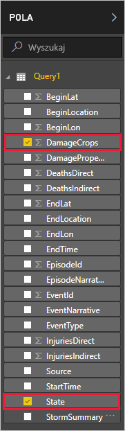
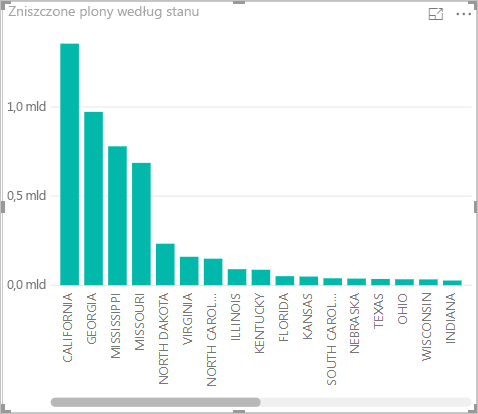

Teraz, gdy już masz dane w programie Power BI Desktop, na ich podstawie możesz tworzyć raporty. Za pomocą wykresu kolumnowego utworzysz prosty raport przedstawiający zniszczenia upraw według stanów.

1. Po lewej stronie głównego okna programu Power BI wybierz widok raportu.

    

1. W okienku **WIZUALIZACJE** wybierz wykres kolumnowy grupowany.

    

    Do kanwy został dodany pusty wykres.

    

1. Na liście **POLA** wybierz pozycje **DamageCrops** i **State**.

    

    Teraz masz wykres przedstawiający zniszczenia upraw dla pierwszych 1000 wierszy w tabeli.

    

1. Zapisz raport.