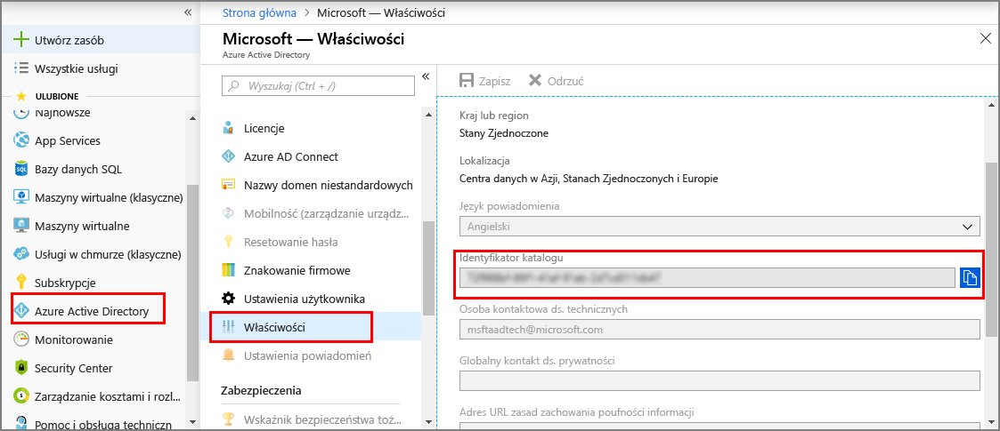
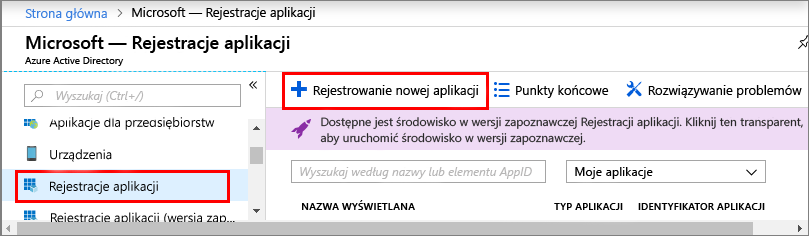

1. W witrynie [Azure Portal](https://portal.azure.com) otwórz usługę **Azure Active Directory** w panelu nawigacyjnym po lewej stronie, a następnie otwórz okienko **Właściwości**. Skopiuj wartość **identyfikatora katalogu** do pliku tymczasowego. Użyjesz tej wartości, aby skonfigurować aplikację przykładową w następnej sekcji.

    

1. Otwórz okienko **Rejestracje aplikacji**, a następnie kliknij przycisk **Rejestrowanie nowej aplikacji**.
    
    

1. Nadaj przyjazną nazwę dla tej rejestracji aplikacji w polu **Nazwa**. W polu **Typ aplikacji** wybierz opcję **_Natywna_**, a w polu **Identyfikator URI przekierowania** opcję **_https://microsoft.com_**. Kliknij pozycję **Utwórz**.

    

1. Otwórz zarejestrowaną aplikację, a następnie skopiuj wartość pola **Identyfikator aplikacji** do pliku tymczasowego.Ta wartość identyfikuje aplikację usługi Azure Active Directory. Identyfikatora aplikacji użyjesz do skonfigurowania aplikacji przykładowej w poniższych sekcjach.

    

1. Otwórz okienko rejestracji Twojej aplikacji, a następnie kliknij pozycję **Ustawienia** > **Wymagane uprawnienia**:
    - Kliknij przycisk **Dodaj** w lewym górnym rogu, aby otworzyć okienko **Dodaj dostęp do interfejsu API**.
    - Kliknij przycisk **Wybierz interfejs API** i wyszukaj usługę **Azure Digital Twins**. Jeśli wyszukiwanie nie znajdzie interfejsu API, zamiast tego wyszukaj frazę **Azure Smart Spaces**.
    - Wybierz opcję **Azure Digital Twins (Azure Smart Spaces Service)** i kliknij pozycję **Wybierz**.
    - Kliknij pozycję **Wybierz uprawnienia**. Zaznacz pole uprawnień delegowanych **Dostęp do odczytu/zapisu** i kliknij przycisk **Wybierz**.
    - Kliknij przycisk **Gotowe** w okienku **Dodaj dostęp do interfejsu API**.
    - W okienku **Wymagane uprawnienia** kliknij przycisk **Udziel uprawnień**, a następnie zaakceptuj wyświetlone potwierdzenie.

       
