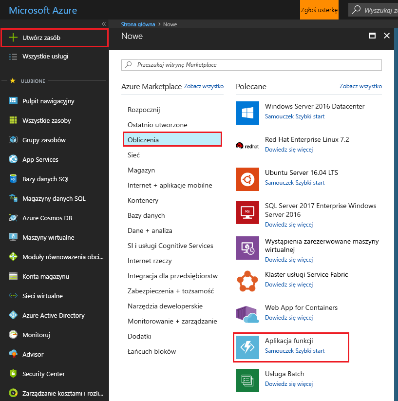
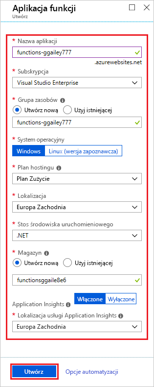

1. Wybierz **Utwórz zasób** znajdujący się w lewym górnym rogu witryny Azure portal, następnie wybierz opcję **obliczenia** > **aplikacji funkcji**.

    

2. Użyj ustawień aplikacji funkcji podanych w tabeli pod obrazem.

    

    | Ustawienie      | Sugerowana wartość  | Opis                                        |
    | ------------ |  ------- | -------------------------------------------------- |
    | **Nazwa aplikacji** | Nazwa unikatowa w skali globalnej | Nazwa identyfikująca nową aplikację funkcji. Prawidłowe znaki to `a-z`, `0-9` i `-`.  | 
    | **Subskrypcja** | Twoja subskrypcja | Subskrypcja, w ramach której jest tworzona ta nowa aplikacja funkcji. | 
    | **[Grupa zasobów](../articles/azure-resource-manager/resource-group-overview.md)** |  myResourceGroup | Nazwa nowej grupy zasobów, w której ma zostać utworzona aplikacja funkcji. |
    | **OS** | Windows | Hosting bezserwerowy w systemie Linux jest obecnie w wersji zapoznawczej. Aby uzyskać więcej informacji, zobacz [w tym artykule zagadnienia](https://aka.ms/funclinux).|
    | **[Plan hostingu](../articles/azure-functions/functions-scale.md)** | Plan Zużycie | Plan hostingu określający sposób przydzielania zasobów do aplikacji funkcji. W domyślnym planie (**Plan Zużycie**) zasoby są dodawane dynamicznie zgodnie z wymaganiami funkcji. W przypadku tego hostingu [bezserwerowego](https://azure.microsoft.com/overview/serverless-computing/) opłaty są naliczane tylko wtedy, gdy funkcje są uruchomione. W przypadku uruchomienia w ramach planu usługi App Service musisz zarządzać [skalowaniem aplikacji funkcji](../articles/azure-functions/functions-scale.md).  |
    | **Lokalizacja** | Europa Zachodnia | Wybierz [region](https://azure.microsoft.com/regions/) w swojej okolicy lub w pobliżu innych usług, do których Twoje funkcje uzyskują dostęp. |
    | **Stos środowiska uruchomieniowego** | Preferowany język | Wybierz środowisko uruchomieniowe, które obsługuje ulubiony język programowania funkcji. Wybierz **.NET** dla funkcji w językach C# i F#. |
    | **[Storage](../articles/storage/common/storage-quickstart-create-account.md)** |  Nazwa unikatowa w skali globalnej |  Utwórz konto magazynu używane przez aplikację funkcji. Nazwy kont usługi Storage muszą mieć długość od 3 do 24 znaków i mogą zawierać tylko cyfry i małe litery. Możesz również użyć istniejącego konta, które musi spełniać [wymagania dotyczące konta magazynu](../articles/azure-functions/functions-scale.md#storage-account-requirements). |
    | **[Application Insights](../articles/azure-functions/functions-monitoring.md)** | Domyślne | Tworzy zasób usługi Application Insights w tej samej *nazwy aplikacji* w najbliższym obsługiwanym regionie. Rozwijając tego ustawienia, można zmienić **Nowa nazwa zasobu** lub wybrać inną **lokalizacji** w [lokalizacja geograficzna platformy Azure](https://azure.microsoft.com/global-infrastructure/geographies/) potrzebne do przechowywania danych. |

3. Wybierz pozycję **Utwórz**, aby zaaprowizować aplikację funkcji i wdrożyć ją.

4. Wybierz ikonę Powiadomienie w prawym górnym rogu portalu i poszukaj komunikatu **Wdrażanie zakończone pomyślnie**.

    

5. Wybierz pozycję **Przejdź do zasobu**, aby wyświetlić nową aplikację funkcji.
