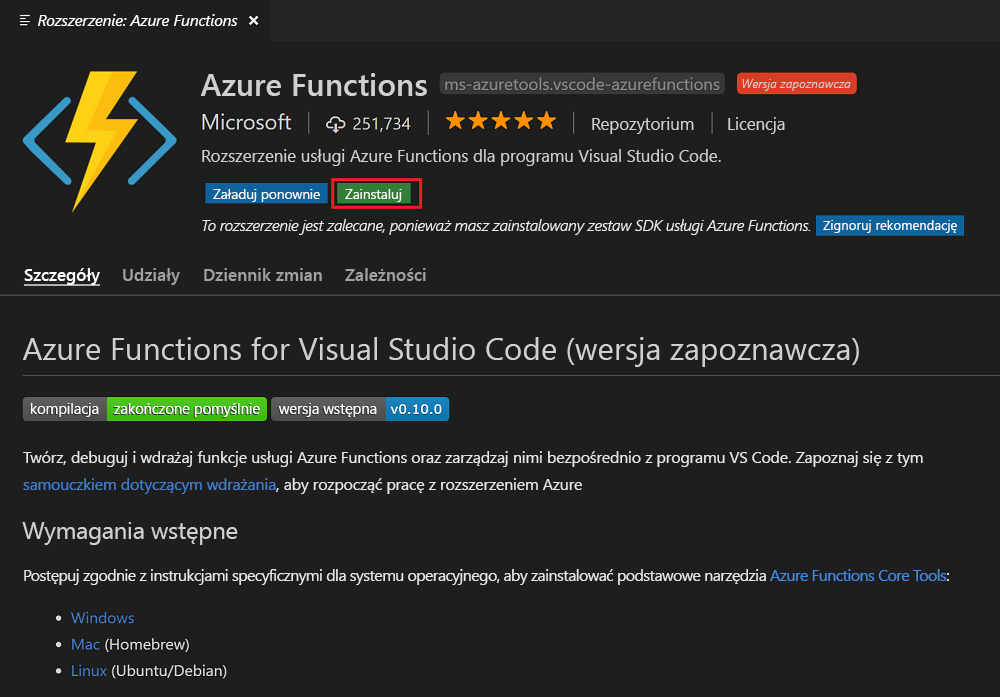

## Instalowanie rozszerzenia usługi Azure Functions

Rozszerzenie usługi Azure Functions umożliwia tworzenie, testowanie i wdrażanie funkcji na platformie Azure.

1. W programie Visual Studio Code otwórz pozycję **Extensions** (Rozszerzenia) i wyszukaj ciąg `azure functions` lub [otwórz ten link w programie Visual Studio Code](vscode:extension/ms-azuretools.vscode-azurefunctions).

1. Wybierz pozycję **Install** (Zainstaluj), aby zainstalować rozszerzenie programu Visual Studio Code.

    

1. Uruchom ponownie program Visual Studio Code, a następnie wybierz ikonę platformy Azure na pasku działań. Powinieneś widzieć obszar usługi Azure Functions na pasku bocznym.

    