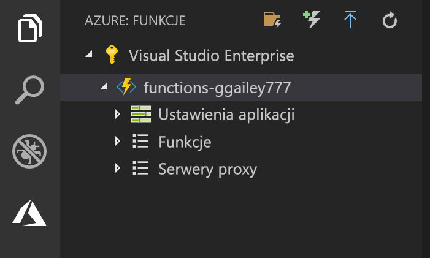

## Publikowanie projektu na platformie Azure

Program Visual Studio Code umożliwia publikowanie projektu usługi Functions bezpośrednio na platformie Azure. W ramach tego procesu tworzysz aplikację funkcji i powiązane zasoby w subskrypcji platformy Azure. Aplikacja funkcji zapewnia kontekst wykonywania dla Twoich funkcji. Projekt jest pakowany i wdrażany do nowej aplikacji funkcji w ramach subskrypcji platformy Azure. 

W tym artykule założono, że tworzysz nową aplikację funkcji. Publikowanie do istniejącej aplikacji funkcji spowoduje zastąpienie zawartości tej aplikacji na platformie Azure.

1. W obszarze **Azure: Functions** wybierz ikonę wdrażania w aplikacji funkcji.

    

1. Wybierz folder projektu, który jest Twoim bieżącym obszarem roboczym.

1. Jeśli masz więcej niż jedną subskrypcję, wybierz tę, w której chcesz hostować swoją aplikację funkcji, a następnie wybierz pozycję **+ Utwórz nową aplikację funkcji**.

1. Wpisz unikatową w skali globalnej nazwę identyfikującą aplikację funkcji, a następnie naciśnij klawisz Enter. Prawidłowe znaki dla nazwy aplikacji funkcji to `a-z`, `0-9` i `-`.

1. Wybierz pozycję **+ Utwórz nową grupę zasobów**, wpisz nazwę grupy zasobów, taką jak `myResourceGroup`, a następnie naciśnij klawisz Enter. Możesz również użyć istniejącej grupy zasobów.

1. Wybierz pozycję **+ Utwórz nowe konto magazynu**, wpisz globalnie unikatową nazwę nowego konta magazynu używanego przez aplikację funkcji i naciśnij klawisz Enter. Nazwy kont usługi Storage muszą mieć długość od 3 do 24 znaków i mogą zawierać tylko cyfry i małe litery. Możesz także użyć istniejącego konta.

1. Wybierz lokalizację w [regionie](https://azure.microsoft.com/regions/) znajdującym się w pobliżu lub blisko innych usług, do których Twoje funkcje uzyskują dostęp.

    Tworzenie aplikacji funkcji rozpoczyna się po wybraniu lokalizacji. Po utworzeniu aplikacji funkcji i zastosowaniu pakietu wdrożeniowego zostanie wyświetlone powiadomienie.

1. Wybierz przycisk **Wyświetl dane wyjściowe** w powiadomieniach, aby wyświetlić wyniki tworzenia i wdrożenia, łącznie z utworzonymi zasobami platformy Azure.

    

1. Zanotuj adres URL nowej aplikacji funkcji na platformie Azure. Pozwoli on na przetestowanie funkcji po opublikowaniu projektu na platformie Azure.

    

1. Wracając do obszaru **Azure: Functions**, zobaczysz nową aplikację funkcji wyświetlaną w ramach Twojej subskrypcji. Po rozwinięciu tego węzła wyświetlone zostaną funkcje w aplikacji funkcji, a także ustawienia aplikacji i serwery proxy funkcji.

    

    Z poziomu węzła aplikacji funkcji naciśnij klawisz Ctrl, a następnie kliknij (prawym przyciskiem myszy), aby wybrać spośród różnych zadań konfiguracji i zarządzania do wykonania w odniesieniu do aplikacji funkcji na platformie Azure. Możesz również wyświetlić aplikację funkcji w witrynie Azure Portal.
