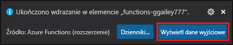

## Publikowanie projektu na platformie Azure

W tej sekcji utworzysz aplikację funkcji i powiązane zasoby w subskrypcji platformy Azure, a następnie wdrożyć kod. 

> [!IMPORTANT]
> Publikowanie do istniejącej aplikacji funkcji spowoduje zastąpienie zawartości tej aplikacji na platformie Azure. 

1. Wybierz ikonę platformy Azure na pasku aktywności, a następnie w obszarze **Azure: Functions** wybierz przycisk **Wdrażanie do aplikacji funkcji....**

    

1. Podaj następujące informacje w monitach:

    + **Wybierz subskrypcję:** Wybierz subskrypcję do użycia. Nie zobaczysz tego, jeśli masz tylko jedną subskrypcję.

    + **Wybierz aplikację funkcji na platformie Azure:** Wybierz `+ Create new Function App`. (Nie wybieraj `Advanced` opcji, która nie jest omówiona w tym artykule).
      
    + **Wprowadź globalnie unikatową nazwę aplikacji funkcji:** Wpisz nazwę prawidłową w ścieżce adresu URL. Wpisywanie nazwy jest sprawdzane, aby upewnić się, że jest unikatowa w usłudze Azure Functions. 
    
    ::: zone pivot="programming-language-python"
    + **Wybierz środowisko wykonawcze:** Wybierz wersję języka Python, na której działa lokalnie. Za pomocą `python --version` polecenia można sprawdzić wersję.
    ::: zone-end

    ::: zone pivot="programming-language-javascript,programming-language-typescript"
    + **Wybierz środowisko wykonawcze:** Wybierz wersję pliku Node.js, na której działa lokalnie. Za pomocą `node --version` polecenia można sprawdzić wersję.
    ::: zone-end

    + **Wybierz lokalizację dla nowych zasobów:** Aby uzyskać lepszą wydajność, wybierz [region](https://azure.microsoft.com/regions/) w pobliżu. 
    
1.  Po zakończeniu w ramach subskrypcji tworzone są następujące zasoby platformy Azure przy użyciu nazw opartych na nazwie aplikacji funkcji:
    
    + Grupa zasobów, która jest logicznym kontenerem dla powiązanych zasobów.
    + Standardowe konto usługi Azure Storage, które przechowuje stan i inne informacje o projektach.
    + Plan zużycia, który definiuje bazowy host dla aplikacji funkcji bez użycia serwera. 
    + Aplikacja funkcji, która zapewnia środowisko do wykonywania kodu funkcji. Aplikacja funkcji umożliwia grupowanie funkcji jako jednostki logicznej w celu łatwiejszego zarządzania, wdrażania i udostępniania zasobów w ramach tego samego planu hostingowego.
    + Wystąpienie usługi Application Insights połączone z aplikacją funkcji, która śledzi użycie funkcji bezserwerowej.

    Po utworzeniu aplikacji funkcji i zastosowaniu pakietu wdrożeniowego zostanie wyświetlone powiadomienie. 
    
1. Wybierz **opcję Wyświetl dane wyjściowe** w tym powiadomieniu, aby wyświetlić wyniki tworzenia i wdrażania, w tym utworzone zasoby platformy Azure. Jeśli przegapisz powiadomienie, wybierz ikonę dzwonka w prawym dolnym rogu, aby zobaczyć je ponownie.

    
