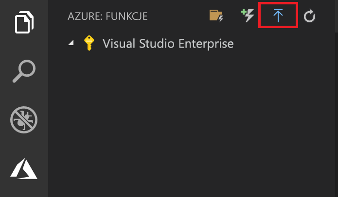

## Publikowanie projektu na platformie Azure

Program Visual Studio Code umożliwia publikowanie projektu usługi Functions bezpośrednio na platformie Azure. W ramach tego procesu tworzysz aplikację funkcji i powiązane zasoby w subskrypcji platformy Azure. Aplikacja funkcji zapewnia kontekst wykonywania dla Twoich funkcji. Projekt jest pakowany i wdrażany do nowej aplikacji funkcji w ramach subskrypcji platformy Azure.

W tym artykule założono, że tworzysz nową aplikację funkcji. 

> [!IMPORTANT]
> Publikowanie do istniejącej aplikacji funkcji spowoduje zastąpienie zawartości tej aplikacji na platformie Azure.

1. W **platformy Azure: Funkcje** obszaru, wybierz Wdróż na ikonie aplikacji funkcji.

    

1. Jeśli nie wylogowuj, monit o **logowanie do platformy Azure**. Możesz również **Utwórz bezpłatne konto platformy Azure**. Po pomyślnym zalogowaniu się za pomocą przeglądarki wróć do programu Visual Studio Code. 

1. Jeśli masz wiele subskrypcji, **Wybierz subskrypcję,** dla aplikacji funkcji kliknij **+ Utwórz nową aplikację funkcji na platformie Azure**.

1. Wpisz unikatową w skali globalnej nazwę identyfikującą aplikację funkcji, a następnie naciśnij klawisz Enter. Prawidłowe znaki dla nazwy aplikacji funkcji to `a-z`, `0-9` i `-`.

1. Wybierz pozycję **+ Utwórz nową grupę zasobów**, wpisz nazwę grupy zasobów, taką jak `myResourceGroup`, a następnie naciśnij klawisz Enter. Możesz również użyć istniejącej grupy zasobów.

1. Wybierz pozycję **+ Utwórz nowe konto magazynu**, wpisz globalnie unikatową nazwę nowego konta magazynu używanego przez aplikację funkcji i naciśnij klawisz Enter. Nazwy kont usługi Storage muszą mieć długość od 3 do 24 znaków i mogą zawierać tylko cyfry i małe litery. Możesz także użyć istniejącego konta.

1. Wybierz lokalizację w [regionie](https://azure.microsoft.com/regions/) znajdującym się w pobliżu lub blisko innych usług, do których Twoje funkcje uzyskują dostęp.

    Po naciśnięciu klawisza Enter następujących zasobów platformy Azure są tworzone w ramach subskrypcji:

    * **[Grupa zasobów](../articles/azure-resource-manager/resource-group-overview.md)**: Zawiera wszystkie utworzone zasoby platformy Azure. Nazwa opiera się na nazwę swojej aplikacji funkcji.
    * **[Konto magazynu](../articles/storage/common/storage-quickstart-create-account.md)**: Standardowe konto magazynu jest tworzone z unikatową nazwę, która opiera się na nazwę swojej aplikacji funkcji.
    * **[Plan hostingu](../articles/azure-functions/functions-scale.md)**: Plan zużycie zostanie utworzona w regionie zachodnie stany USA do hostowania aplikacji funkcję niewymagającą użycia serwera.
    * **Aplikacja funkcji**: Projekt jest wdrażana i jest uruchamiany w tej nowej aplikacji funkcji.

    Po utworzeniu aplikacji funkcji i zastosowaniu pakietu wdrożeniowego zostanie wyświetlone powiadomienie. Wybierz **wyświetlanie danych wyjściowych** w tym zgłoszeniu do wyświetlania, tworzenia i wynikami wdrożenia, łącznie z zasobów platformy Azure, które zostały utworzone.

1. Ponownie **platformy Azure: Funkcje** obszaru, rozwiń węzeł nowej aplikacji funkcji w ramach Twojej subskrypcji. Rozwiń **funkcje**, kliknij prawym przyciskiem myszy **HttpTrigger**, a następnie wybierz **skopiuj adres URL funkcji**.

    
