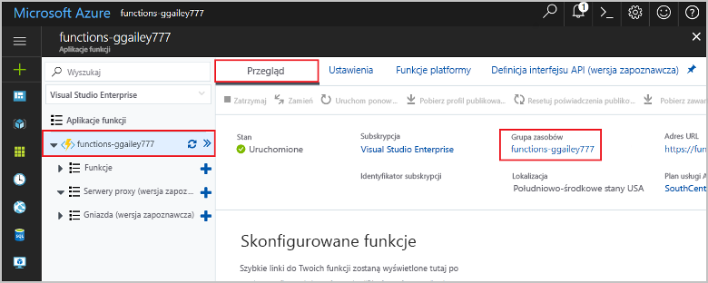

Inne przewodniki Szybki start w tej kolekcji bazują na tym przewodniku. Jeśli planujesz pracować z kolejnymi przewodnikami Szybki start, samouczkami lub dowolną usługą utworzoną w tym przewodniku Szybki start, nie należy czyścić zasobów.

*Zasoby* na platformie Azure dotyczą aplikacji funkcji, funkcji, kont magazynu i tak dalej. Są one pogrupowane w *grupy zasobów*i można usunąć wszystko w grupie, usuwając grupę. 

Aby ukończyć te przewodniki Szybki start, zostały utworzone zasoby. Za te zasoby może zostać naliczona opłata — zależy to od Twojego [stanu konta](https://azure.microsoft.com/account/) i [cennika usług](https://azure.microsoft.com/pricing/). Jeśli nie potrzebujesz już tych zasobów, oto jak możesz je usunąć:

1. W witrynie Azure Portal przejdź do strony **Grupa zasobów**. 

   Aby uzyskać dostęp do tej strony na stronie aplikacji funkcji, wybierz kartę **Omówienie**, a następnie wybierz link w obszarze **Grupa zasobów**.

   

   Aby uzyskać dostęp do tej strony z poziomu pulpitu nawigacyjnego, wybierz pozycję **Grupy zasobów**, a następnie wybierz grupę zasobów, która została użyta na potrzeby tego przewodnika Szybki start.

2. Na stronie **Grupa zasobów** przejrzyj listę uwzględnionych zasobów i sprawdź, czy są to te, które chcesz usunąć.
 
3. Wybierz pozycję **Usuń grupę zasobów**, a następnie postępuj zgodnie z instrukcjami.

   Usuwanie może potrwać kilka minut. Po jego zakończeniu przez kilka sekund będzie widoczne powiadomienie. Możesz również wybrać ikonę dzwonka w górnej części strony, aby wyświetlić powiadomienie.
