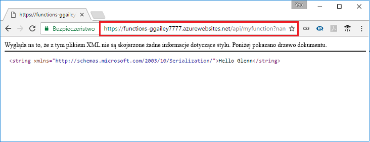

## <a name="test"></a>Testowanie funkcji na platformie Azure

Korzystanie z programu cURL, przetestuj wdrożoną funkcję. Przy użyciu adresu URL, który został skopiowany w poprzednim kroku, Dołącz ciąg zapytania `&name=<yourname>` do adresu URL, jak w poniższym przykładzie:

```bash
curl https://myfunctionapp.azurewebsites.net/api/httptrigger?code=cCr8sAxfBiow548FBDLS1....&name=<yourname>
```

 

Można także Wklej skopiowany adres URL w adresu przeglądarki sieci web. Ponownie Dołącz ciąg zapytania `&name=<yourname>` do adresu URL, przed wykonaniem żądania.

  
