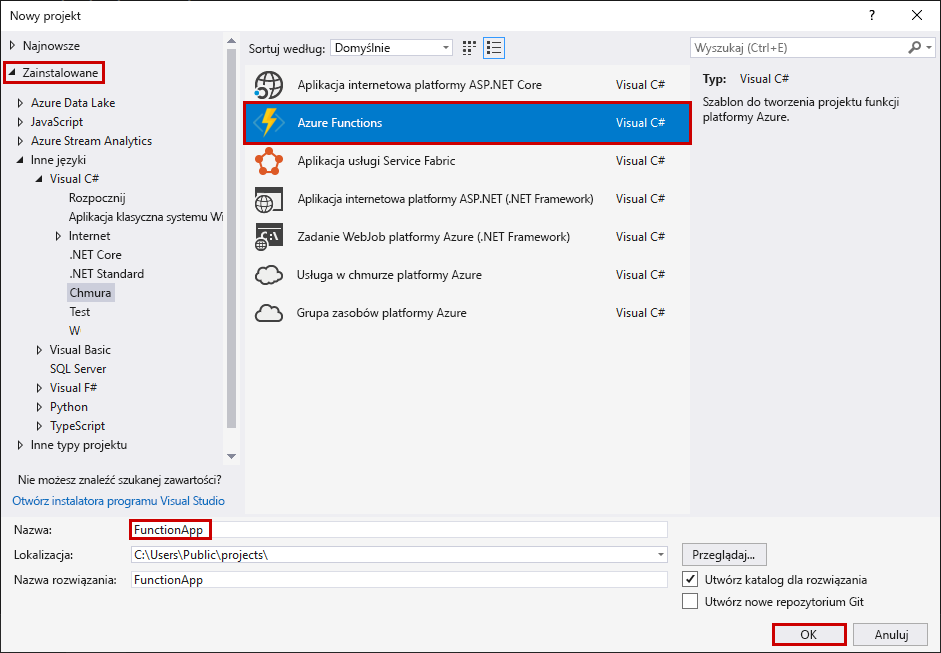
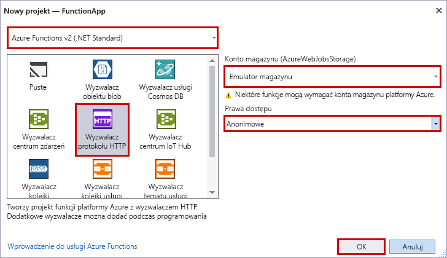

Szablon projektu usługi Azure Functions w programie Visual Studio umożliwia utworzenie projektu, który można opublikować w aplikacji funkcji na platformie Azure. Aplikację funkcji do funkcji grupy można użyć jako jednostki logicznej, zarządzania, wdrażanie i udostępnianie zasobów.

1. W programie Visual Studio na **pliku** menu, wybierz opcję **New** > **projektu**.

2. W **nowy projekt** okno dialogowe, wybierz opcję **zainstalowane** > **Visual C#**   >  **chmury**  >  **Usługi azure Functions**. Wprowadź nazwę dla projektu, a następnie wybierz pozycję **OK**. Nazwa aplikacji funkcji musi być prawidłową nazwą przestrzeni nazw C#, dlatego nie należy używać znaków podkreślenia, łączników ani znaków innych niż alfanumeryczne.

    

3. Użyj ustawień określonych w tabeli pod obrazem.

     

    | Ustawienie      | Sugerowana wartość  | Opis                      |
    | ------------ |  ------- |----------------------------------------- |
    | **Wersja** | Azure Functions 2.x  (.NET Core) | To ustawienie powoduje tworzenie projektu funkcji, który używa usługi Azure functions, która obsługuje platformy .NET Core — środowisko uruchomieniowe 2.x na wersji. Usługa Azure Functions 1.x obsługuje program .NET Framework. Aby uzyskać więcej informacji, zobacz [docelowej usługi Azure Functions, wersję środowiska uruchomieniowego](../articles/azure-functions/functions-versions.md).   |
    | **Szablon** | Wyzwalacz HTTP | To ustawienie powoduje tworzenie funkcji wyzwalanej przez żądanie HTTP. |
    | **Konto magazynu**  | Emulator magazynu | Wyzwalacz HTTP nie korzysta z połączenia konta magazynu platformy Azure. Wszystkie inne typy wyzwalaczy wymagają prawidłowych parametrów połączenia konta magazynu. |
    | **Prawa dostępu** | Anonimowe | Utworzona funkcja może zostać wyzwolona przez dowolnego klienta bez podawania klucza. To ustawienie autoryzacji ułatwia testowanie nowej funkcji. Aby uzyskać więcej informacji na temat kluczy i autoryzacji, zobacz sekcję [Authorization keys (Klucze autoryzacji)](../articles/azure-functions/functions-bindings-http-webhook.md#authorization-keys) w artykule [HTTP and webhook bindings (Powiązania protokołu HTTP i elementów webhook)](../articles/azure-functions/functions-bindings-http-webhook.md). |
    
    > [!NOTE]
    > Upewnij się, możesz ustawić **prawa dostępu** do `Anonymous`. Po wybraniu domyślnego poziomu `Function`, jesteś zobowiązany do przedstawienia [funkcyjne](../articles/azure-functions/functions-bindings-http-webhook.md#authorization-keys) w żądaniach wysyłanych do uzyskania dostępu do punktu końcowego funkcji.
    
4. Wybierz **OK** do tworzenia projektu funkcji i funkcji wyzwalanej przez HTTP.
