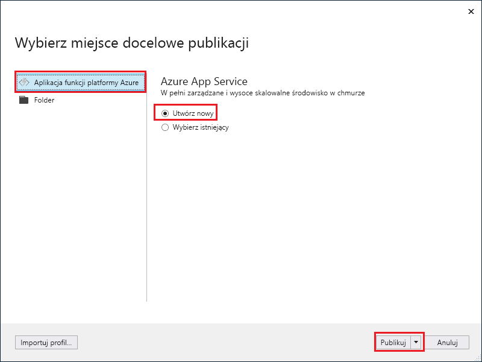
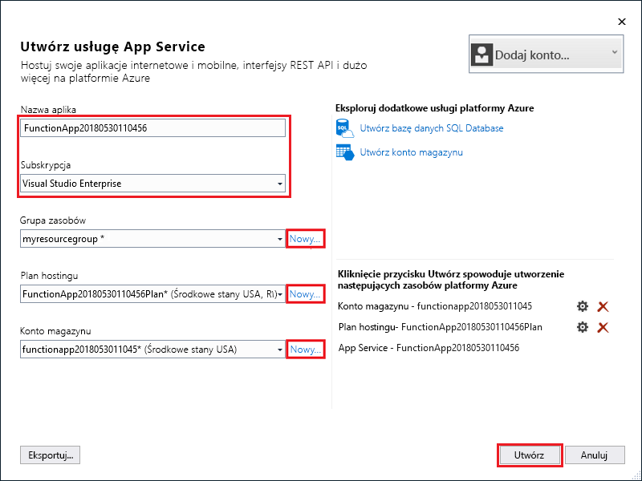
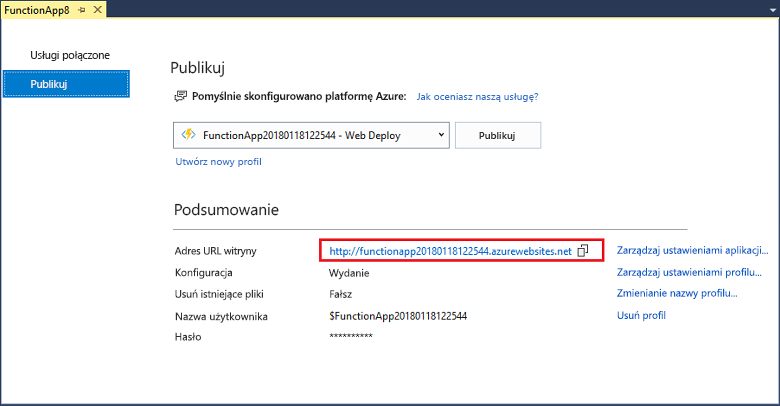

1. W **Eksploratorze rozwiązań** kliknij prawym przyciskiem myszy projekt i wybierz polecenie **Opublikuj**.

2. Wybierz kolejno pozycje **Aplikacja funkcji platformy Azure**, **Utwórz nową** i **Publikuj**.

    

3. Jeśli program Visual Studio nie został jeszcze połączony z kontem platformy Azure, wybierz pozycję **Dodaj konto...**.

4. W oknie dialogowym **Tworzenie usługi App Service** zastosuj w obszarze **Hosting** ustawienia określone w tabeli pod obrazem:

    

    | Ustawienie      | Sugerowana wartość  | Opis                                |
    | ------------ |  ------- | -------------------------------------------------- |
    | **Nazwa aplikacji** | Nazwa unikatowa w skali globalnej | Unikatowa nazwa identyfikująca nową aplikację funkcji. |
    | **Subskrypcja** | Wybierz subskrypcję | Subskrypcja platformy Azure, która ma być używana. |
    | **[Grupa zasobów](../articles/azure-resource-manager/resource-group-overview.md)** | myResourceGroup |  Nazwa grupy zasobów, w której ma zostać utworzona aplikacja funkcji. Wybierz pozycję **Nowa**, aby utworzyć nową grupę zasobów.|
    | **[Plan usługi App Service](../articles/azure-functions/functions-scale.md)** | Plan Zużycie | Pamiętaj, aby po kliknięciu pozycji **Nowy** w celu utworzenia planu bezserwerowego wybrać pozycję **Zużycie** w obszarze **Rozmiar**. Ponadto w polu **Lokalizacja** wybierz [region](https://azure.microsoft.com/regions/) w swojej okolicy lub w pobliżu innych usług, do których Twoje funkcje uzyskują dostęp. W razie działania w planie innym niż **Zużycie** konieczne jest zarządzanie [skalowaniem aplikacji funkcji](../articles/azure-functions/functions-scale.md).  |
    | **[Konto magazynu](../articles/storage/common/storage-create-storage-account.md#create-a-storage-account)** | Konto magazynu ogólnego przeznaczenia | Środowisko uruchomieniowe usługi Functions wymaga konta magazynu platformy Azure. Kliknij przycisk **Nowe**, aby utworzyć konto magazynu ogólnego przeznaczenia. Możesz również użyć istniejącego konta, które spełnia [wymagania dotyczące konta magazynu](../articles/azure-functions/functions-scale.md#storage-account-requirements).  |

5. Kliknij przycisk **Utwórz**, aby utworzyć aplikację funkcji i powiązane zasoby na platformie Azure przy użyciu tych ustawień i wdrożyć kod projektu funkcji. 

6. Po ukończeniu wdrażania zanotuj wartość **Adres URL witryny**, która jest adresem aplikacji funkcji na platformie Azure.

    
