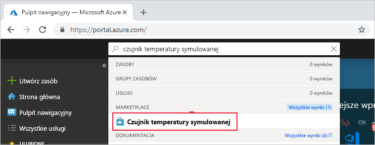
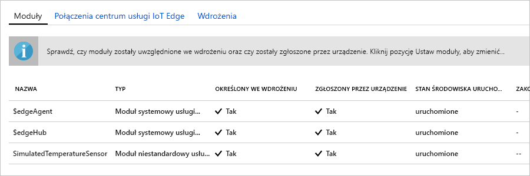

Jedną z najważniejszych funkcji usługi Azure IoT Edge jest możliwość wdrażania kodu na urządzeniach usługi IoT Edge z poziomu chmury. **Moduły usługi IoT Edge** to pakiety plików wykonywalnych implementowane jako kontenery. Ta sekcja obejmuje wdrożenie wstępnie skompilowanego modułu z [sekcji modułów IoT Edge w portalu Azure Marketplace](https://azuremarketplace.microsoft.com/marketplace/apps/category/internet-of-things?page=1&subcategories=iot-edge-modules) bezpośrednio z poziomu usługi Azure IoT Hub.

Moduł, który wdrożysz w tej sekcji, symuluje czujnik i wysyła wygenerowane dane. Ten moduł jest przydatny, gdy rozpoczyna się pracę z usługą IoT Edge, ponieważ symulowane dane można wykorzystać przy programowaniu i testowaniu. Jeśli chcesz zobaczyć, co dokładnie robi ten moduł, możesz wyświetlić [kod źródłowy symulowanego czujnika temperatury](https://github.com/Azure/iotedge/blob/027a509549a248647ed41ca7fe1dc508771c8123/edge-modules/SimulatedTemperatureSensor/src/Program.cs).

Aby wdrożyć swój pierwszy moduł z witryny Azure Marketplace, wykonaj następujące kroki:

1. Zaloguj się do [witryny Azure portal](https://portal.azure.com) i przejdź do Centrum IoT hub.

1. W menu po lewej stronie w obszarze **Automatyczne zarządzanie urządzeniami**wybierz pozycję **IoT Edge**.

1. Kliknij identyfikator urządzenia na urządzeniu docelowym z listy urządzeń.

1. Na górnym pasku wybierz pozycję **Ustaw moduły**.

1. W sekcji **IoT Edge modułów** na stronie kliknij pozycję **Dodaj**.

1. Z menu rozwijanego wybierz pozycję **moduł witryny Marketplace**.

   

1. W **witrynie IoT Edge Marketplace**Wyszukaj ciąg "symulowanie czujnika temperatury" i wybierz ten moduł.

1. Zauważ, że moduł SimulatedTemperatureSensor jest wypełniany automatycznie. W samouczkach ta strona pozwala dodawać do wdrożenia dodatkowe moduły. Na potrzeby tego przewodnika Szybki start wdrożysz tylko ten jeden moduł. Nie są wymagane żadne poświadczenia, ponieważ są one publiczne.

   

   Wybierz pozycję **Dalej: trasy** , aby przejść do następnego kroku kreatora.

1. Na karcie **trasy** kreatora należy określić sposób przekazywania komunikatów między modułami i IoT Hub. Komunikaty są konstruowane przy użyciu par nazwa/wartość. W przypadku tego przewodnika Szybki start wszystkie komunikaty ze wszystkich modułów mają trafiać do usługi IoT Hub (`$upstream`). Jeśli nie jest on automatycznie wypełniany, Dodaj następujący kod dla **wartości** **nazwy** `upstream`:

   ```sql
    FROM /messages/* INTO $upstream
   ```

   Wybierz kolejno pozycje **Dalej: przegląd + Utwórz** , aby przejść do następnego kroku kreatora.

1. Na karcie **Przegląd + tworzenie** kreatora można wyświetlić podgląd pliku JSON, który definiuje wszystkie moduły, które są wdrażane na urządzeniu IoT Edge. Zauważ, że uwzględniony został moduł **SimulatedTemperatureSensor** oraz dwa dodatkowe moduły systemowe o nazwach **edgeAgent** i **edgeHub**. Wybierz pozycję **Utwórz** po zakończeniu przeglądania.

   Podczas przesłania nowego wdrożenia na urządzenie usługi IoT Edge do urządzenia nie jest wypychane żadne powiadomienie. Nie jest to konieczne, ponieważ urządzenie regularnie wysyła do usługi IoT Hub zapytania w celu odebrania wszelkich nowych instrukcji. Jeśli urządzenie znajdzie zaktualizowany manifest wdrażania, użyje informacji o nowym wdrożeniu, aby ściągnąć obrazy modułów z chmury, a następnie zacznie uruchamiać moduły lokalnie. Ten proces może potrwać kilka minut.

1. Po utworzeniu szczegółów wdrożenia modułu Kreator powróci do strony **IoT Edge** Centrum IoT. Wybierz urządzenie z listy urządzeń usługi IoT Edge, aby wyświetlić jego szczegóły.

1. Na stronie Szczegóły urządzenia przewiń w dół do karty **moduły** . Należy wymienić trzy moduły: $edgeAgent, $edgeHub i SimulatedTemperatureSensor. Jeśli co najmniej jeden z modułów jest wyświetlany jako określony we wdrożeniu, ale nie jako zgłaszany przez urządzenie, to urządzenie usługi IoT Edge nadal go uruchamia. Poczekaj chwilę, a następnie wybierz pozycję **Odśwież** w górnej części strony.

   
