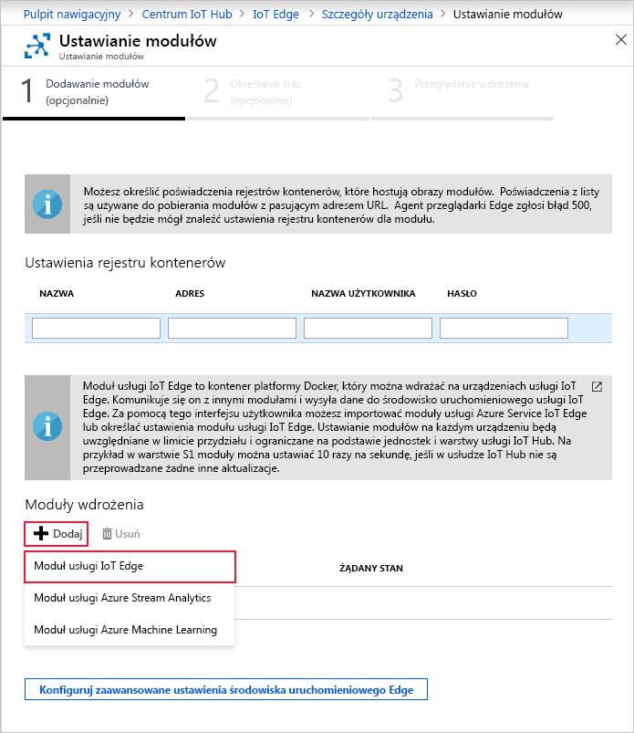

Jedną z najważniejszych funkcji usługi Azure IoT Edge jest możliwość wdrażania modułów na urządzeniach usługi IoT Edge z poziomu chmury. Moduł usługi IoT Edge to pakiet wykonywalny wdrażany jako kontener. W tej sekcji zapoznasz się ze sposobem wdrażania modułu generującego dane telemetryczne na symulowanym urządzeniu.

1. W witrynie Azure Portal przejdź do centrum IoT Hub.

2. Przejdź do usługi **IoT Edge** w obszarze **Automatyczne zarządzanie urządzeniami** i wybierz urządzenie usługi IoT Edge.

3. Wybierz pozycję **Ustaw moduły**. W portalu zostanie otwarty kreator obejmujący trzy kroki. Przeprowadzi Cię on przez procesy dodawania modułów, określania tras i przeglądania wdrożenia. 

4. W kroku **Dodawanie modułów** kreatora znajdź sekcję **Moduły wdrażania**. Kliknij pozycję **Dodaj**, a następnie wybierz pozycję **Moduł usługi IoT Edge**.

   

5. W polu **Nazwa** wprowadź wartość `tempSensor`.

6. W polu **Identyfikator URI obrazu** wprowadź wartość `mcr.microsoft.com/azureiotedge-simulated-temperature-sensor:1.0`.

7. Pozostaw inne ustawienia bez zmian, a następnie wybierz pozycję **Zapisz**.

   

8. Po powrocie do pierwszego kroku kreatora wybierz przycisk **Dalej**.

9. W kroku **Określanie tras** kreatora powinna być widoczna domyślna trasa, która wysyła wszystkie komunikaty ze wszystkich modułów do centrum IoT Hub. Jeśli tak nie jest, dodaj następujący kod, a następnie wybierz przycisk **Dalej**.

   ```json
   {
       "routes": {
           "route": "FROM /messages/* INTO $upstream"
       }
   }
   ```

10. W kroku **Przegląd wdrożenia** kreatora wybierz pozycję **Prześlij**.

11. Wróć do strony szczegółów urządzenia i wybierz opcję **Odśwież**. Oprócz modułu edgeAgent, który został utworzony podczas pierwszego uruchomienia usługi, powinien być widoczny inny moduł środowiska uruchomieniowego o nazwie **edgeHub** oraz moduł **tempSensor**.

   Wyświetlenie nowych modułów może zająć kilka minut. Urządzenie usługi IoT Edge musi pobrać z chmury nowe informacje o wdrożeniu, uruchomić kontenery i zgłosić swój nowy stan usłudze IoT Hub. 

   
