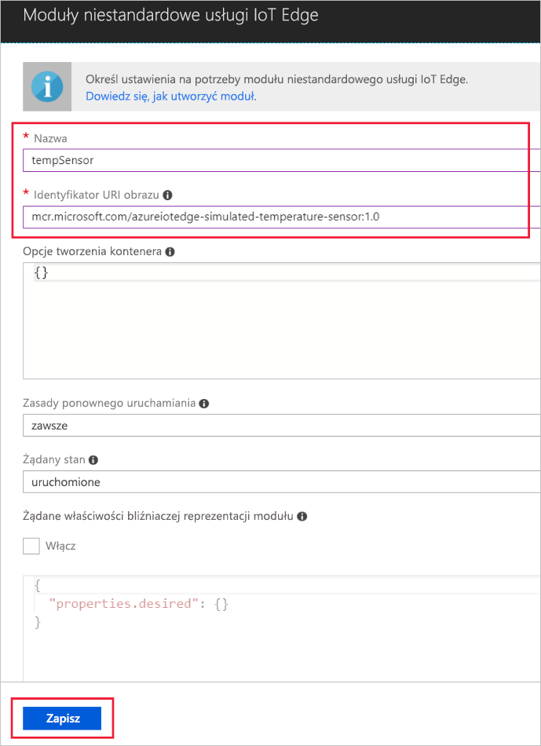

Jedną z najważniejszych funkcji usługi Azure IoT Edge jest możliwość wdrażania modułów na urządzeniach usługi IoT Edge z poziomu chmury. Moduł usługi IoT Edge to pakiet wykonywalny wdrażany jako kontener. W tej sekcji zapoznasz się ze sposobem wdrażania modułu generującego dane telemetryczne na symulowanym urządzeniu.

1. W witrynie Azure Portal przejdź do centrum IoT Hub.
1. Przejdź do usługi **IoT Edge** w obszarze **Automatyczne zarządzanie urządzeniami** i wybierz urządzenie usługi IoT Edge.
1. Wybierz pozycję **Ustaw moduły**.
1. W sekcji **Moduły wdrożenia** kroku **Dodawanie modułów** kliknij pozycję **Dodaj**, a następnie wybierz pozycję **Moduł usługi IoT Edge**.
1. W polu **Nazwa** wprowadź wartość `tempSensor`.
1. W polu **Identyfikator URI obrazu** wprowadź wartość `mcr.microsoft.com/azureiotedge-simulated-temperature-sensor:1.0`.
1. Pozostaw inne ustawienia bez zmian, a następnie wybierz pozycję **Zapisz**.

   

1. W kroku **Dodawanie modułów** wybierz opcję **Dalej**.
1. W kroku **Określanie tras** powinna być widoczna domyślna trasa, która wysyła wszystkie komunikaty ze wszystkich modułów do centrum IoT Hub. Jeśli tak nie jest, dodaj następujący kod, a następnie wybierz przycisk **Dalej**.

   ```json
   {
       "routes": {
           "route": "FROM /messages/* INTO $upstream"
       }
   }
   ```

1. W kroku **Przegląd wdrożenia** wybierz pozycję **Prześlij**.
1. Wróć do strony szczegółów urządzenia i wybierz opcję **Odśwież**. Oprócz modułu edgeAgent, który został utworzony podczas pierwszego uruchomienia usługi, powinien być widoczny inny moduł środowiska uruchomieniowego o nazwie **edgeHub** oraz moduł **tempSensor**.

   
