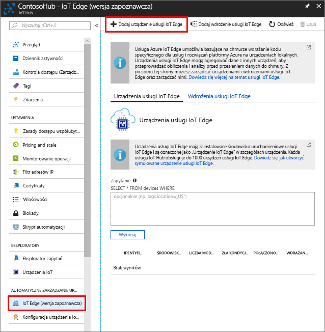

Utwórz tożsamość urządzenia symulowanego, aby umożliwić mu komunikowanie się z centrum IoT Hub. Ponieważ urządzenia usługi IoT Edge zachowują się inaczej niż typowe urządzenia IoT, a także mogą być inaczej zarządzane, już na samym początku zadeklaruj to urządzenie jako urządzenie usługi IoT Edge. 

1. W witrynie Azure Portal przejdź do centrum IoT Hub.
1. Wybierz pozycję **IoT Edge**, a następnie pozycję **Dodaj urządzenie usługi IoT Edge**.

   

1. Nadaj urządzeniu symulowanemu unikatowy identyfikator urządzenia.
1. Wybierz pozycję **Zapisz**, aby dodać to urządzenie.
1. Wybierz to nowe urządzenie z listy urządzeń.
1. Skopiuj wartość **Parametry połączenia — klucz podstawowy** i zapisz ją. Za pomocą tej wartości skonfigurujesz środowisko uruchomieniowe usługi IoT Edge w następnej sekcji. 

