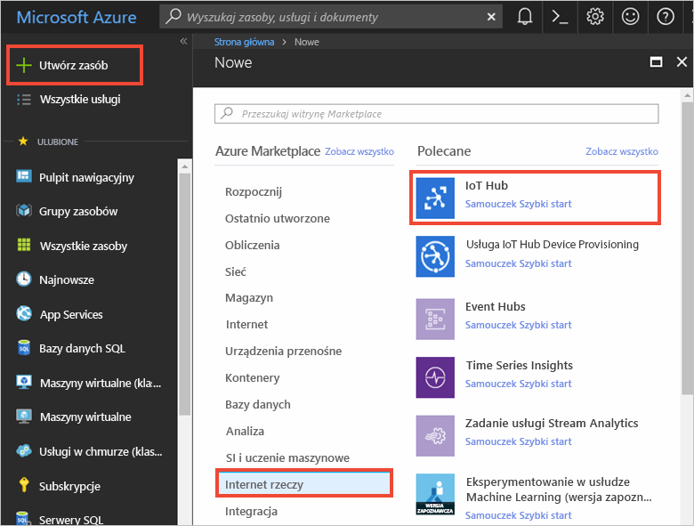
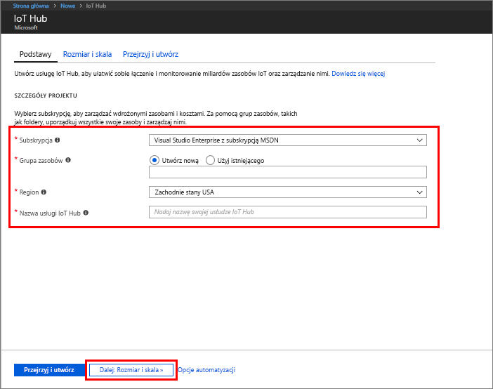
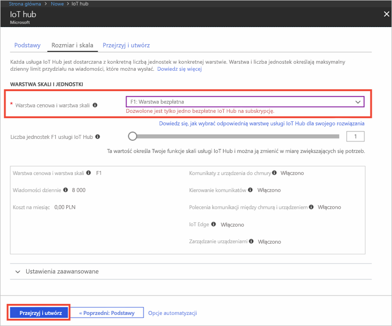

1. Zaloguj się w witrynie [Azure Portal](https://portal.azure.com/).

2. Wybierz pozycję **Utwórz zasób** > **Internet rzeczy** > **IoT Hub**.
   
    

3. W okienku **IoT Hub** wprowadź następujące informacje dotyczące centrum IoT Hub:

   * **Subskrypcja**: wybierz subskrypcję, która ma zostać użyta do utworzenia tego centrum IoT Hub.

   * **Grupa zasobów**: utwórz grupę zasobów do hostowania centrum IoT Hub lub użyj istniejącej grupy zasobów. Więcej informacji można znaleźć w temacie [Używanie grup zasobów do zarządzania zasobami platformy Azure](../articles/azure-resource-manager/resource-group-portal.md).

   * **Region**: wybierz lokalizację znajdującą się najbliżej Ciebie.

   * **Nazwa**: utwórz nazwę centrum IoT Hub. Jeśli wprowadzona nazwa jest dostępna, zostanie wyświetlony zielony znacznik wyboru.

   [!INCLUDE [iot-hub-pii-note-naming-hub](iot-hub-pii-note-naming-hub.md)]

   

4. Wybierz pozycję **Dalej: rozmiar i skala**, aby kontynuować tworzenie centrum IoT Hub. 

5. Wybierz wartość pozycji **Warstwa cenowa i warstwa skali**. Na potrzeby tego artykułu wybierz warstwę **F1 — Bezpłatna**, jeśli jest ona nadal dostępna w ramach subskrypcji. Aby uzyskać więcej informacji, zobacz [Ceny i warstwa skalowania](https://azure.microsoft.com/pricing/details/iot-hub/).

   

6. Wybierz pozycję **Przegląd + utwórz**.

7. Przejrzyj informacje o centrum IoT Hub, a następnie kliknij pozycję **Utwórz**. Proces tworzenia centrum IoT Hub może potrwać kilka minut. Postępy możesz monitorować w okienku **Powiadomienia**.