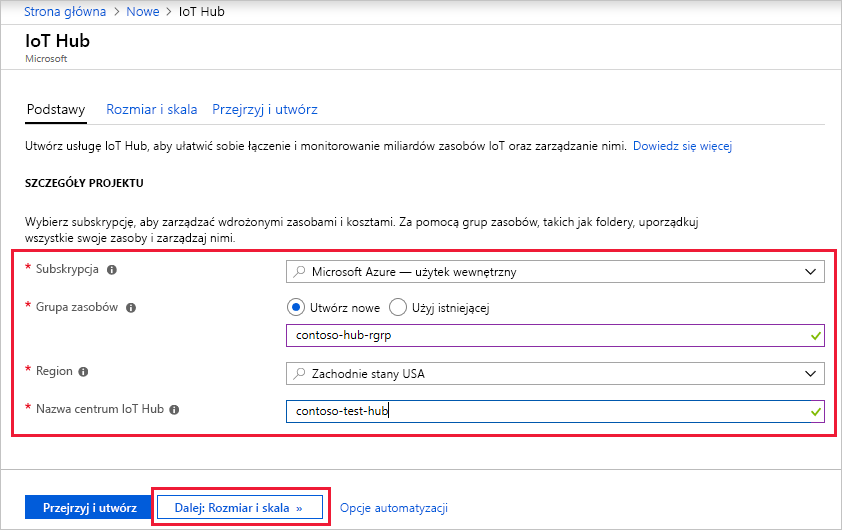
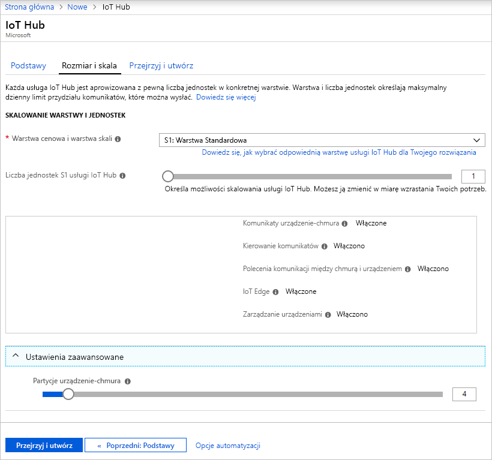
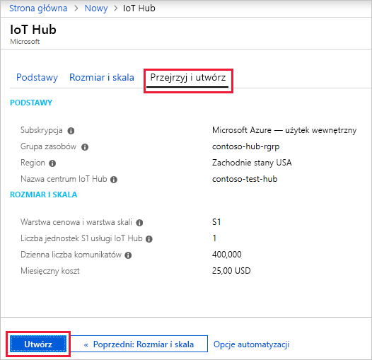

W tej sekcji opisano, jak utworzyć centrum IoT przy użyciu witryny [Azure Portal](https://portal.azure.com).

1. Zaloguj się do witryny [Azure Portal](https://portal.azure.com). 

2. Wybierz +**Utwórz zasób**, następnie *Przeszukaj witrynę Marketplace* dla **usługi IoT Hub**.

3. Wybierz **usługi IoT Hub** i kliknij przycisk **Utwórz** przycisku. Pojawi się pierwszy ekran do tworzenia centrum IoT.

   

   Wypełnij pola.

   **Subskrypcja**: wybierz subskrypcję, która ma być używana dla centrum IoT.

   **Grupa zasobów**: istnieje możliwość utworzenia nowej lub użycia istniejącej grupy zasobów. Aby utworzyć nową, kliknij pozycję **Utwórz nową** i wprowadź nazwę, której chcesz używać. Aby użyć istniejącej grupy zasobów, kliknij pozycję **Użyj istniejącej**, a następnie wybierz grupę zasobów z listy rozwijanej. Aby uzyskać więcej informacji, zobacz [Zarządzanie grupami zasobów usługi Azure Resource Manager](../articles/azure-resource-manager/manage-resource-groups-portal.md).

   **Region**: jest to region, w którym ma znajdować się centrum. Wybierz najbliższą swojej lokalizację z listy rozwijanej.

   **Nazwa centrum IoT**: podaj nazwę dla centrum IoT Hub. Ta nazwa musi być unikatowa w skali globalnej. Jeśli wprowadzona nazwa jest dostępna, zostanie wyświetlony zielony znacznik wyboru.

   [!INCLUDE [iot-hub-pii-note-naming-hub](iot-hub-pii-note-naming-hub.md)]

4. Kliknij pozycję **Dalej: rozmiar i skala**, aby kontynuować tworzenie centrum IoT.

   

   Na tym ekranie możesz przyjąć wartości domyślne, klikając pozycję **Przejrzyj i utwórz** u dołu. 

   **Warstwa cenowa i warstwa skali**: do wyboru jest kilka warstw, w zależności od tego, ilu funkcji chcesz używać oraz ile komunikatów dziennie chcesz wysyłać za pośrednictwem rozwiązania. Warstwa Bezpłatna służy do testowania i oceny. Obsługuje ona 500 urządzeń połączonych z centrum IoT i do 8000 komunikatów dziennie. Każda subskrypcja platformy Azure umożliwia utworzenie jednego centrum IoT w ramach warstwy Bezpłatna. 

   **Jednostki usługi IoT Hub**: liczba dozwolonych komunikatów na jednostkę dziennie zależy od warstwy cenowej centrum. Jeśli na przykład centrum IoT ma obsługiwać 700 000 komunikatów przychodzących, należy wybrać dwie jednostki warstwy S1.

   Aby uzyskać szczegółowe informacje na temat innych opcji warstw, zobacz [Choosing the right IoT Hub tier](../articles/iot-hub/iot-hub-scaling.md) (Wybieranie właściwej warstwy usługi IoT Hub).

   **Zaawansowane / Partycje na potrzeby komunikacji między urządzeniem i chmurą**: ta właściwość dotyczy relacji między komunikatami urządzenie-chmura, a liczbą czytników jednocześnie odczytujących te komunikaty. W przypadku większości centrów IoT wystarczą tylko cztery partycje. 

5. Kliknij pozycję **Przejrzyj i utwórz**, aby przejrzeć wybrane opcje. Zostanie wyświetlony ekran podobny do następującego.

   

6. Kliknij przycisk **Utwórz**, aby utworzyć nowe centrum IoT. Utworzenie centrum zajmuje kilka minut.
