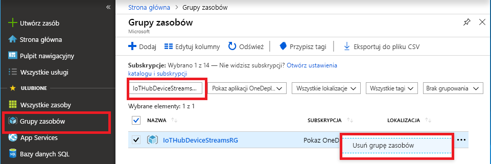

Jeśli planujesz kontynuować do następnego artykułu, zalecane, można przechowywać i ponownie zasoby, które zostały już utworzone.

W przeciwnym razie Aby uniknąć opłat, możesz usunąć zasoby platformy Azure, które zostały utworzone w tym artykule.

> [!IMPORTANT]
> Usunięcie grupy zasobów jest nieodwracalne. Grupa zasobów oraz wszystkie zawarte w niej zasoby zostaną trwale usunięte. Uważaj, aby nie usunąć przypadkowo niewłaściwych zasobów lub niewłaściwej grupy zasobów. Jeśli utworzono Centrum IoT hub wewnątrz istniejącej grupy zasobów, która zawiera zasoby, które chcesz zachować, Usuń tylko IoT hub zasób, nie w grupie zasobów.
>

Aby usunąć grupę zasobów na podstawie nazwy:

1. Zaloguj się do witryny [Azure Portal](https://portal.azure.com), a następnie wybierz pozycję **Grupy zasobów**.

1. W **Filtruj według nazwy** wprowadź nazwę grupy zasobów, który zawiera usługi IoT hub.

1. Na liście wyników, po prawej stronie grupy zasobów, wybierz przycisk wielokropka ( **...** ), a następnie wybierz pozycję **Usuń grupę zasobów**.

    

1. Aby potwierdzić usunięcie grupy zasobów, wprowadź nazwę grupy zasobów, a następnie wybierz **Usuń**. Po kilku chwilach grupy zasobów i wszystkie zawarte w niej zasoby zostaną usunięte.
